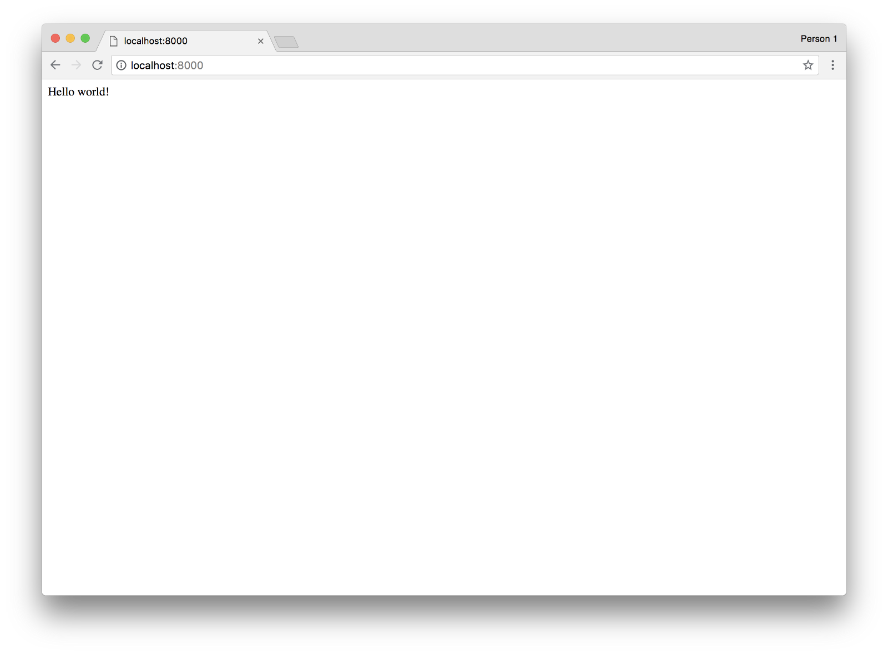
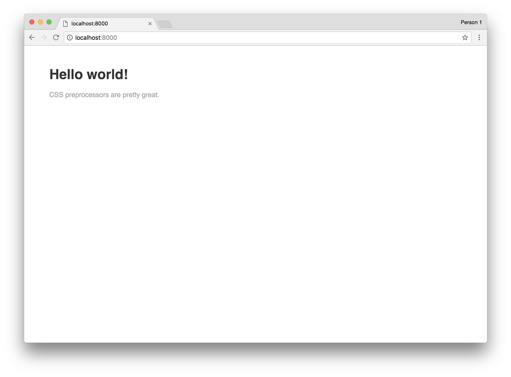
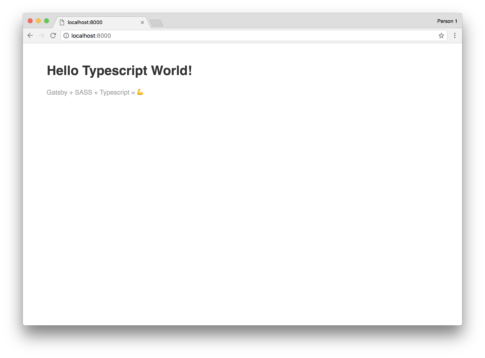
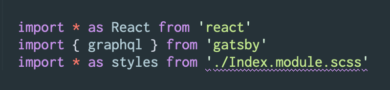

I was able to build a super-fast static site generated from a headless CMS using Gatsby. I liked it so much that I put together a starter repo. You can just [jump to the starter repo](https://github.com/tdharmon/gatsby-starter-typescript-sass "A Gatsby starter repo based on this article"), or you can read this article for a step-by-step approach, so that you know the ins and outs of what’s going on.

*Disclaimer #1: I think you should probably read the [Gatsby docs](https://www.gatsbyjs.org/tutorial/ "Gatsby's starter tutorial"), because they’re pretty thorough. Be sure to check those out first–this specific article doesn’t cover any Gatsby basics.*

*Disclaimer #2: I’m using Gatsby version 2 in this tutorial. If you don’t want to use a beta version of Gatsby, I wouldn’t recommend following this specific tutorial.*

*Disclaimer #3: I’m going to use Yarn in this tutorial instead of NPM. I ran into issues using NPM when I deployed this to Netlify, but they were resolved by using Yarn. Either one will work just fine if you aren’t planning on deploying to Netlify.*

## 1. Create a new Gatsby project

If you haven’t already, go ahead and install the Gatsby CLI and then whip up a new project:

```shell
gatsby new your-site-name https://github.com/gatsbyjs/gatsby-starter-hello-world
```

If you poke around the site, you’ll notice that Gatsby has already given you the start of an app. Because I had both NPM and Yarn installed, it created both a `package-lock.json` file and a `yarn.lock` file — be sure to delete whichever one you don’t need. If you want to see the starting point that Gatsby has given you, run `gatsby develop` (or `yarn start`) and you should see something simliar to this:



## 2. Integrate the Gatsby SASS plugin

Gatsby has a bunch of plugins that hook into webpack behind the scenes, making it really easy to integrate them into your project. Install the Gatsby SASS plugin:

```shell
yarn add node-sass gatsby-plugin-sass
```

We have to add both node-sass and gatsby-plugin-sass because node-sass is a peer dependency of gatsby-plugin-sass.

Once you get that installed, create a file called `gatsby-config.js` at the root level of the project. As you probably guessed it, this file controls Gatsby-specific settings, including plugins. In gatsby-config.js , add the following:

```javascript
module.exports = {
  plugins: [
    `gatsby-plugin-sass`,
  ],
}
```

This tells gatsby explicitly that we want to want to use the sass plugin we installed earlier.

In order to make sure that our newly-installed plugin is actually working, let’s change the markup of index.js in src/pages:

```javascript
import React from "react"
import * as styles from './Index.module.scss'
  
export default () => (
  <div className={styles.Container}>
    <h1>Hello world!</h1>
    <p>CSS preprocessors are pretty great.</p>
  </div>
);
```

Let’s also add an `Index.module.scss` file in that directory and style our page a little bit:

```scss
.Container {
  max-width: 60rem;
  margin: 3rem auto 0;
  font-family: sans-serif;
  
  h1 {
    color: #333;
  }
  
  p {
    color: #aaa;
  }
}
```

If everything went well, restart your server, and gatsby develop should show the following:



## 3. Integrate the Typescript Plugin

Now it’s time to add some typescript goodness on top of everything. To get started, first install typescript and the Gatsby typescript plugin:

```shell
yarn add typescript gatsby-plugin-typescript
```

Be sure to add the plugin to your gatsby-config.js file. We’re also going to add a site name and tagline to the config file. The final code looks like this:

```javascript
module.exports = {
  siteMetadata: {
    name: `Hello Typescript World!`,
    tagline: `Gatsby + SASS + Typescript = 💪`
  },  
  plugins: [
    `gatsby-plugin-sass`,
    `gatsby-plugin-typescript`,
  ],
}
```

Now that the plugin is installed, let’s update our index file to use typescript instead of javascript. Rename the file to `index.tsx` and use the following code as a starting point:

```typescript
import * as React from 'react'
import * as styles from './Index.module.scss'
  
interface IndexPageProps {}
  
export default class IndexPage extends React.Component<IndexPageProps, {}> {
  public render() {
    return (
      <div className={styles.Container}>
        <h1>Hello world!</h1>
        <p>CSS preprocessors are pretty great.</p>
      </div>
    )
  }
}
```

Now that we’re using Typescript, let’s bring in the site name and tagline using a graphQL query. GraphQL is an integral part of Gatsby, and it comes baked in out of the box (if you haven’t been exposed to graphQL yet, be sure to [read up on it](https://graphql.org/learn/ "Learn about GraphQL")).

As part of the Gatsby build process, it automagically takes your config file and makes the gatsby-config exports available through graphQL queries. Here’s our first query, which will let us access the site’s name and tagline:

```javascript
export const indexPageQuery = graphql`
  query IndexPageQuery {
    site {
      siteMetadata {
        name
        tagline
      }
    }
  }
`
```

Because we’re using typescript, we also need to provide types for this data. Gatsby automatically takes our graphQL queries, runs them, and exposes all the data through an object called `data`. Let’s write an interface for our index page’s data:

```typescript
interface IndexPageProps {
  data: {
    site: {
      siteMetadata: {
        name: string;
        tagline: string;
      }
    }
  }
}
```

Now that we’ve got data and the interface is written, let’s pull it all together. Here’s the final version of our `index.tsx` file:

```typescript
import * as React from 'react'
import { graphql } from 'gatsby'
import * as styles from './Index.module.scss'
  
interface IndexPageProps {
  data: {
    site: {
      siteMetadata: {
        name: string;
        tagline: string;
      }
    }
  }
}
  
export const indexPageQuery = graphql`
  query IndexPageQuery {
    site {
      siteMetadata {
        name
        tagline
      }
    }
  }
`
  
export default class IndexPage extends React.Component<IndexPageProps, {}> {
  
  public render() {
    const {
      name,
      tagline
    } = this.props.data.site.siteMetadata
  
    return (
      <div className={styles.Container}>
        <h1>{name}</h1>
        <p>{tagline}</p>
      </div>
    )
  }
}
```

Restart the server aaaaaaand…🥁



It worked! 🎉


## Bonus: Silence Typescript Warnings for .SCSS files

After going through all of these steps, you might see a warning associated with `Index.module.scss`:



If you’re having that problem, I decided to write about [how to silence those (false) warnings](https://thetrevorharmon.com/blog/how-to-silence-false-sass-warnings-in-react "How to Silence False SASS Warnings in React").

## Next Steps

One great thing about Gatsby is how easy it is to pull in content from other places. In my portfolio, I’m pulling in data from Contentful, a headless CMS with graphQL support. Want to know more about how to pull in data from Contentful? I decided to [write all about it](https://medium.com/@thetrevorharmon/how-to-make-a-static-site-with-flexible-content-using-gatsby-contentful-f02a5faf1d "How to set up flexible content with Contentful").

### Update (11/6/2018):
I decided to add a typescript linter to the starter repo. If you want to know more, I [wrote an article](https://medium.com/@thetrevorharmon/how-to-lint-typescript-with-gatsby-1e2cbd08b73 "How to Lint Typescript in Gatsby") about it.

### Update (11/27/2018):
I updated this article to reflect Gatsby exiting beta. Thanks [Olivia](https://medium.com/@ifrim.olivia) for getting this on my radar! I also added a section about silencing Typescript warnings for `.scss` files.