One of the reasons why I chose to use Gatsby is because it gave me the power of React with the speed of vanilla HTML. However, I knew that I’d need an easy way to update content, and Contentful seemed like the best bet. Here’s how I integrated Contentful and used it to power my site.

By the end of this article, this is what you’ll have to show off to your friends:

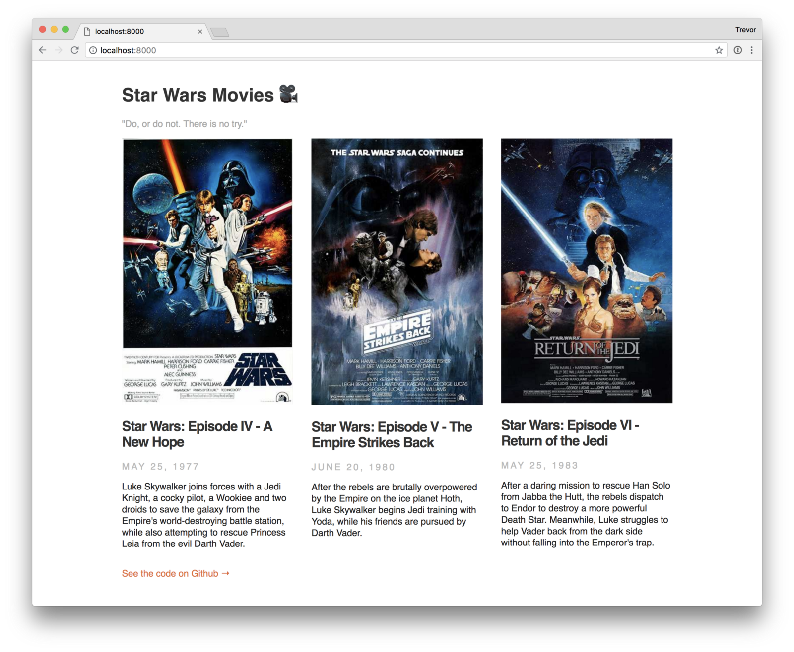

_Disclaimer #1: I’m picking up from where I left off in my last article, “[How to make a super-fast static site with Gatsby, Typescript, and SASS](https://medium.com/@thetrevorharmon/how-to-make-a-super-fast-static-site-with-gatsby-typescript-and-sass-3742c00d4524 'A link to a related article about getting started with Gatsby')”. If you haven’t yet, I would either follow along with that article or at least [clone that repo](https://github.com/tdharmon/gatsby-starter-typescript-sass 'The GitHub repo with starter code for this tutorial') as a starting point._

_Disclaimer #2: Shannon Soper wrote [a great article](https://www.gatsbyjs.org/blog/2018-1-25-building-a-site-with-react-and-contentful/ 'A great article written by Shannon Soper about using Gatsby with Contentful') about integrating Gatsby with Contentful, which was a starting point for me. My goal with this article is to illustrate the process with typescript, and to go into more detail than Shannon did._

_Disclaimer #3: There were a handful of Typescript import errors I came across because of .scss imports. If you have that issue, you can read [an article I wrote about fixing those](https://thetrevorharmon.com/blog/how-to-silence-false-sass-warnings-in-react 'An article about how to fix false SCSS errors')._

Ready? Let’s do this! 🚀

## 1. Get a Contentful Account and Add Content

First, get yourself a Contentful account. They’ve got a very generous free tier, which means it’s easy (and free!) to get started. Once you’ve created an account, you’ll see a screen similar to this (and if you don’t see this exact screen, that’s ok, just keep reading):

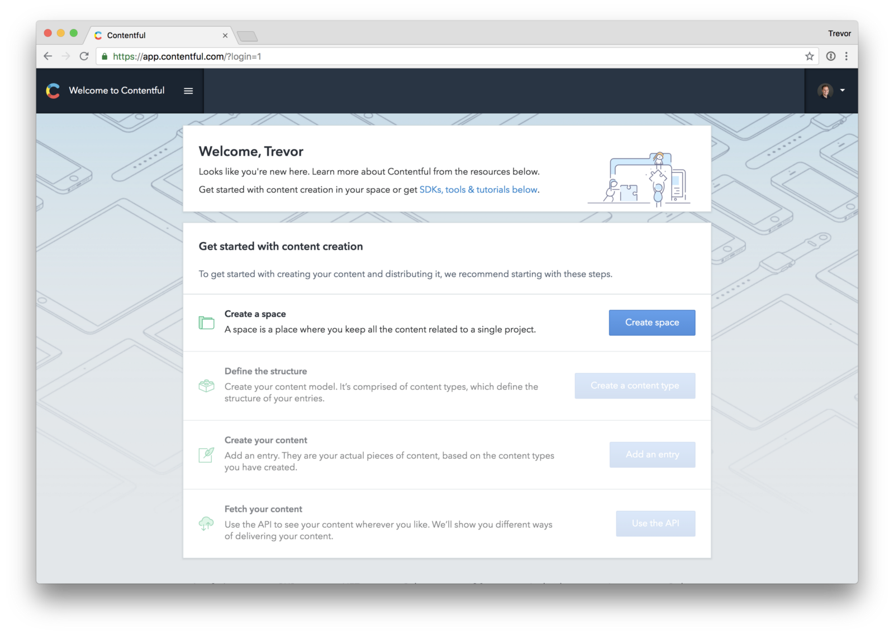

If you click “create space”, Contentful will display a window asking how you usually work with content. Go ahead and tell it that you want to “Explore content modeling”, which will create an example space for you.

You’re welcome to play around with that example space, but since it’s more complex than what we want to work with, we’re going to delete the example space and create a new space of our own. Click on Settings > General Settings and then “Remove space and all its contents”. Once you do that, you should be able to click on “Create Space” and see a screen that looks simliar to this:

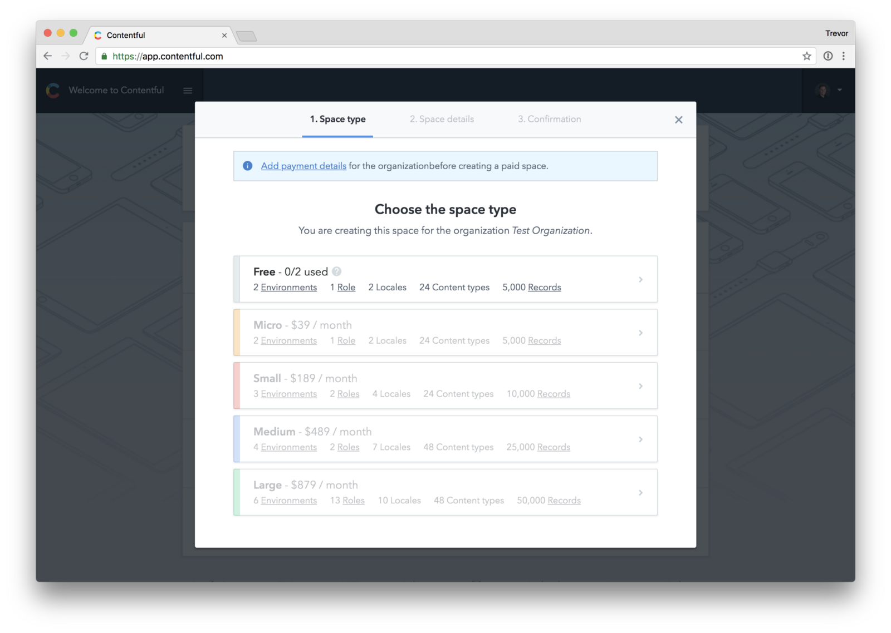

Click on the free tier, create an empty space with the name of your choice, and then confirm it. Once you’re to that point, you can jump in and start creating content.

### Creating a “Movie” Content Model

Before you can create any content itself, you need to create a model of the content. If you’re following along with this article with a specific content model in mind, feel free to stop reading and start making a model. If you don’t, we’ll go ahead and make a content model for a “movie”:

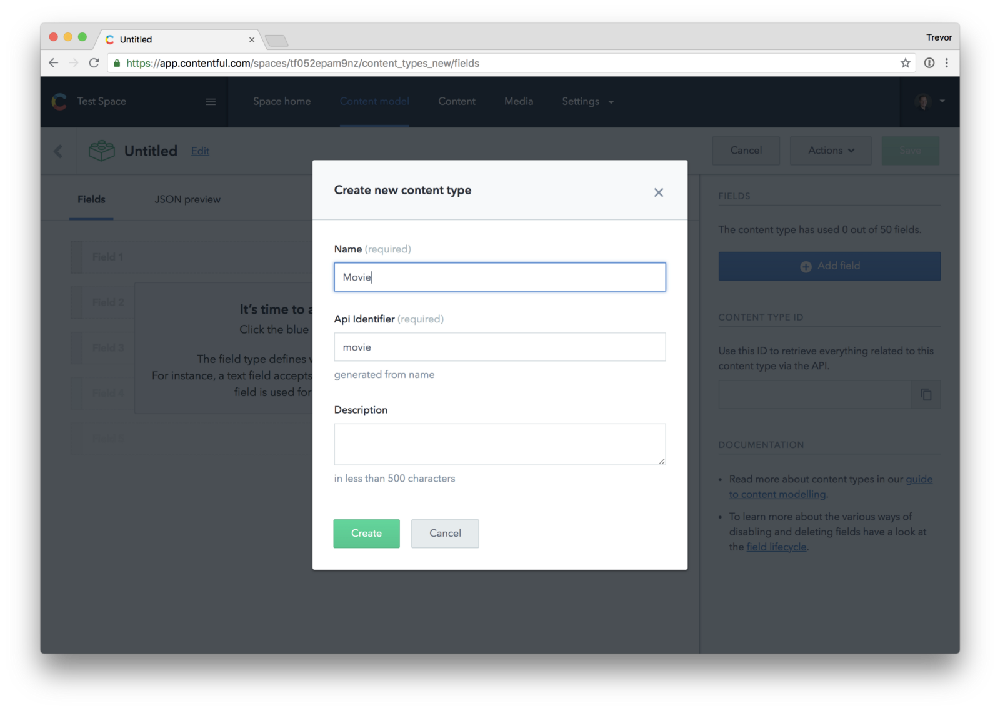

To keep things simple, I added the following fields to my model:

- **Title:** the title of the movie. I set this as a “short text, exact search” type, made sure that the checkbox that reads “This field respresents the Entry title” was checked, and made it a required field in the validations tab.
- **Slug:** not totally necessary, but I wanted to add it now to future proof this model. Contentful can automagically generate a slug based on the title of the entry if you give it the right type. Choose “text” (short text) and under the “appearance” tab, pick “slug”. It’s that simple.

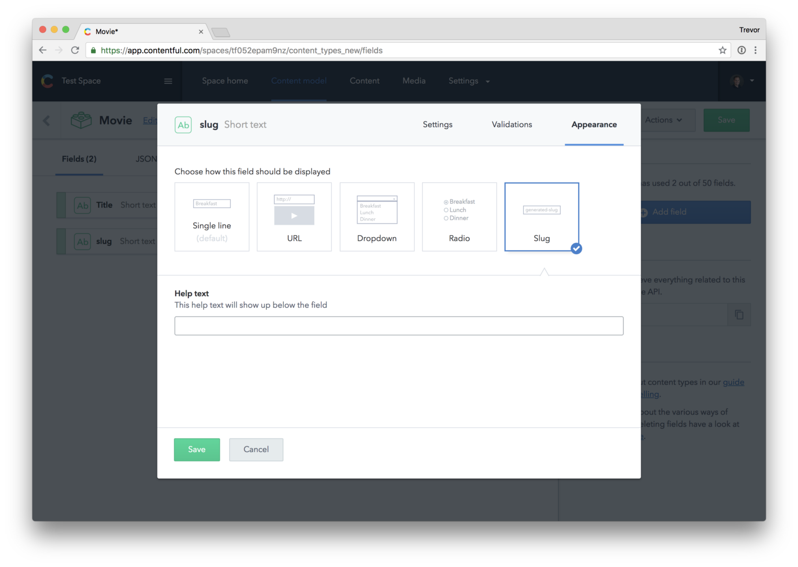

- **Description:** text, but make it a long text type instead of a short text type. Then you aren’t limited to the number of characters you can enter.
- **Release Date:** I chose the date type and under “appearance”, I set it to be the date only, since the time part of the DateTime wasn’t important.
- **Poster Image:** You can add a media field to Contentful and specify whether you want a single image or multiple images. I decided to go with a single image.

Once you add all of your fields to this model, your fields should look something like this:

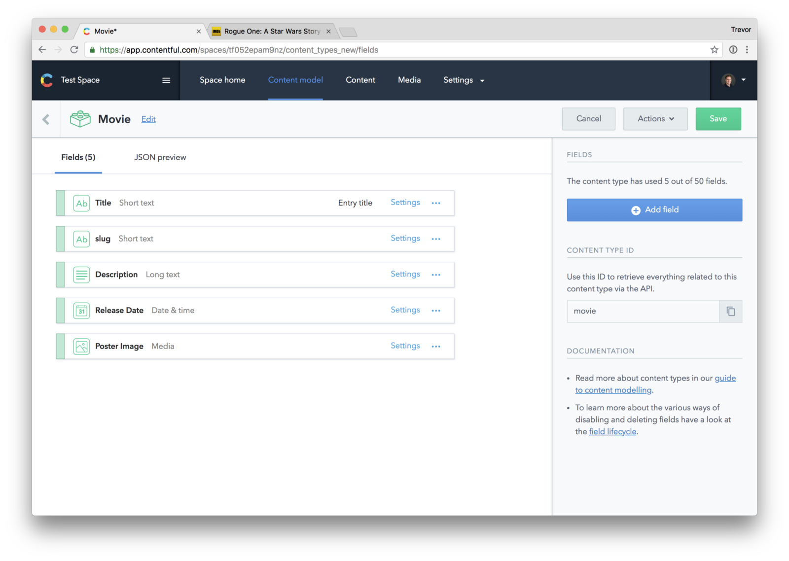

### Adding Movies

To make things simple, I’m just going to borrow a bunch of data from IMDB. I’m going to add the original three Star Wars movies ([4](https://www.imdb.com/title/tt0076759/?ref_=nv_sr_5 'Star Wars Episode IV on IMDB'), [5](https://www.imdb.com/title/tt0080684/?ref_=nv_sr_1 'Star Wars Episode V on IMDB'), [6](https://www.imdb.com/title/tt0086190/?ref_=nv_sr_1 'Star Wars Episode 6 on IMDB')) to the “content” section of Contentful.

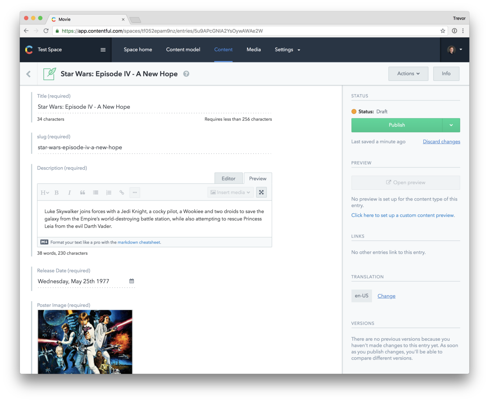

If you’ve added all of the data you need to Contentful, your Content tab should look something like this:

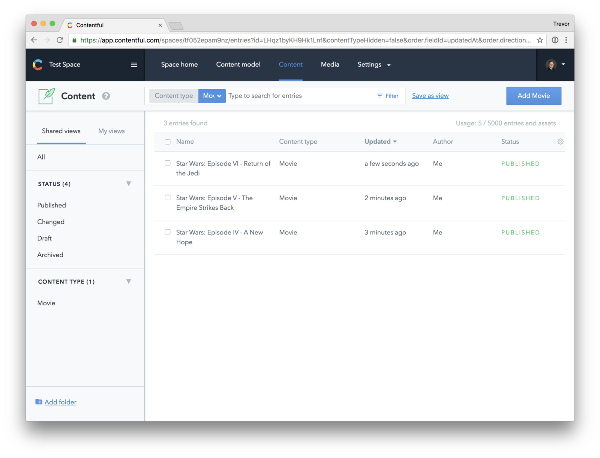

## 2. Connecting Contentful to Gatsby

We’re _almost_ done with Contentful–the last thing we need to do is grab our API key. You can find your keys in Settings > API Keys. Contentful probably created an Example Key for you. Click into that, give it a more descriptive name and description, and then save it:

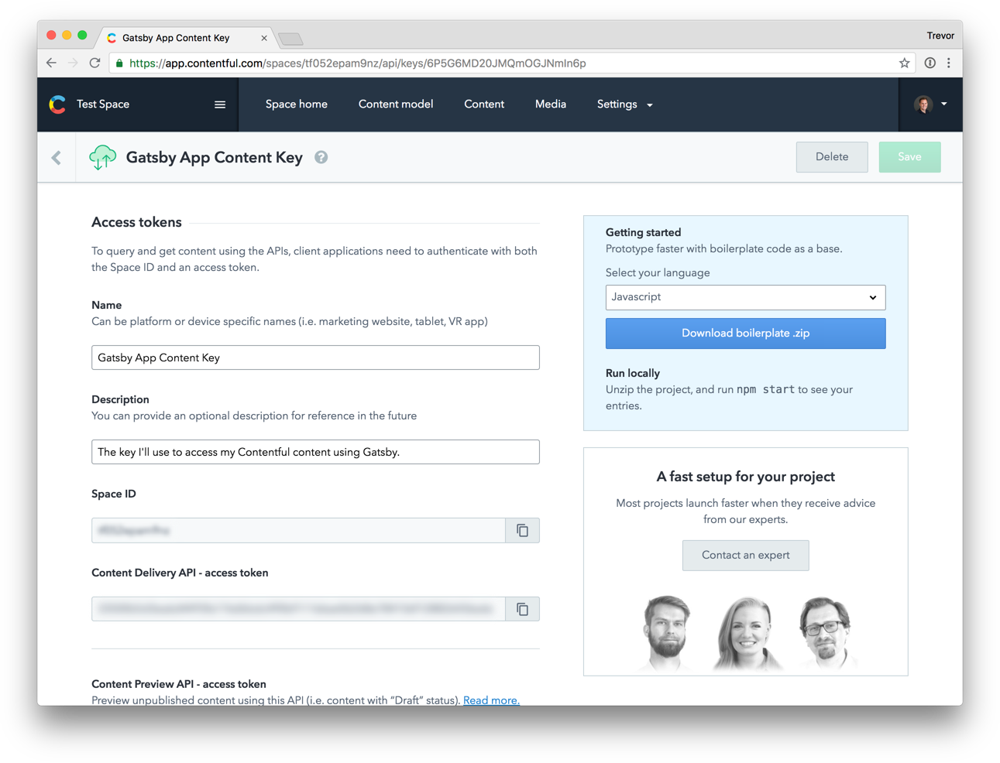

The two fields you want to make special note of are **Space ID** and **Content Delivery API access token**. Keep this window open or copy those values for reference–we’ll need them in just a second. Time to jump into the code!

(If you haven’t already, [clone the starter repo](https://github.com/tdharmon/gatsby-starter-typescript-sass 'A starter repo related to this tutorial') or [read my previous article](https://thetrevorharmon.com/blog/how-to-make-a-super-fast-static-site-with-gatsby-typescript-and-sass 'An article about how to get started on Gatsby'). You need that up and working before you can continue forward.)

Gatsby’s got a lovely Contentful plugin that we’re going to make use of here. We’re also going to add dotenv to make handling credentials a breeze.

```shell
yarn add gatsby-source-contentful dotenv
```

Even though this is just a little tutorial, I’m still wary of sticking any kind of keys directly into `config` files, and prefer to stick them in a `.env` file. Create a `.env` file at the top level of your repo, and add your space id and access token to it:

```shell
CONTENTFUL_SPACE_ID=Your space id Here
CONTENTFUL_DELIVERY_ACCESS_TOKEN=Your access token here
```

Finally, let’s add the plugin to to our `gatsby-config.js` file. Instead of just passing the name of the plugin, we need to pass the name with additional parameters. Here’s an example of what that looks like:

```javascript
{
  resolve: `gatsby-source-contentful`,
  options: {
    spaceId: // space id here
    accessToken: // access token here
  },
},
```

In order to get our Space Id and Access Token from our `.env` file into our `gatsby-config.js` file, we need to use dotenv. The final config file code should look something like this (notice the site name, tagline, and Github link):

```javascript
require(`dotenv`).config({path: `.env`});

module.exports = {
  siteMetadata: {
    name: `Star Wars Movies 🎥`,
    tagline: `"Do, or do not. There is no try."`,
    githubLink: `https://github.com/tdharmon/gatsby-example-typescript-sass-contentful`,
  },
  plugins: [
    `gatsby-plugin-sass`,
    `gatsby-plugin-typescript`,
    {
      resolve: `gatsby-source-contentful`,
      options: {
        spaceId: process.env.CONTENTFUL_SPACE_ID,
        accessToken: process.env.CONTENTFUL_DELIVERY_ACCESS_TOKEN,
      },
    },
  ],
};
```

Once you’ve got all of this in place, it’s time to run it! Run `gatsby develop` and watch the logs. You should see logs similar to this:

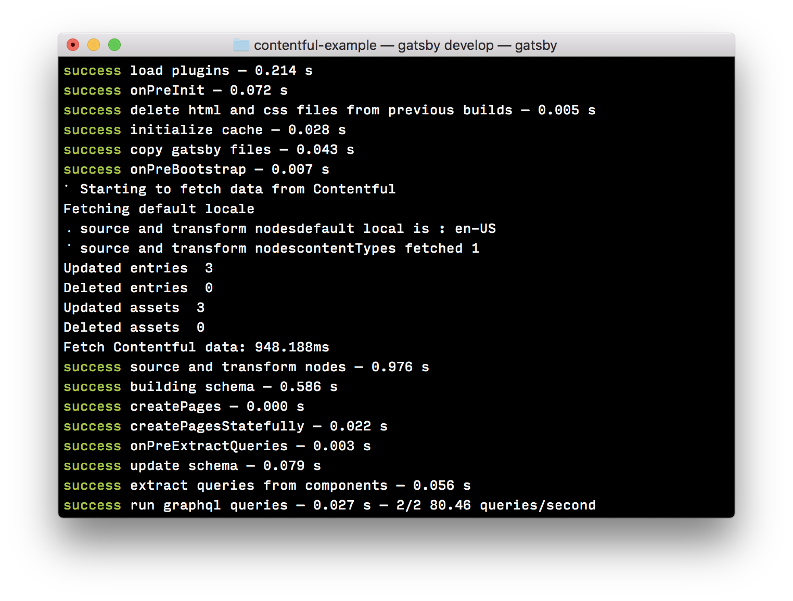

If you see `Starting to fetch data from Contentful` and `Updated entries 3`, that means that Gatsby has gone out, fetched data from Contentful, and made it available to your project. You’re ready to start building with Contentful content!

## 3. Bringing Content in with Gatsby

When you bring content in from Contentful, you can query the content with a graphQL query. We’re going to bring in our list of movies and display them pretty.

\_Brief aside: Gatsby has a nice graphQL helper viewer that you can access at [http://localhost:8000/\_\_\_graphQL](http://localhost:8000/___graphQL 'Local GraphQL browser'). It’s really useful for validating graphQL queries quickly, without having to look in your browser and figure out what’s wrong.\_

We’re going to first just get our feet wet by displaying a basic unordered list of movies. GraphQL’s approach is that you only bring in the information you want, so our query would look like this:

```javascript
allContentfulMovie {
  edges {
    node {
      title
    }
  }
}
```

When working with Contentful, you access any of your Contentful models with the prefix `allContentful` and then the name of the model, which in our case is movie. Additionally, all of the content you create is always under an array called `edges`, with `node` being a representation of each individual piece of content.

Additionally, we also need to provide typings for our data. Our types for this data looks very simliar:

```typescript
allContentfulMovie: {
  edges: {
    node: {
      title: string;
    }
  }
}
```

In order to display all of our movie titles in an unordered list, we also need to render each title to the page, now that the data is coming in. Update your `index.tsx` with the following code:

```typescript
import * as React from 'react';
import {graphql} from 'gatsby';
import * as styles from './Index.module.scss';
interface IndexPageProps {
  data: {
    site: {
      siteMetadata: {
        name: string;
        tagline: string;
        githubLink: string;
      };
    };
    allContentfulMovie: {
      edges: {
        node: {
          title: string;
        };
      };
    };
  };
}
export const indexPageQuery = graphql`
  query IndexPageQuery {
    site {
      siteMetadata {
        name
        tagline
        githubLink
      }
    }
    allContentfulMovie {
      edges {
        node {
          title
        }
      }
    }
  }
`;
export default class IndexPage extends React.Component<IndexPageProps, {}> {
  public render() {
    const {name, tagline, githubLink} = this.props.data.site.siteMetadata;

    const movies = this.props.data.allContentfulMovie.edges.map(
      (edge) => edge.node,
    );

    return (
      <div className={styles.Container}>
        <h1>{name}</h1>
        <p>{tagline}</p>
        <ul>
          {movies.map((movie, index) => {
            return <li key={index}>{movie.title}</li>;
          })}
        </ul>
        <a href={githubLink}>See the code on Github &rarr;</a>
      </div>
    );
  }
}
```

Once you’ve updated your `index.tsx` file, your site should look like this:

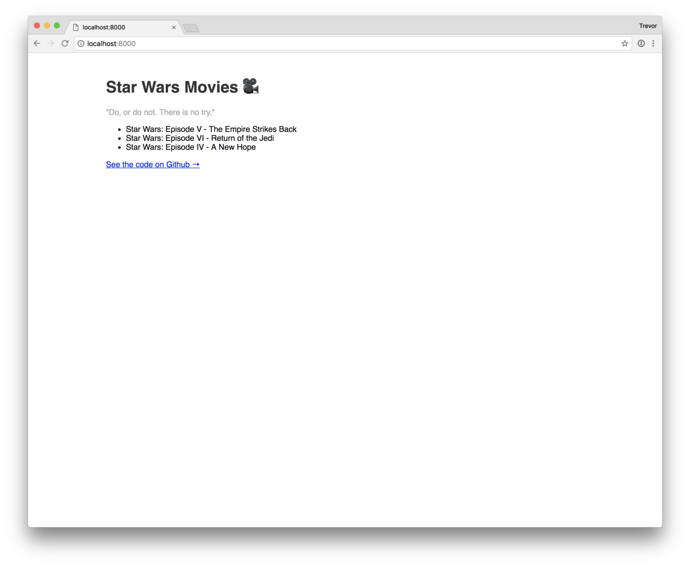

We’ve got the basic information in here. Now let’s make it a little bit more exciting.

## 4. Taking it a Step Further

We’re going to pull in all of the fields we created in Contentful with our graphQL query:

```javascript
allContentfulMovie(sort: { fields: [releaseDate] }) {
  edges {
    node {
      title
      description {
        description
      }
      posterImage {
        resolutions {
          src
        }
      }
      slug
      releaseDate(formatString: "MMMM DD, YYYY")
    }
  }
}
```

Notice that we’re passing a format string directly to the date in our query statement. GraphQL can format dates inline for you, which means they come pre-formatted! We’re also sorting by releaseDate, so that they are displayed oldest to newest.

Additionally, we need to update our types:

```javascript
allContentfulMovie: {
  edges: {
    node: {
      title: string;
      description: {
        description: string;
      }
      posterImage: {
        resolutions: {
          src: string;
        }
      }
      slug: string;
      releaseDate: string;
    }
  }
}
```

Notice that our types aren’t as straightforward as you might assume; the `description` has a nested `description` object (because it’s a long text format) and the `posterImage` has nested objects as well (because it’s an image, which Contentful calls a `ContentfulAsset`).

In addition to pulling in more data, let’s make it look a little bit nicer. We’ll add a function called `renderMovieTile` which takes in movie data and renders HTML, and we’ll also add some styling to make it look nice. The updated `index.tsx` file looks like this:

```typescript
import * as React from 'react';
import {graphql} from 'gatsby';
import * as styles from './Index.module.scss';

interface IndexPageProps {
  data: {
    site: {
      siteMetadata: {
        name: string;
        tagline: string;
        githubLink: string;
      };
    };
    allContentfulMovie: {
      edges: {
        node: {
          title: string;
          description: {
            description: string;
          };
          posterImage: {
            resolutions: {
              src: string;
            };
          };
          slug: string;
          releaseDate: string;
        };
      };
    };
  };
}

export const indexPageQuery = graphql`
  query IndexPageQuery {
    site {
      siteMetadata {
        name
        tagline
        githubLink
      }
    }
    allContentfulMovie(sort: {fields: [releaseDate]}) {
      edges {
        node {
          title
          description {
            description
          }
          posterImage {
            resolutions {
              src
            }
          }
          slug
          releaseDate(formatString: "MMMM DD, YYYY")
        }
      }
    }
  }
`;

export default class IndexPage extends React.Component<IndexPageProps, {}> {
  renderMovieTile = (movie, index) => {
    return (
      <div key={index} className={styles.MovieTile}>
        
        <h2>{movie.title}</h2>
        <span>{movie.releaseDate}</span>
        <p>{movie.description.description}</p>
      </div>
    );
  };

  public render() {
    const {name, tagline, githubLink} = this.props.data.site.siteMetadata;

    const movies = this.props.data.allContentfulMovie.edges.map(
      (edge) => edge.node,
    );

    return (
      <div className={styles.Container}>
        <h1>{name}</h1>
        <p>{tagline}</p>
        <div className={styles.MovieTileWrapper}>
          {movies.map((movie, index) => this.renderMovieTile(movie, index))}
        </div>
        <a href={githubLink} className={styles.Link}>
          See the code on Github &rarr;
        </a>
      </div>
    );
  }
}
```

And don’t forget the styles in `Index.module.scss`!

```scss
.Container {
  max-width: 60rem;
  margin: 3rem auto 3rem;
  font-family: sans-serif;

  h1 {
    color: #333;
  }

  p {
    color: #aaa;
  }
}

.MovieTileWrapper {
  margin: 0 -1rem;
  display: flex;
  justify-content: space-evenly;
}

.MovieTile {
  margin: 0 1rem;
  flex-basis: 0;
  flex-grow: 1;

  h2 {
    color: #333;
    letter-spacing: -1px;
  }

  span {
    color: #bbb;
    text-transform: uppercase;
    letter-spacing: 3px;
  }

  p {
    color: #222;
    line-height: 1.3;
  }
}

.MovieImg {
  max-width: 100%;
}

.Link {
  display: inline-block;
  margin-top: 1rem;

  color: #ea6e2e;
  text-decoration: none;

  &:hover {
    text-decoration: underline;
  }
}
```

Now that you’ve got more data and updated styles, let’s pop back over into our browser:


## Next Steps

Working with Gatsby + Contentful makes it really easy to update content while still getting the benefits of a super-fast static site. If you’re now looking for deployment options, I used Netlify and decided to [write about my experience (spoiler: I loved it)](https://medium.com/@thetrevorharmon/how-to-quickly-deploy-a-gatsby-site-with-netlify-aace23623f14 'A tutorial about how to deploy a site to Netlify'). If you want additional reading, check out [this tutorial](https://www.netlify.com/blog/2016/02/24/a-step-by-step-guide-gatsby-on-netlify/ 'A tutorial from Netlify about getting Gatsby on Netlify') from Netlify itself. It’s dead simple to deploy to Netlify, and it even hooks into Github, so that any changes you make get automatically updated on your deployed site. 🎉
