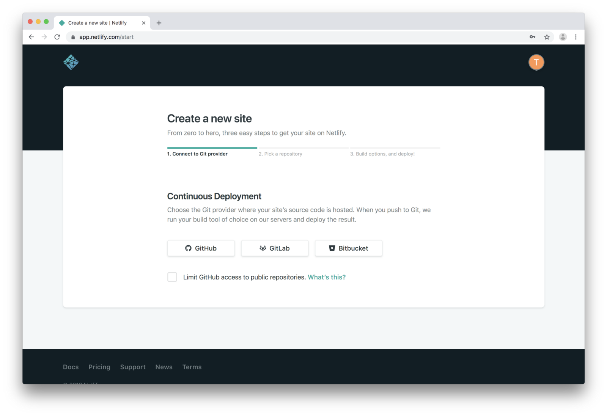
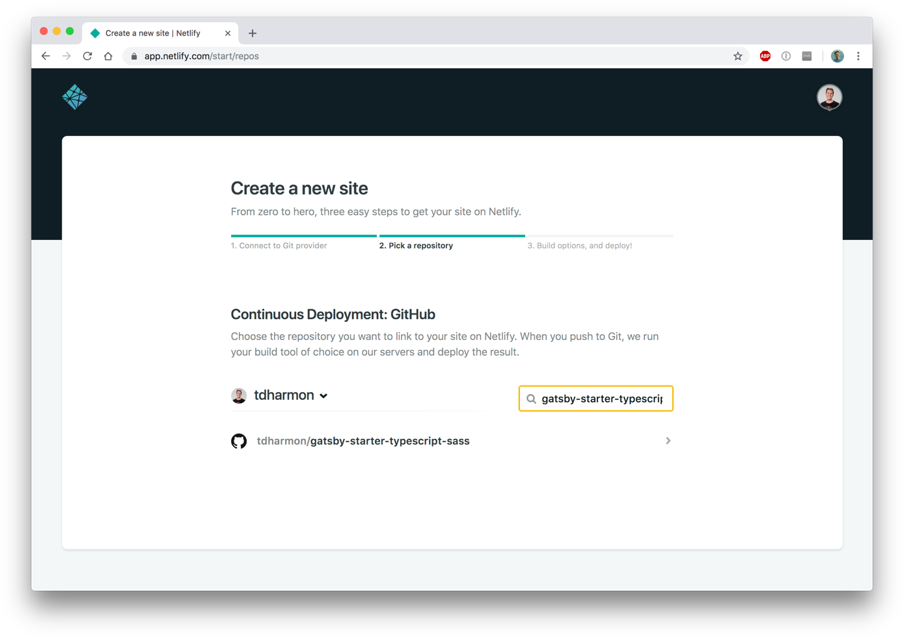
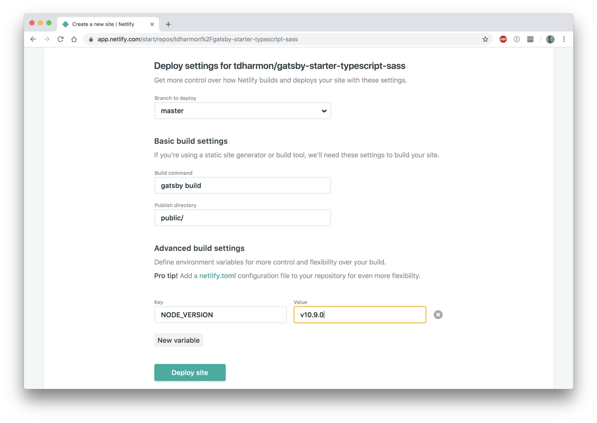
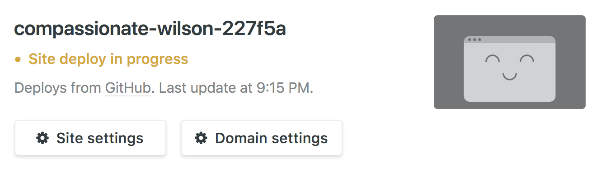
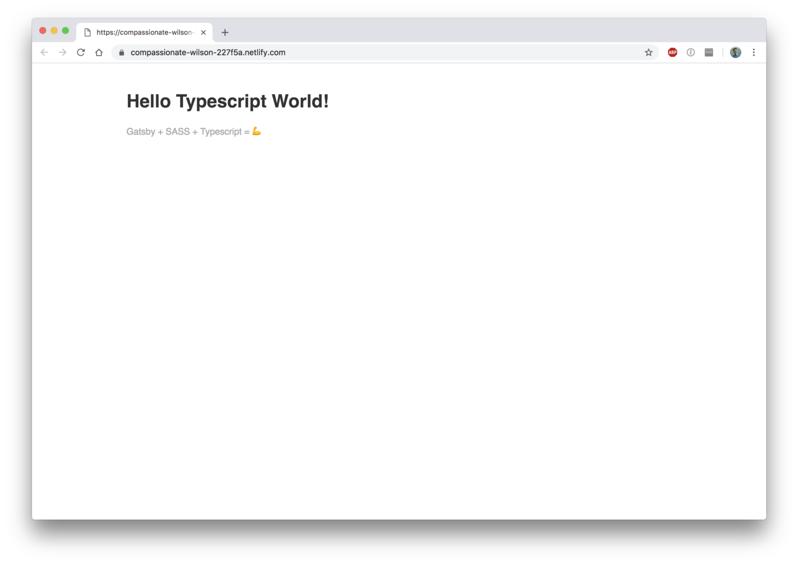

_Disclaimer #1: I wrote this because I had issues getting the beta version of Gatsby (Gatsby 2) working on Netlify. I figured it might help somebody, so I wanted to pay it forward._

_Disclaimer #2: This is the 3rd article about Gatsby I’ve written, and I’ll be using code from a previous article. You can walk through [that article](https://medium.com/@thetrevorharmon/how-to-make-a-super-fast-static-site-with-gatsby-typescript-and-sass-3742c00d4524 'An article about how to make a site with Gatsby') or just [grab the code](https://github.com/tdharmon/gatsby-starter-typescript-sass 'The repo for a Gatsby starter project') if you’re walking through this article just to learn about the process._

_Disclaimer #3: I bet these steps would work with other types of statically-generated sites, but I’ve never tried. Let me know if you do!_

Ready? Here we go! ✈️

## 1. Get a Netlify account

Head over to [Netlify](https://www.netlify.com 'Netlify.com') and get yourself an account, and then confirm your email address. Pretty basic stuff.

## 2. Connect a git repo

Netlify is based around continuous deployment from a Git repo, and they make it easy to pull in a repo from Gitlab, Github, and BitBucket. Since I’m working off of a [Github repo](https://github.com/tdharmon/gatsby-example-typescript-sass-contentful 'The repo for a Gatsby starter project') for this, I’ll go ahead and connect my Github account:

Then I’ll choose the specific repo that I want to deploy:

## 3. Tweak your settings

Once you’ve selected your repo, you’ll see a screen with a few options, mostly pre-filled for you. If you’re using Gatsby out of the box without any build setting changes, you can leave all of those to their defaults.

Before you hit that ‘Deploy’ button, you need to be aware of 3 gotchas:

### Gotcha #1: Environment Variables

Because your environment variables are (most likely) stored in a `.env` file and therefore not in source control, they won’t automatically be pulled into Netlify.

### Gotcha #2: Node Version

Turns out that Netlify will default to Node.js v8 unless you explicitly tell it otherwise. This caused me to have issues when I was trying to deploy a preojct with the latest version of Gatsby. You can solve this one of two ways:

1. Include it as an environment variable
2. [Add a `.nvmrc` file to your repo.](https://www.netlify.com/docs/#helpful-hints 'Information about how to add a .nvmrc file to a repo')

I’m feeling lazy, so I decided to go with option #1.

### Gotcha #3: Yarn, not NPM

If you’re this far and you still can’t get it to work, try using Yarn instead of NPM. I’m not exactly sure why, but that solved the issue for me.

Now that you know to edit your environment variables before deploying, click “Show Advanced” and start adding any environment variables you need (which will probably be the node version, if not more):

Now you finally get to click that lovely “Deploy site” button.

## 4. Let Netlify make your life easier

Once you’ve deployed, you’ll be redirected to your site’s dashboard, and you’ll see that a deployment is in progress:

Give it a few minutes and…

Voilà!

## Next Steps

Once you’ve deployed your site, if you like it enough, maybe set up a domain name? Netlify even has a (free!) built in SSL certificate manager, so all you have to do is point your domain at their servers, and they do the rest for you. It’s a piece of cake 🍰.
