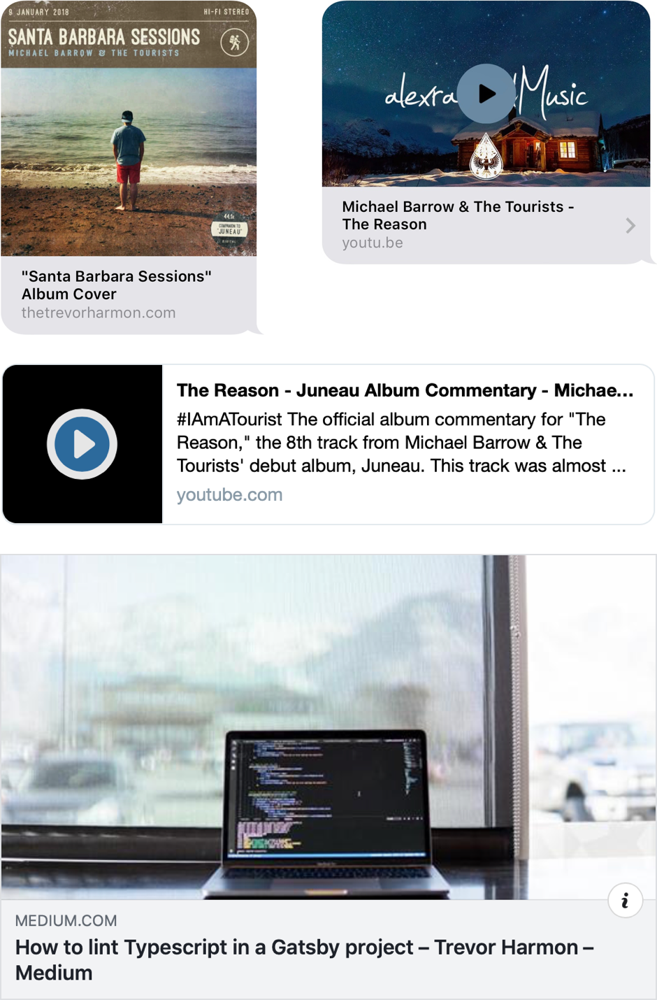

I recently asked myself the question "how do link previews in iMessage work, and why doesn't my site have a preview?". I discovered that iMessage link previews, Twitter cards, Facebook link previews, and other social link previews revolve around one standard: the Open Graph protocol.

## What's the Open Graph protocol?

It says on [the Open Graph protocol spec][1] that

> the Open Graph protocol enables any web page to become a rich object in a social graph.

A "rich object" is a rich preview of the content of a link. You see these all over the place–here are just a few examples:



Without this protocol, social sites don't have a clear way to understand what content is relevant for a link preview, and link previews are dull and uninteresting. The Open Graph protocol provides a standard way for you as a developer to do a small amount of effort that results in rich, engaging link previews.

## How do I use it?

You use the Open Graph protocol by adding specific types of [meta tags][2] in the head of your page. Much like standard meta information (`title`, `description`, etc), this allows web crawlers to quickly find out information about your page by only crawling the head.

### General usage

A basic Open Graph meta tag looks like this:

```html
<meta property="og:title" content="The Trevor Harmon" />
```

The `property` attribute on the tag acts like a key and the `content` attribute acts like a value. Every Open Graph meta tag property name uses `og:` as the prefix (except for certain Twitter-specific properties–more on that later).

_Note: most of the time (outside of Open Graph usage) a meta tag uses `name` instead of `property` as the identifying attribute. The difference is explained on [this StackOverflow post][3] but because the [Open Graph protocol][1] uses `property`, it seems like that's the preferred usage when working with Open-Graph-related meta information._

### Basic metadata

There are four basic meta tags that you should include on every page:

1. `og:title`: the title of the page. According to [Apple's documentation][4], this shouldn't include identifying information about the site, but only information about the page itself.
2. `og:type`: the type of content of the page. The type you will most likely choose is `website`, but there are also [other types available][5] if you need something more specific.
3. `og:image`: the image that will display on a link preview. This should be an image that is representative of the page's content. It's also helpful to have an image representing the site associated with the link (like a favicon) as a fallback.
4. `og:url`: the canonical URL of the page. It needs to be an absolute url.

As I implemented these four basic tags, I found out about a couple of gotchas:

- I had problems with relative urls for `og:image`. I would recommend using an absolute url instead.
- Use the _resolved_ url for `og:url`. Some of the tools I used threw warnings about redirects in the url.

### Optional metadata

In addition to those four basic tags, there are a few more to know about:

- `og:description`: the Open-Graph-specific description. This lets you include a description catered to social media sharing, instead of using the default description set in typical metadata.
- `og:site_name`: the name of the website ("Facebook", "Reddit", etc).
- `og:locale`: the locale of the website content. This tag defaults to `en_US`–change it if your content isn't US centric.

There are [more optional tags][1] you can use, but these are the most important to know about (for most cases).

### Twitter specific metadata

Twitter has created a few of its own meta tags that affect Twitter cards (which are generated when you share a link on Twitter). Twitter first looks at typical Open Graph tag (like `og:title`), and then looks for any Twitter-specific tags. Here are the Twitter-specific tags you need to know about:

- `twitter:image`: like `og:image`, but for Twitter. Twitter will automatically pull from `og:image` if it doesn't find `twitter:image`.
- `twitter:description` and `twitter:title`: same as `twitter:image`.
- `twitter:site`: the Twitter handle of the website. If the link was to a page on the New York Times, this would be the twitter handle of the New York Times (@nytimes).
- `twitter:creator`: the Twitter handle of the content creator. If the link was to a page on the New York Times, this would be the handle of the author of the article.
- `twitter:card`: the type of card displayed on Twitter. If `og:type`, `og:title`, and `og:description` exist on the page, Twitter defaults to using `summary` for the card type.

If you need more documentation on what Twitter tags exist, you can find a full list [in the documentation on their website][6].

## Putting it all together

As an example, the open graph implementation for [my previous article][7] looks like this:

```html
<head>
  <!-- Basic -->
  <meta property="og:title" content="What I Learned from a Failed Startup" />
  <meta
    property="og:description"
    content="Four lessons I learned from working as an engineer for a startup that ran out of cash and went bankrupt."
  />
  <meta
    property="og:url"
    content="https://thetrevorharmon.com/blog/what-I-learned-from-a-failed-startup/"
  />
  <meta property="og:image" content="https://thetrevorharmon.com/favicon.png" />

  <!-- Additional -->
  <meta property="og:type" content="website" />
  <meta property="og:site_name" content="The Trevor Harmon" />

  <!-- Twitter -->
  <meta property="twitter:card" content="summary" />
  <meta name="twitter:site" content="@thetrevorharmon" />
  <meta name="twitter:creator" content="@thetrevorharmon" />
</head>
```

I've broken out the code according to each section of this article. I'm letting Twitter infer most of the information, and only providing the meta information for the card type and twitter handles. All of that code translates to this nice Twitter card:


## Next steps

Setting up Open Graph metadata isn't challenging, but it makes a big difference for the shareability of your website. Here are some of the tools I used and documentation I read in order to get Open Graph working on my own site.

### Tools

- [Twitter's Card Validator][8]: This was the most useful tool I used to test out my tags because it followed redirects, so I could use this with [ngrok][9] and test using my local development server. Unfortunately, it's a gated tool, but worth getting a twitter login if you need to do some testing.
- [OpenGraphCheck.com][10]: I used this sparingly, but it can provide good, general information about a link. It also follows ngrok tunnels.
- [Facebook's Open Graph debugger][11]: Facebook invented the Open Graph protocol, and their tool can give you detailed info about the link you have it debug.

### Reading

- [Apple documentation][4]: Apple chooses to consume Open Graph information within iMessage previews, but they provide a handful of specific tips for proper formatting and usage. I'd recommend becoming familiar with the best practices they list here.
- [Open Graph protocol documentation][1]: for a deeper dive into what the protocol looks like beyond basic usage, definitely read the documenation.
- [Twitter cards documentation][12]: If you want to make sure you are taking advantage of all of Twitter's card features, hop on over to their documentation.
- [StackOverflow Post][13]: this was my starting point that got me from "iOS message previews" to "what is Open Graph?". You might find it useful.
- I also read over [these][14] [three][15] [articles][16] as I sought to understand more about what Open Graph is and how it works

[1]: http://ogp.me 'Open Graph Protocol'
[2]: https://searchenginewatch.com/2018/06/15/a-guide-to-html-and-meta-tags-in-2018/ 'A Guide to HTML and Meta Tags in 2018'
[3]: https://stackoverflow.com/questions/22350105/whats-the-difference-between-meta-name-and-meta-property "Stack Overflow article about Meta's 'name' and 'property' properties"
[4]: https://developer.apple.com/library/archive/technotes/tn2444/_index.html "Apple's documentation about using rich previews in iMessage"
[5]: http://ogp.me/#types 'Open Graph types'
[6]: https://developer.twitter.com/en/docs/tweets/optimize-with-cards/overview/markup "Twitter's documentation about their  Open Graph markup"
[7]: https://thetrevorharmon.com/blog/what-I-learned-from-a-failed-startup 'What I learned from a failed startup'
[8]: https://cards-dev.twitter.com/validator "Twitter's card validator tool"
[9]: https://ngrok.com 'A tool that makes temporarily exposing local develoment servers easy'
[10]: https://opengraphcheck.com 'A website dedicated to checking your open graph tags'
[11]: https://developers.facebook.com/tools/debug/sharing/ "Facebook's tool for debugging Open Graph tags"
[12]: https://developer.twitter.com/en/docs/tweets/optimize-with-cards/overview/abouts-cards "Twitter's documentation of an overview of their Cards"
[13]: https://stackoverflow.com/questions/38986140/ios10-messages-link-preview-image 'A Stack Overflow post that gives the basics of iMessage rich previews'
[14]: https://medium.freecodecamp.org/how-to-avoid-the-shaming-look-your-site-has-on-twitter-and-facebook-f2e8f4be568d 'How to avoid the shaming look your site has on twitter and facebook'
[15]: https://medium.com/@richardoosterhof/how-to-optimize-your-site-for-rich-previews-527ed13a6d69 'How to optimize your site for rich previews'
[16]: https://www.emergeinteractive.com/insights/detail/rich-video-previews-in-ios-macos-messages 'How to add iMessage Rich Video Previews to your website'
