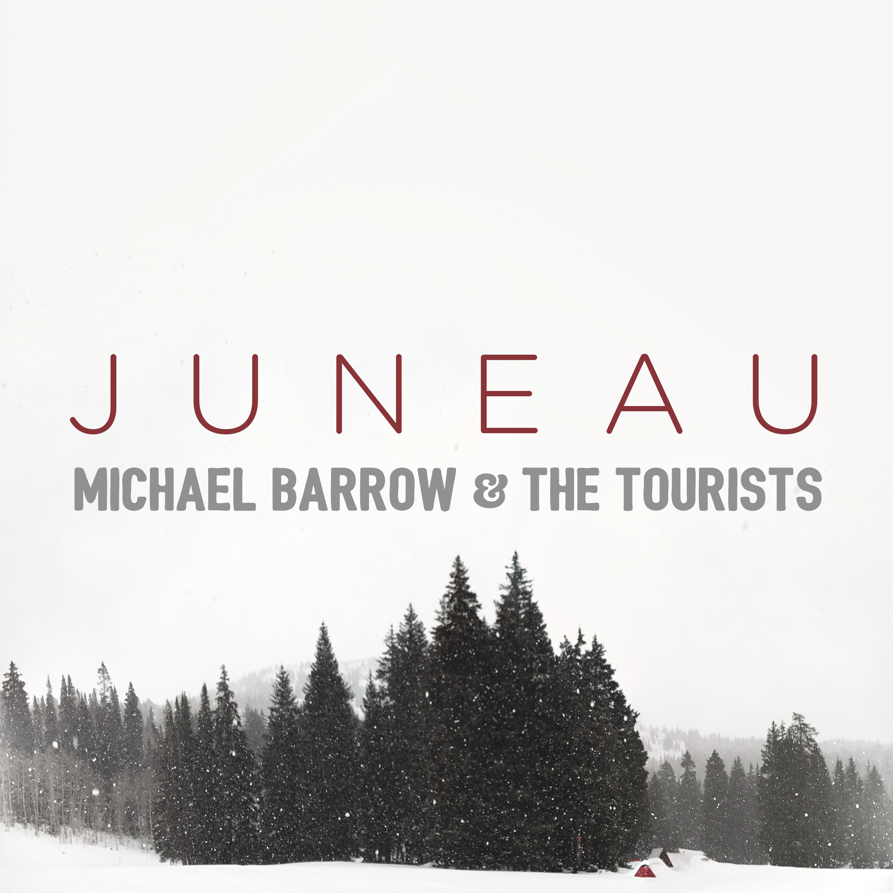
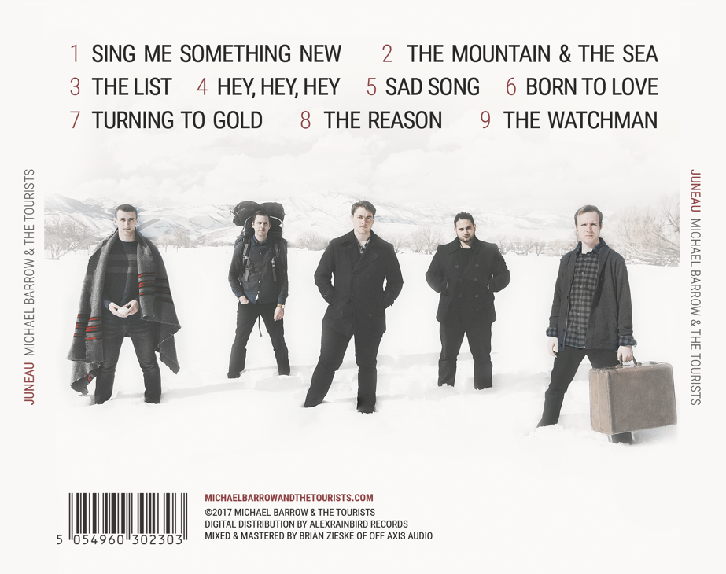
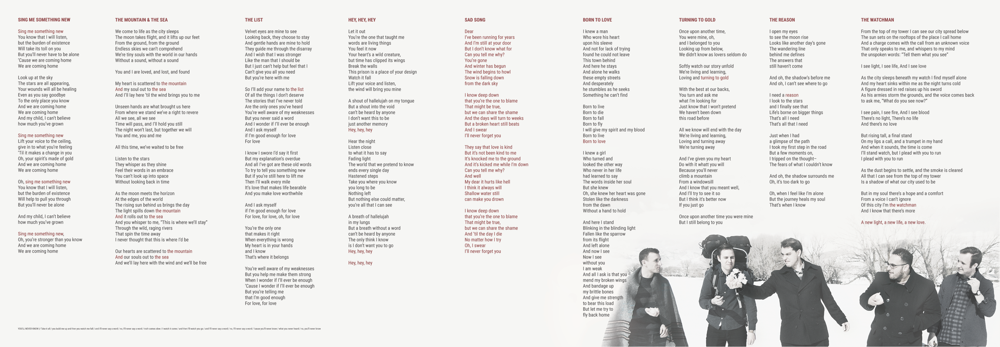
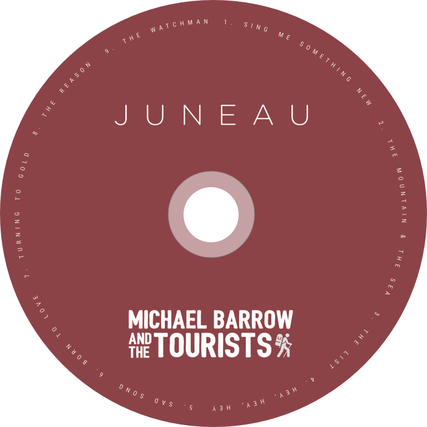
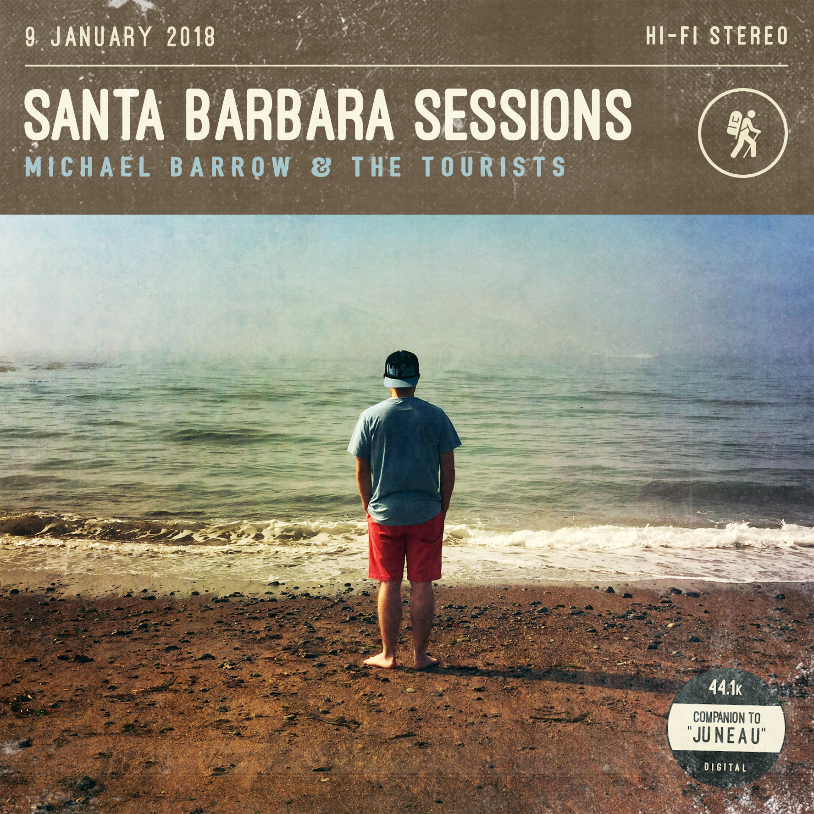
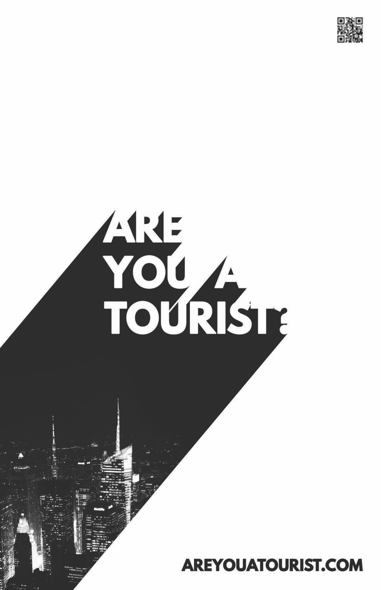
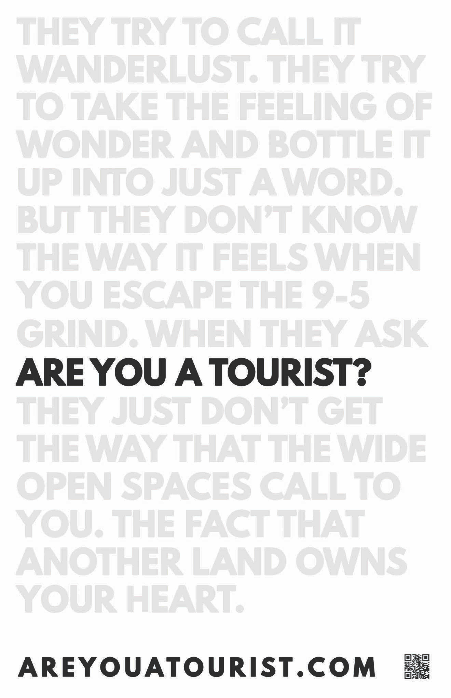
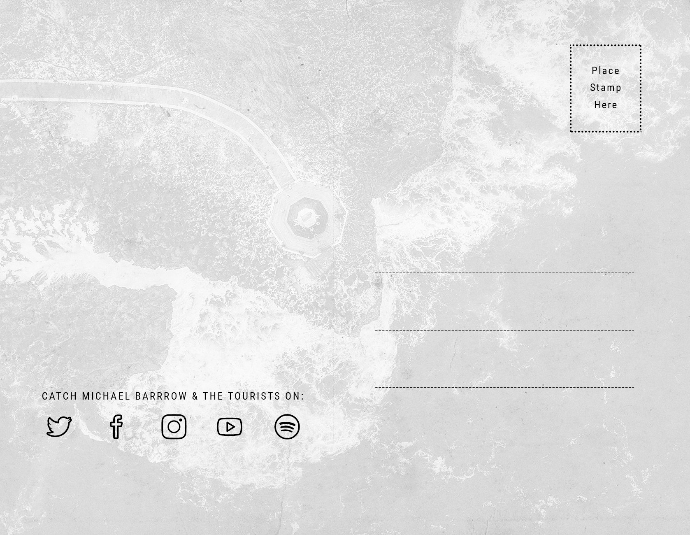
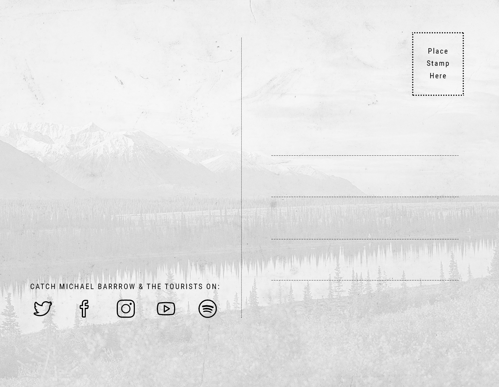

Throughout 2016-2018, I was the lead guitarist for [Michael Barrow & the Tourists](https://open.spotify.com/artist/1mhe70fSiQDyc16JVlhBUE?si=ZJI76VbpTvS1fMPwT5-bQg). In addition to playing lead guitar, I also produced most of the band's visual content–album art, merchandise, flyers, etc. This post includes all of the content I felt was either my best work or the most impactful work.

## Album art

### Juneau

[Juneau](https://open.spotify.com/album/6paW7rC4mJ5zUY43nWuuc4?si=yW3pQT-9RPCSa3pmLcm-xw) was the first full-length album that the band released, and the only one I contributed to. We decided to do a limited run of physical cds with a 3-panel folding insert. I designed the album art and provided the landscape photography. Other photography was provided by Jenna Harmon.

One of the touches I was the most proud of was the way I styled the lyrics; I applied the accent color to the title of the song wherever it occured in the song. This worked all of the songs except "Sad song"–which I opted to color the entire song.

  

  

  <TwoUp>

    

    

  </TwoUp>

### Something New

[Something New](https://open.spotify.com/album/1ekqkcJ1gtdyCRnkZu7H7J?si=5wjILF9UQgy8GD_aIBIe2g) is a 5-song EP and the last contribution musically I made to the band. Ahead of the release of the EP, two singles were released: Sweet Honey and Never Stop. I created a visual identity for the releases and was the primary contributor to the album artwork for the releases. 

My article ["The Value of Iterative Design"](/blog/the-value-of-iterative-design 'The blog post explaining the iterations I went through to get to my final design for Sweet Honey') goes in depth about the process I went through to create the first album artwork of the series (Sweet Honey), which created the visual identity for the susequent artwork.

**EP artwork**

This artwork was partially rejected; the band opted to go with a slightly different version that was modified by a band member. This design was also modified and used for a follow up EP, [Something Different](https://open.spotify.com/album/5lBfK9f7ttxIC95mdTTacq?si=TA2esT3WRfKUYz0KonCV3Q) (a remix version of the EP).

  

**Never Stop**

  

**Sweet Honey**

  

### Santa Barbara Sessions

[Santa Barbara Sessions](https://open.spotify.com/album/5tt75nfPFSB9Irt84PEIR9?si=6Aui4ehbQ8eqa6jzniuOLQ) is a live 5-song EP that we released as a follow up to Juneau. It includes acoustic versions of two songs from _Juneau_, two cover songs, and one new original. I did all the audio engineering on this EP (recording, mixing, mastering), but provided no musical contribution. I collaborated with bandmate Zach Collier on the idea (his dad provided the photography), and then I completed the design.

  

## Flyers

### Are you a tourist? posters

We did a promotional campaign featuring the tagline "Are you a tourist?". I created these two posters for that campaign.

  <TwoUp>

    
    

  </TwoUp>

## Merchandise

### Tourist postcard

We wanted a distinct, physical item we could hand out after shows to people to remember the band and promote our socials. Since we were the tourists, the idea of a postcard came up. I did two designs, and we decided to print the ocean-themed design.

    
  {/* <TwoUp>
    
  </TwoUp> */}

  <TwoUp>
    
    
  </TwoUp>

