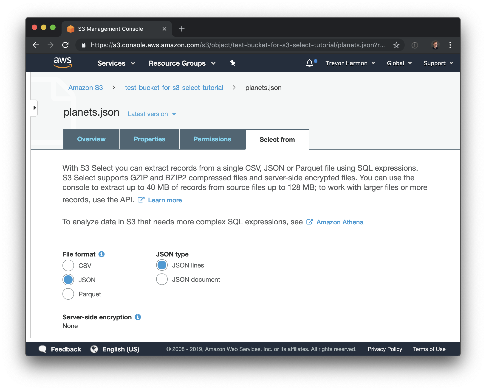
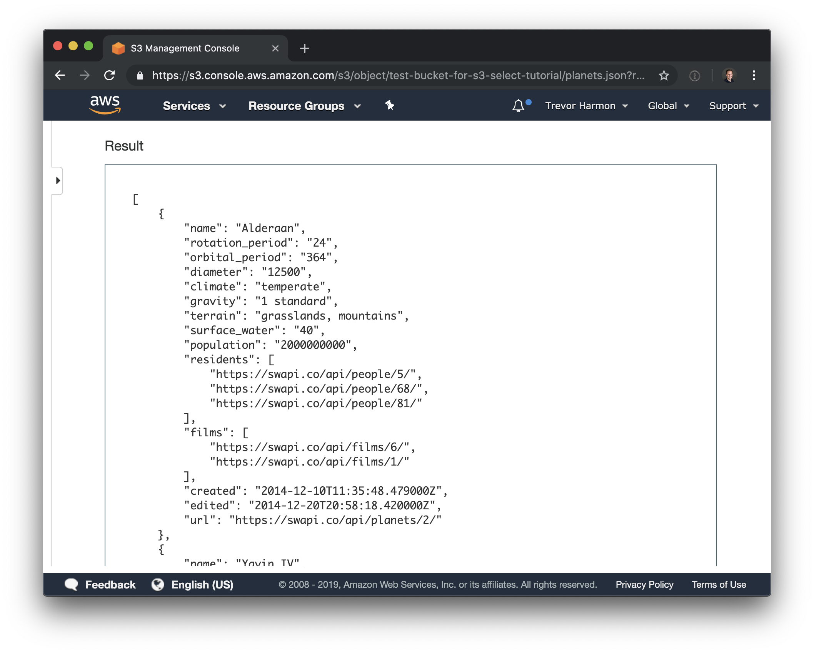
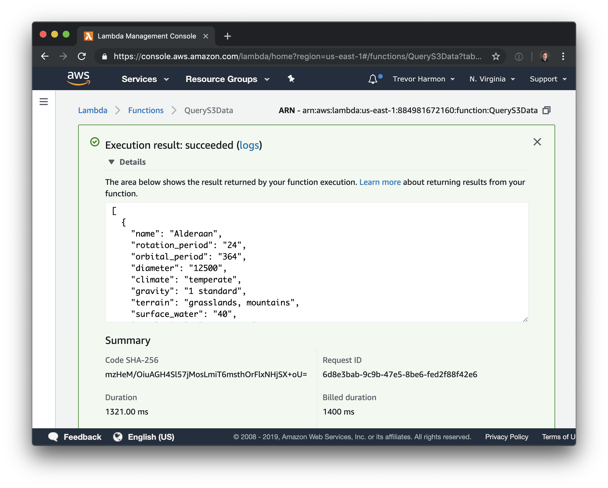

About a year ago, AWS publicly released S3 Select, a service that lets you query data in S3 with SQL-style queries. They [announced support][1] for a Javascript SDK in July 2018, and provided an example of how to query CSV data. I recently wanted to use S3 Select, but I was querying JSON. Here's an example of how to use S3 select in Node.js to query JSON data.

_Note: If you are unfamiliar with AWS, you might run across terms or instructions in the first step that are unfamliar to you. I won't go into depth with the initial instructions, but there are many AWS-related resources that can help you understand. I would recommend looking at those before this article._

## Initial Setup

The data that I'll be querying against is from the Star Wars API (I grabbed the first page of the [Planets list][2]). It looks something like this:

```JSON
{
	"count": 61,
	"next": "https://swapi.co/api/planets/?page=2",
	"previous": null,
	"results": [
		{
			"name": "Alderaan",
			"rotation_period": "24",
			"orbital_period": "364",
			"diameter": "12500",
			"climate": "temperate",
			"gravity": "1 standard",
			"terrain": "grasslands, mountains",
			"surface_water": "40",
			"population": "2000000000",
			"residents": [
				"https://swapi.co/api/people/5/",
				"https://swapi.co/api/people/68/",
				"https://swapi.co/api/people/81/"
			],
			"films": [
				"https://swapi.co/api/films/6/",
				"https://swapi.co/api/films/1/"
			],
			"created": "2014-12-10T11:35:48.479000Z",
			"edited": "2014-12-20T20:58:18.420000Z",
			"url": "https://swapi.co/api/planets/2/"
		},
		...
	]
}
```

I took that data and stored it in an S3 bucket, and then created a lambda with the most recent version of Node.js as the lambda runtime. I also created an IAM role to give that lambda `GET` access to S3.

## Writing the Query

I found it easier to first get the query working using the AWS console before incorporating it into my lambda. To test a query, navigate to your bucket, click on the file you want to run the query against, and choose the "select from" tab:



Ensure the defaults match what you're trying to do and click "next". You'll then see a "SQL expression" section that lets you insert a query and test it. Here's the query we're going to run:

```SQL
SELECT * FROM s3object[*].results[*] r;
```

Running that query produces a list of planets:



The syntax is a bit strange, the `[*]` means something like "give me everything that is within this specific array".

## Initial Setup Code

We need to first determine the parameters and bucket information before we can run a query. Let's start writing this lambda with the setup code:

```javascript
const AWS = require('aws-sdk');
const S3 = new AWS.S3();

exports.handler = async (_, context) => {
  try {
    // 1
    const query = 'SELECT * FROM s3object[*].results[*] r;';
    // 2
    const bucket = 'test-bucket-for-s3-select-tutorial';
    const key = 'planets.json';

    // 3
    const params = {
      Bucket: bucket,
      Key: key,
      ExpressionType: 'SQL',
      Expression: query,
      InputSerialization: {
        JSON: {
          Type: 'DOCUMENT',
        },
      },
      OutputSerialization: {
        JSON: {
          RecordDelimiter: ',',
        },
      },
    };

    // 4
    const data = await getDataUsingS3Select(params);

    context.succeed(data);
  } catch (error) {
    context.fail(error);
  }
};
```

About the code:

1. The S3 Select query that we're going to run against the data.
2. The bucket and key of the file we're querying.
3. The parameters that we're going to use to query; I was able to glean this information from the original S3 select [announcement post][1] and from the [docs][3].
4. A soon-to-be-written function that does the work and returns the data.

## 3. Data Function

Now that we've got our parameters set up, let's write the function that does the work for us:

```javascript
const getDataUsingS3Select = async (params) => {
  // 1
  return new Promise((resolve, reject) => {
    S3.selectObjectContent(params, (err, data) => {
      if (err) {
        reject(err);
      }

      if (!data) {
        reject('Empty data object');
      }

      // This will be an array of bytes of data, to be converted
      // to a buffer
      const records = [];

      // This is a stream of events
      data.Payload.on('data', (event) => {
        // There are multiple events in the eventStream, but all we
        // care about are Records events. If the event is a Records
        // event, there is data inside it
        if (event.Records) {
          records.push(event.Records.Payload);
        }
      })
        .on('error', (err) => {
          reject(err);
        })
        .on('end', () => {
          // Convert the array of bytes into a buffer, and then
          // convert that to a string
          let planetString = Buffer.concat(records).toString('utf8');

          // 2
          // remove any trailing commas
          planetString = planetString.replace(/\,$/, '');

          // 3
          // Add into JSON 'array'
          planetString = `[${planetString}]`;

          try {
            const planetData = JSON.parse(planetString);
            resolve(planetData);
          } catch (e) {
            reject(
              new Error(
                `Unable to convert S3 data to JSON object. S3 Select Query: ${params.Expression}`,
              ),
            );
          }
        });
    });
  });
};
```

In addition to the comments in the code itself, here are some particular things to be aware of:

1. I'm wrapping the `selectObjectContent` callback within a promise, so I can use the `getDataUsingS3Select` function with either Promises or Async/Await. The [documentation][4] for the S3 javascript SDK lists a few ways you can handle the callback, and even lists an async/await example (marked as experiemental). I wasn't able to get their async/await example to work on my end, so wrapping the callback in a promise was the next-best thing.
2. Once the data is received, converted to a buffer and then to a string, I remove any trailing commas. This is because when the data comes back from S3 select, it looks like `{}, {}, {},`. Throwing `JSON.parse()` at that fails when it encounters the trailing comma.
3. In addition to removing the trailing comma, I need to "wrap" the objects in an array, so `JSON.parse()` comes back with an array of objects.

At certain points while trying to get this function working, I ran into the following error:

```bash
TypeError: Cannot read property 'Payload' of null
```

If you run into this error, I would recommend that you:

1. Double check your S3 Select query by using the S3 console
2. Double check permissions on your bucket and lambda–make sure that your lambda has `GET` permissions on your bucket.

## Fetch the Data

If you've made it this far, it's time to run your lambda! When I run my lambda, the output looks like this:



## Conclusion

A final version of the code is on this [Github gist](https://gist.github.com/thetrevorharmon/6b831875cde98e5dc7f7458f6112b061). Hopefully by this point you have a basic, working example of getting JSON data out of S3 by using Node.js. I found this significantly easier than trying to use a managed service like Athena or manually parsing through S3 files to find the data I want. S3 Select makes getting JSON data out of S3 less painful while also making it more targeted.

[1]: https://aws.amazon.com/blogs/developer/introducing-support-for-amazon-s3-select-in-the-aws-sdk-for-javascript/
[2]: https://swapi.co/api/planets/
[3]: https://docs.aws.amazon.com/AmazonS3/latest/API/RESTObjectSELECTContent.html
[4]: https://docs.aws.amazon.com/AWSJavaScriptSDK/latest/AWS/S3.html#selectObjectContent-property
