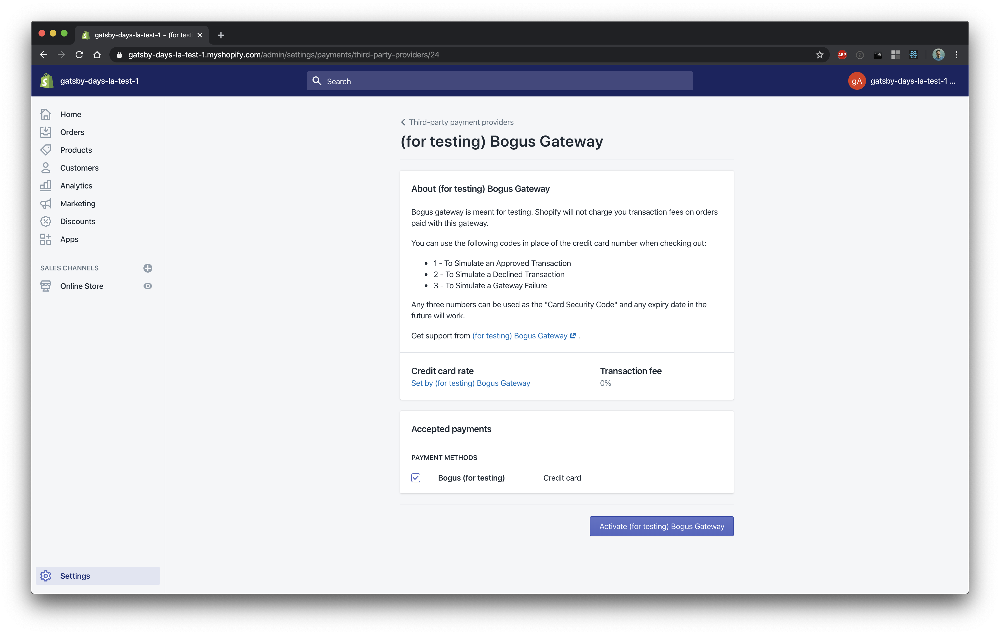
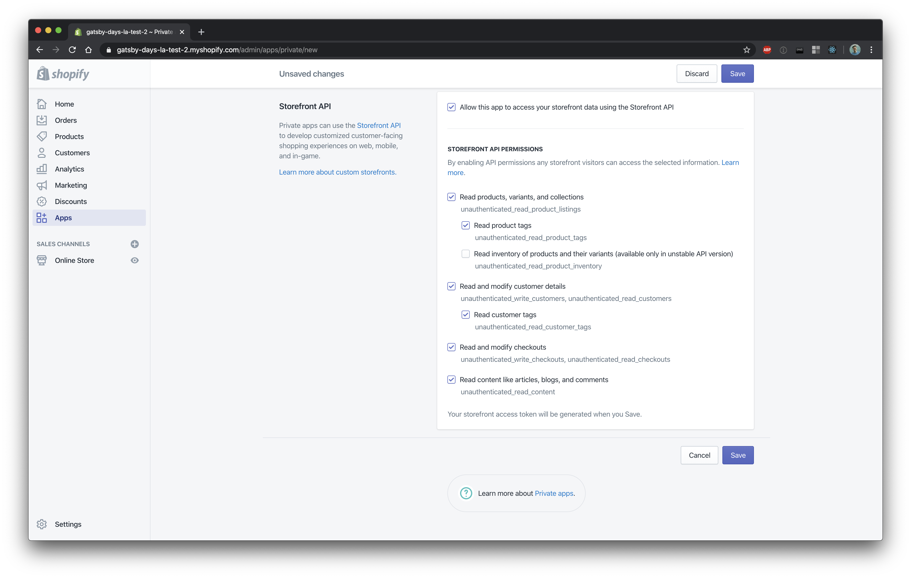
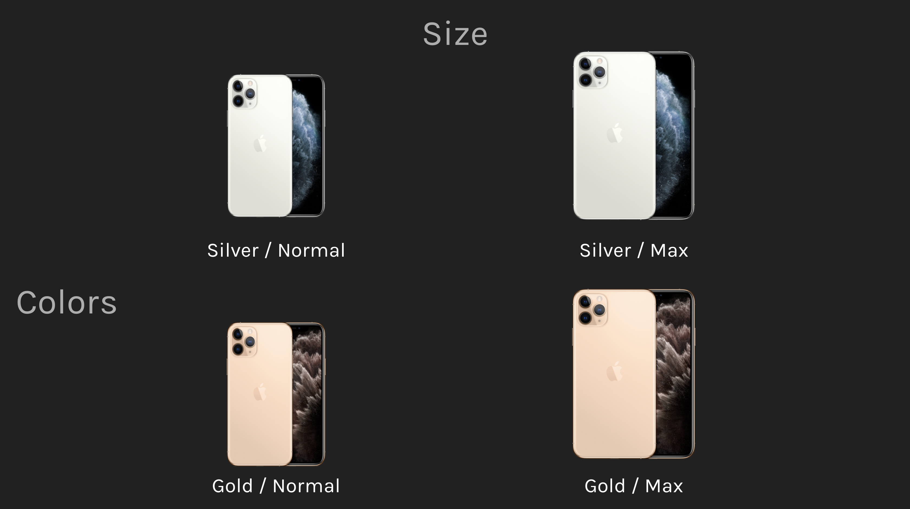
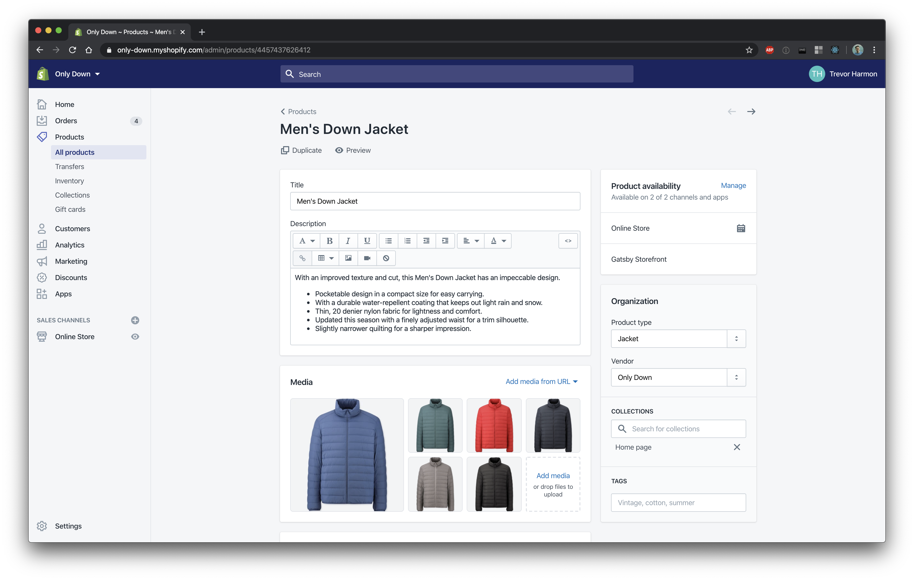
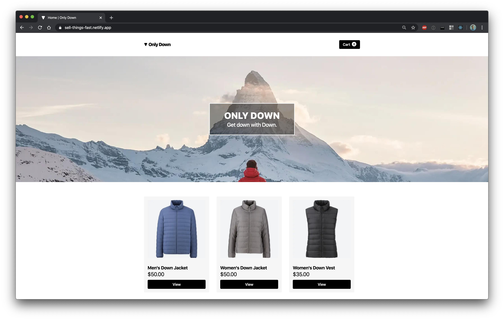

Speed is the most important factor in converting patrons to buyers online. According to a [study by Akamai][3], a 100ms delay causes conversion to drop 7%. If that's additive, a 1 second delay would cause a site to lose 51.6% of its customers!

If speed is the most important thing in e-commerce, then Gatsby is your best friend in building an e-commerce site. Gatsby's performance has been [written][4] [about][5] [already][6], but for me it comes down to this:

<div className="[&>img]:my-0 my-medium">

<span className="Caption mt-little block">Photo courtesy of [Grant Glidewell][24].</span>
</div>

Out of the box, Gatsby's [lighthouse][7] score shows just how performant it is ⚡. But Gatsby won't do _all_ the e-commerce work for you–that's where Shopify comes in. I might be [biased][8], but I think Shopify is the best e-commerce platform to build on. If you're wondering why, here are just a few (of the many!) reasons:

1. Shopify is not just a product but also a platform with a large and diverse [app ecosystem][9]. If Shopify doesn't perfectly meet your needs out of the box, there's a good chance that you'll be able to find apps that meet your needs.
2. Shopify is [priced][10] to scale with your business. You get to focus on selling products instead of trying to figure out how to pay for software licenses.
3. The [Shopify Fulfillment Network][11] enables merchants to offer competitive shipping times.

Building an e-commerce store with Shopify and Gatsby lets you control the entire customer experience (not to mention a great developer experience!) while leveraging the power of Shopify.

## Building our first Gatsby-powered store

Let's imagine that our good friend Derek wants our help in building an online store. He's a goose farmer, and makes goose down jackets. Here's him with his geese:


He wants to set up his own brand of down jackets called "Only Down", and he's asked that we help with the website. Here are the steps we'll take to do that:

1. Setup Shopify store with necessary options
2. Pull data from Shopify into Gatsby
3. Use Shopify data in Gatsby to create pages
4. Use shopify-buy plugin to manage checkout
5. Buy something!

## Setting up a Shopify store

When setting up a Shopify store, the first decision to make is the type of account we'll signup for: store trial or [Shopify partner][13]. Each option has its benefits:

- **Store Trial:** the store trial/plan is great for those who know exactly what they want to build and are ready to sell products almost immediately. The trial is 14 days long and allows you to do everything you need to do within Shopify for this process. The only downside is that the checkout experience is disabled until you choose a plan.
- **Shopify Partner:** a Shopify partner account allows you to build on top of Shopify without focusing so much on what products you're selling. It allows you to have the full store experience (including the checkout experience), lets you build stores and apps, and just generally experiment with Shopify. Oh, and it's free! 🎉

After looking at each, we sign up for a Partner account, make a new demo store, and we're ready to go! When setting up our store, we'll need to do two distinct steps to get a full-functioning "test" store: set up a test payment gateway and create a new private app.

### Bogus Gateway

Shopify has a ["bogus gateway"][14] that lets you accept fake credit cards in order to test the customer experience end to end. To set this up, you'll need to take the following steps:

- Go to your store's settings
- Choose "Payment Providers" and third party payment providers
- Search for "Bogus Gateway", and then activate it



Once you've activated the bogus gateway, you'll be able to send fake transactions while testing.

### New Private App

After activating the bogus gateway, the next thing to do is to create a new private app. To do this, you'll take the following steps:

- Go to the "Apps" tab, and then click the "Manage Private Apps" link
- Create a new private app, and fill in the appropriate information
- At the bottom of the private app creation page, make sure to check the **Storefront API** section. This is the API that [gatsby-source-shopify][15] uses to pull product information into Gatsby.
- Under the Storefront API section, be sure to check the boxes next to **Read product tags** and **Read customer tags**. If you don't, Gatsby will throw an error that might seem confusing or hard to understand. Might as well catch it now!



Once you've filled out the form, save it and take note of the Storefront API token it gives you:


This API token will be the token you use to get data into Gatsby later on, so hold on to it!

At this point, you'll need to set up product in your store to test with (otherwise you'll be testing with an empty store). I would recommend creating some dummy products (if you have no real ones), and adding some additional options to those products (so if you add a shirt, add it in multiple colors). Now that we're talking products, it's useful to go over some Shopify terms to make it easier going foward.

## Products, Options, Variants

While you are setting up your products, it's helpful to have a mental model of how Shopify's product model is set up. The three words to remember are **products**, **options**, and **variants**.

- Products are the most generic level (e.g. a jacket)
- Options are different features that the product might have (e.g. size, color)
- Variants are a particular combination of options within a product (e.g. medium green jacket)

To make sure we understand exactly what this means, take the iPhone for example. We'll simplify the latest iPhone (iPhone 11 Pro) into two options:

- Size (Normal or Max)
- Color (Silver or Gold)



If you were to model our simplified iPhone 11 Pro within Shopify it would look like this:

- Product: iPhone 11 Pro
- Options:
  - Size: Normal, Max
  - Color: Silver, Gold
- Variants:
  - Normal Sized Silver iPhone 11 Pro
  - Normal Sized Gold iPhone 11 Pro
  - Max Sized Silver iPhone 11 Pro
  - Max Sized Gold iPhone 11 Pro

This model is important to understand because when interacting with products on an online store, _you are interacting with variants_. When you add an item to a cart, you are adding _a particular variant_ of that product to the cart, not the product itself. Inventory is associated with a variant, not a product.

Now that we understand the distinction between products and variants, it's time to create some products in Shopify! Here's one example of a product (Men's Down Jacket) that I created within Shopify:



## Getting Data out of Shopify and into Gatsby

Now that we have products in our store and an understanding of the product model, we can move on to working with those products within Gatsby. To get data into Gatsby, you use the [gatsby-source-shopify][15] plugin. The plugin has two required options:

- `shopName`: This is the part of your store's url before `myshopify.com`. So if your Shopify store was named `i-love-jackets.myshopify.com`, the value for `shopName` would be `i-love-jackets`.
- `accessToken`: This is the Storefront API token that we saved from earlier.

After installing the plugin, let's take a look at the data coming back from Shopify. If you use the Gatsby [GraphiQL interface][16], it allows you to run queries and explore the data associated with Gatsby source plugins. Here's a sample query to illustrate the different types of data we have access to:

```graphQL
{
  allShopifyBlog(limit: 1) {
  	nodes { id }
  }
  allShopifyProduct(limit: 1) {
  	nodes { id }
  }
  allShopifyCollection(limit: 1) {
  	nodes { id }
  }
  allShopifyProductOption(limit: 1) {
  	nodes { id }
  }
  allShopifyProductVariant(limit: 1) {
  	nodes { id }
  }
}
```

This is a pretty simple query that shows us the different types of data we can access (that comes from Shopify). The types that we really care about are `allShopifyProduct`, `allShopifyProductOption`, and `allShopifyProductVariant`.

Let's dig a bit deeper into the kind of information that exists on a variant–here's a graphql query that returns some useful information:

```graphql
{
  allShopifyProductVariant(limit: 1) {
    nodes {
      title
      shopifyId
      selectedOptions {
        name
        value
      }
    }
  }
}
```

This query returns the following object:

```json
{
  "data": {
    "allShopifyProductVariant": {
      "nodes": [
        {
          "title": "Gray / Small",
          "shopifyId": "Z2lkOi8vc2hvcGlmeS9Qcm9kdWN0VmFyaWFudC8zMTc4NDQ5ODkyMTUxNg==",
          "selectedOptions": [
            {
              "name": "Color",
              "value": "Gray"
            },
            {
              "name": "Size",
              "value": "Small"
            }
          ]
        }
      ]
    }
  }
}
```

You can see the computed title that describes all of the selected options, as well as the full information about the options. There is also a `shopifyId` field–this field is important because it's the identifier we use when adding an item to a user's cart.

At this point, we're ready to start building our store in Gatsby. Gatsby has [an excellent article][17] on getting things working with Shopify, so I won't cover what's there in too much detail. At a high level:

- As we've seen, `gatsby-source-shopify` works just like every other source plugin
- You can pull in product data using Gatsby's StaticQuery or by using a page query
- You can get a list of products and generate pages based on those products

If you want to explore an example of some of these concepts, check out the [index page][18] of the site I built for this talk.

After setting up my source plugin and getting the data into my Gatsby site, I've started using [Theme UI][19] to get my site built with products being displayed. Here's what it looks like:



## Using shopify-buy to manage the cart

We've set up a store on Gatsby and we're getting data in, but how about getting data "out" and communicating with Shopify's servers? That's where the Shopify-provided [shopify-buy][20] plugin comes in. Shopify-buy is a javascript library that facilitates the connection between the Gatsby store and Shopify, and makes it easy to get a managed cart set up. Here are the most important functions that the plugin offers (for our use case):

- `buildClient`: This sets up the client object that connects to Shopify.
- `addLineItems`: This adds items to the cart by using the variant id.
- `removeLineItems`: This removes items from the cart.
- `fetch`: This fetches an existing checkout, to let you persist the cart for a user between visits.
- `checkout.webUrl`: This provides the url to the currently managed cart, and is where you send users when they want to checkout and complete their purchase.

The best way to manage the shopify-buy client object is by creating it once and sharing it throughout the application. I chose to do this with React Context, but you could do it with redux or other state managers. The React Context code that I wrote to manage the shopify-buy client is [on Github][21]. Here's what I'm doing in that file:

1. I set up the shopify-buy client with the same information that I provided the `gatsby-source-shopify` plugin. The names are slightly different, and the only difference in values is that the `shopName` is `domain`, which is the full Shopify url of your store.
2. I create the context and provide it some initial values.
3. I create a `StoreContextProvider` that saves the client in state and does some checks to make sure it's still a valid session.
4. I create some hooks like `useCartCount` to make working with the client easier.

Once I have the context set up, I wrap my entire application in it using the [gatsby-browser.js][22] file. This ensures that every page on my site can access the client.

Now that there's a working cart set up, it's time to see it in action! You can see [the working site on Netlify][23].

## What's next?

While there are some great things about my store, there is a lot of room for improvement. Here are two ideas of what you could do to improve on the code I've written:

- It only checks to see if an item is stock when you build the site. Instead, you could check to see if it's in stock when a user visits the page.
- It shows zero for the tax estimate until you go to the checkout page. You could ask the user for their address to calculate taxes before sending them to checkout.

Just don't forget that the _most important_ thing is this:


Now go sell things fast with Gatsby and Shopify!

_P.S. This post is an adaptation of a talk I gave at Gatsby Days LA. You can see that talk on Gatsby's [YouTube channel][1]. If you came here looking for the slides for my talk, they're [on Google Slides][2]._

_P.P.S. While I was buildling this, I realized that this was more complicated than I though it should be. **I'm releasing something soon** that will make this process much easier–follow me [on Twitter][25] or subscribe to my blog to find out about that when it comes out!_

[1]: https://www.youtube.com/watch?v=tUtuGAFOjYI
[2]: https://docs.google.com/presentation/d/e/2PACX-1vRW2cq1SarLP41OS5cCTIz9WKDLEUNftOCVnOlb7LLph1m0Bm_Eirs_8PLeVBbmW89Xk3NXXcBjMkKZ/pub?start=false&loop=false&delayms=3000
[3]: https://www.gigaspaces.com/blog/amazon-found-every-100ms-of-latency-cost-them-1-in-sales/
[4]: https://www.freecodecamp.org/news/how-gatsby-is-so-blazing-fast-c99a6f2d405e/
[5]: https://www.gatsbyjs.org/blog/2017-09-13-why-is-gatsby-so-fast/
[6]: https://herchel.com/2018-01-10-why-is-gatsby-fast-prpl/
[7]: https://developers.google.com/web/tools/lighthouse
[8]: https://twitter.com/thetrevorharmon/status/1158445074981650432?s=21
[9]: https://apps.shopify.com/
[10]: https://www.shopify.com/pricing
[11]: https://news.shopify.com/introducing-shopify-fulfillment-network
[12]: https://www.flickr.com/photos/53277017@N08/9258527696/in/album-72157634580736157/
[13]: https://www.shopify.com/partners
[14]: https://www.google.com/search?q=bogus+gateway+shopify&oq=bogus+gatw&aqs=chrome.1.69i57j0l7.1708j1j7&sourceid=chrome&ie=UTF-8
[15]: https://www.gatsbyjs.org/packages/gatsby-source-shopify/
[16]: https://www.gatsbyjs.org/docs/running-queries-with-graphiql/
[17]: https://www.gatsbyjs.org/docs/building-an-ecommerce-site-with-shopify/
[18]: https://github.com/thetrevorharmon/sell-things-fast/blob/master/src/pages/index.js
[19]: https://theme-ui.com/
[20]: https://shopify.github.io/js-buy-sdk/
[21]: https://github.com/thetrevorharmon/sell-things-fast/blob/master/src/context/StoreContext.js
[22]: https://github.com/thetrevorharmon/sell-things-fast/blob/master/gatsby-browser.js
[23]: https://sell-things-fast.netlify.com
[24]: https://blogwell.io/tag-performance/
[25]: https://twitter.com/thetrevorharmon
