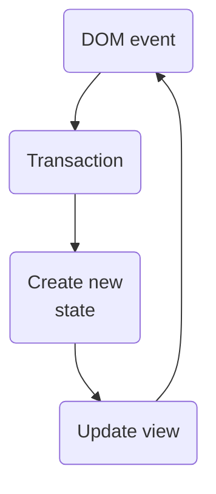
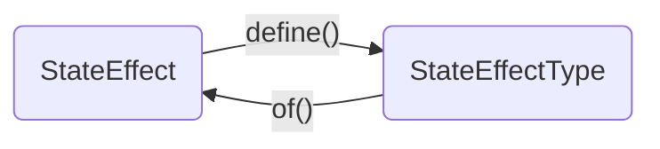

In July 2022, I was tasked with integrating [CodeMirror](https://codemirror.net/), a “code editor component for the web”, into [ShopifyQL Notebooks](https://shopify.engineering/building-commerce-data-models-with-shopifyql). Learning the ins and outs of the library was more complex than I anticipated, and there were many times that I came away from reading the docs scratching my head. After spending many months staring at [the documentation](https://codemirror.net/docs/) and [discussion board](https://discuss.codemirror.net/), I feel like I've emerged on the other side of a long journey of learning CodeMirror with a clearer picture of the core concepts. My goal with this article is to explain those concepts and provide commentary in addition to the many [examples](https://codemirror.net/examples/) that already exist on the CodeMirror site.

<Callout>
  This article is not meant to replace reading the docs, but rather give a
  different take on various concepts taught there. Make sure you [give those a
  read](https://codemirror.net/docs/), too. Might be best to start with the
  [system guide](https://codemirror.net/docs/guide/).
</Callout>

## Structure & lifecycle

Rather than trying to bundle all of the editor concerns into a single, massive package, CodeMirror has an intentional divide between (1) core capabilities and (2) added functionality through extensions. This separation enables the developer to pick and choose the functionality they want. Within the core functionality, there are two key classes:

1. `EditorView`
2. `EditorState`

The `EditorView` manages the connection to the DOM, and handles any DOM events that occur within the editor–typing, focusing, clicking, re-rendering DOM elements, etc.

As we have learned from libraries like jQuery, using the DOM for state management is slow and painful to manage. CodeMirror (like many other libraries) has abstracted the editor's state into a separate place called `EditorState`. While the `view` is concerned about what the DOM looks like, the `state` is primarily concerned about what the _document_ looks like (while also managing the state of the rest of the editor).

In order to keep updates to the state very fast, the editor state only performs pure updates (updates that do not produce side effects). A view may produce a side effect as a result of the change in state, but the state focuses exclusively on re-computing changes to the state based off of inputs and nothing else.

The typical lifecyle for an update within CodeMirror looks like this (this diagram is from the **State and Updates** section of the [system guide](https://codemirror.net/docs/guide/)):



A transaction defines a change to the state. For example, updating the text of an editor would trigger a transaction with a list of changes. The state takes in those changes, makes changes to the internal document, and produces a new state. The view then takes that state and updates the DOM with the changes.

## Extensions

Functionality beyond the core capability lives inside of extensions. [`Extension`](https://codemirror.net/docs/ref/#state.Extension) is a bit of a catch-all term within CodeMirror, and I think of them as “ways I can add other functionality to an editor”. CodeMirror offers a breadth of functionality through extensions–here's a brief list of some of the things it can do:

- [Language](https://codemirror.net/docs/ref/#language.Language) support
- [Keyboard shortcuts](https://codemirror.net/docs/ref/#commands)
- [Autocomplete](https://codemirror.net/docs/ref/#autocomplete)
- [Linting](https://codemirror.net/docs/ref/#lint)

This list really only scratches the surface but highlights the wide range of possible features that CodeMirror provides. I would recommend looking at the [reference guide](https://codemirror.net/docs/ref/) to see all of the extensions that CodeMirror offers.

## CodeMirror primitives

Many of the extensions offered by CodeMirror are "pre-built"–internally, they take CodeMirror primitives and create an extension with a single configuration point. However, there are times when you need to craft your own for custom functionality. The primitives you will most likely encounter are:

- Facet
- StateField
- ViewPlugin
- Decoration

### Facet

[The docs](https://codemirror.net/docs/ref/#state.Facet) describe a facet as:

> A facet is a labeled value that is associated with an editor state. It takes inputs from any number of extensions, and combines those into a single output value.

I imagine a CodeMirror facet sort of like adding a value to a javascript object. Let's say that we represent the editor state as a simple object (the actual state doesn't look like this):

```js
const state = {
  document: `const hello = 'world';`,
  selection: {anchor: 0, head: 0},
};
```

Now we want to add a property to our state called `tabSize`. This will be the default tab size for an editor. In this example, we can simply add a new member to the object:

```js
const state = {
  document: `const hello = 'world';`,
  selection: {anchor: 0, head: 0},
  tabSize: 4, // highlight-line
};
```

We have a default tab size of 4, but what if we had two editors each with its own tab size? We would need a way to handle the concept of a default value with the option for clients to override it. We could take an approach where we write a function with default values that are configurable:

```js
// highlight-next-line
const state = (tabSize = 4) => {
  return {
    document: `const hello = 'world';`,
    selection: {anchor: 0, head: 0},
    tabSize, // highlight-line
  };
}; // highlight-line
```

However, this approach doesn't scale as our needs become more complex. It requires us to add every possible option to our editor state object, which means that even if our editor is very basic, it still contains all of the functionality of a very complex editor.

CodeMirror solves this problem with the [`Facet`](https://codemirror.net/docs/ref/#state.Facet) class. The class provides a developer a way to take multiple inputs and produce a single output in a way that can be referenced throughout the code editor.

The simplest way to use a facet is to use its [`of`](https://codemirror.net/docs/ref/#state.Facet.of) method which takes a value and returns an extension. The extension internally holds the given value and passes it to the editor state. For example, if you want to set the tab size or set the editor to read only, you can use facets that are static methods on the `EditorState` class:

```ts
const tabSize = EditorState.tabSize.of(4);
const readOnly = EditorState.readOnly.of(true);
```

If you pass these to an instance of `EditorState`, you can read them with the [`state.facet()`](https://codemirror.net/docs/ref/#state.EditorState.facet) method:

```ts
const tabSizeValue = state.facet(EditorState.tabSize);
const readOnlyValue = state.facet(EditorState.readOnly);
```

CodeMirror uses facets in multiple ways to provide extensibility. As shown before, they can be as simple as a configuration value (like `tabSize`). Other facets provide "hooks" into CodeMirror's internal workings. For example, if you wanted to set up a function that logged a message to the console every time the editor changed focused, you could use the view [`updateListener`](https://codemirror.net/docs/ref/#view.EditorView^updateListener) facet:

```ts
const focusStateLogger = EditorView.updateListener.of(
  (viewUpdate: ViewUpdate) => {
    if (!viewUpdate.focusChanged) {
      return;
    }

    console.log(
      `The user ${
        viewUpdate.view.hasFocus ? 'is' : 'is not'
      } focusing on the editor`,
    );
  },
);
```

Some facets return classes that display DOM elements, like [`showTooltip`](https://codemirror.net/docs/ref/#view.showTooltip) or [`showPanel`](https://codemirror.net/docs/ref/#view.showPanel). You use these facets in a similar way as the other facets, with the `of` method:

```ts
const panel = showPanel.of((view) => {
  const dom = document.createElement('div');
  const tabSize = view.state.facet(EditorState.tabSize);
  dom.textContent = `This is my bottom panel. Tab size is ${tabSize}.`;

  return {dom};
});
```

Let's say that you want to have a custom configuration value (like `editorName`) that you provide through a facet. To set up an use the facet, the code might look like this:

```ts
const nameFacet = Facet.define<string>();
const nameExtension = nameFacet.of('My Cool Editor');
const nameValue = state.facet(nameFacet);
```

You first define a facet (without a value), then create an extension from that instance with a value, and then you can read the value out of state with `state.facet()`.

To put this all together, here's an editor with a `tabSize` facet, a panel that uses the `showPanel` facet, our custom name facet, and a focus logger that uses the `updateListener` facet (open your dev tools to see the logs when you focus and blur on the editor):

import {FacetExample} from './FacetExample';

<FacetExample />

Facets cover a wide range of functionality within CodeMirror, but I have observed that there tends to be two types of facets (illustrated by the exmaples above):

1. Facets provided by CodeMirror. These range from simple configuration values to listeners to DOM manipulation.
2. Facets created by a developer provided to CodeMirror. These are not limited to configurable values, but are usually the best tool for that type of data.

If you have a value that you need to track that is static or fits into the limits of the [facet's API](https://codemirror.net/docs/ref/#state.Facet^define^config), a facet may be the right choice. However, if you want to track a stateful value, you may be better off with a state field.

### StateField

[The docs](https://codemirror.net/docs/ref/#state.StateField) describe the capabilities of a state field:

> Fields can store additional information in an editor state, and keep it in sync with the rest of the state.

State fields are computed every time the state goes through an update cycle.Each time the cycle happens, the state field has an opportunity to recompute and provide a new value.

The two main ingredients of a state field are:

1. `create`: this receives the current value of the editor state and returns the initial value of the state field.
2. `update`: this receives the current value of the state field and the current transaction of an update cycle. It uses those to compute the new value for the state field.

Let's write a very simple state field to illustrate how these pieces fit together. Our state field will keep a running count of the number of times the document has changed in an editor.

```ts
const changeCounterStateField = StateField.define<number>({
  create: (state) => {
    return 0;
  },
  update: (currentValue, transaction) => {
    let newValue = currentValue;

    if (transaction.docChanged) {
      newValue += 1;
    }

    return newValue;
  },
});
```

A state field should return a value of a specific type from both its `create` and `update` methods. I've annotated the type to be `number` in this example to be explicit.

For the initial state, we don't need to compute a value from the state, and we simply return 0. During the `update` cycle, we can use the [`docChanged`](https://codemirror.net/docs/ref/#state.Transaction.docChanged) property on the transaction to conditionally add one to the value.

There are times when we want a state field to track a change emitted by some other field or extension. To accomplish that we can use a [`StateEffect`](https://codemirror.net/docs/ref/#state.StateEffect). The docs explain:

> [State effects] are often useful to model changes to custom state fields, when those changes aren't implicit in document or selection changes.

State effects are a way to wrap and pass a value between primitives. Because it requires you to create a class instance before passing the value around, it enables a very clear way to identify the type of a given value. Let's imagine that we want to update our state field to also increase the counter by a value in a state effect. We first need to create the state effect:

```ts
const updateCounterStateEffect = StateEffect<number>.define();
```

With this code, we have described that instances of `updateCounterStateEffect` will contain a number inside of them.

But wait–we actually didn't define a state effect–we defined a [`StateEffectType`](https://codemirror.net/docs/ref/#state.StateEffectType)! This is because the state effect type is the _descriptor_ of the value, whereas a state effect contains the _actual value_ itself. There is a cyclical relationship between `StateEffect.define()` and `StateEffectType.of()`:



Let's update our example and actually create a state effect:

```ts
const updateCounterStateEffectType = StateEffect<number>.define();
const incrementCounterByFiveStateEffect = updateCounterStateEffectType.of(5);
```

With this code, we have created a state effect that increments our counter by 5. Now that we can [dispatch](https://codemirror.net/docs/ref/#view.EditorView.dispatch) this state effect to update our counter, we need to update the state field to accept new values from this effect:

```ts
const changeCounterStateField = StateField.define<number>({
  create: (state) => {
    return 0;
  },
  update: (currentValue, transaction) => {
    let newValue = currentValue;

    if (transaction.docChanged) {
      newValue += 1;
    }

    // highlight-start
    for (const effect of transaction.effects) {
      if (effect.is(updateCounterStateEffectType)) {
        newValue += effect.value;
      }
    }
    // highlight-end

    return newValue;
  },
});
```

Each transaction contains an array of effects, and we can loop through them looking for our value. When the call to `effect.is()` returns true, the type for `effect.value` is inferred to be of type `number` (and therefore compatible with the `+=` operator).

In addition to tracking custom state, a state field can provide information to the view to know how to render the value contained in the state field. Let's say we want to display the count in a panel beneath the editor. We can utilize the state field's [`provide`](https://codemirror.net/docs/ref/#state.StateField^define^config.provide) argument to return an extension that recieves the value from the state field and renders that value in a panel.

We'll first make a small helper function to create the DOM element with the correct content:

```ts
function createCounterPanel(value: number): PanelConstructor {
  return () => {
    const dom = document.createElement('div');
    dom.textContent = `Current count is ${value}`;

    return {dom};
  };
}
```

This receives the value of the counter (which in our case is a number) and returns a function that creates the DOM element. It needs to a return a function to conform to the [`PanelConstructor`](https://codemirror.net/docs/ref/#view.PanelConstructor) spec, which is how we're going to create this element. Now we can update our state field to provide this as an extension:

```tsx
const changeCounterStateField = StateField.define<number>({
  create: () => {
    return 0;
  },
  update: (currentValue, transaction) => {
    let newValue = currentValue;

    if (transaction.docChanged) {
      newValue += 1;
    }

    for (const effect of transaction.effects) {
      if (effect.is(updateCounterStateEffectType)) {
        newValue += effect.value;
      }
    }

    return newValue;
  },
  // highlight-next-line
  provide: (value) => showPanel.from(value, createCounterPanel),
});
```

We're using the [`showPanel`](https://codemirror.net/docs/ref/#view.showPanel) facet to return an extension that takes the value and creates a panel with the desired content. You can see a working example of this below:

import {StateFieldExample} from './StateFieldExample';

<StateFieldExample />

As a final example, let's make a new state field that consumes a state effect that CodeMirror exports. Imagine that we want to keep a running list of all of the linter errors (of type `Diagnostic`) in our editor. We can make use of the [`setDiagnosticsEffect`](https://codemirror.net/docs/ref/#lint.setDiagnosticsEffect) state effect type that CodeMirror exposes to us. The code to track the diagnostics would look like this:

```ts
const diagnosticsStateField = StateField.define<Diagnostic[]>({
  create: () => [],
  update: (currentDiagnostics, transaction) => {
    let diagnostics = currentDiagnostics;

    for (const effect in transaction.effects) {
      if (effect.is(setDiagnosticsEffect)) {
        diagnostics = effect.value;
      }
    }

    return diagnostics;
  },
});
```

### Decoration

CodeMirror's `EditorView` class manages and updates the DOM as the state changes. There are times when you may want to manipulate the DOM in some way, but because the view manages it, any changes you make manually will be discarded when a state update cycle occurs and new version of the DOM is rendered.

One of CodeMirror's answers to this problem is the `Decoration` class, which enables you to manipulate the DOM in harmony with the view. Decorations enable you to modify the DOM of a range of content in some way. There are four types of decorations that CodeMirror offers:

1. [Mark decorations](https://codemirror.net/docs/ref/#view.Decoration^mark): These enable you to modify a range of content (like adding a classname). CodeMirror uses mark decorations to provide syntax highlighting.
2. [Widget decorations](https://codemirror.net/docs/ref/#view.Decoration%5Ewidget): These enable you to display a DOM element at a specific position.
3. [Replace decorations](https://codemirror.net/docs/ref/#view.Decoration^replace): These decorations act on a range of content and can replace a the range with a widget or they can hide (but not remove) the range.
4. [Line decorations](https://codemirror.net/docs/ref/#view.Decoration^line): Similar to mark decorations, these enable you to modify content, but it modifies it on a line basis instead of a character basis.

The `EditorView` class has a static facet called [`decorations`](https://codemirror.net/docs/ref/#view.EditorView^decorations) that returns an extension–this enables us to provide decorations to the view.

Let's make a simple widget decoration. Our decoration will display the midpoint of the editor (as a value) and will be positioned at the midpoint as well. We first need to implement the [`WidgetType`](https://codemirror.net/docs/ref/#view.WidgetType) class:

```tsx
class MidpointWidget extends WidgetType {
  toDOM(view: EditorView) {
    const midpoint = Math.floor(view.state.doc.length / 2);

    const dom = document.createElement('span');
    dom.textContent = `${midpoint}`;
    dom.className = 'midpoint-widget';

    return dom;
  }
}
```

This widget is very simple–it determines the midpoint based on the state a creates a little `<span>` with the right styling and content. In order to provide this widget to CodeMirror, we can use a state field. Our state field type will be [`DecorationSet`](https://codemirror.net/docs/ref/#view.DecorationSet)–even though we'll only have a single item in our set, using this as our type enables us to take advantage of the [`decorations`](https://codemirror.net/docs/ref/#view.EditorView^decorations) facet. Before we write that state field, we need a helper method that can take in a midpoint and return a decoration set with our widget in it:

```tsx
function getMidpointWidgetDecorationSet(midpoint: number) {
  const widget = new MidpointWidget();

  return Decoration.set([
    Decoration.widget({
      widget,
    }).range(midpoint),
  ]);
}
```

We call [`Decoration.widget`](https://codemirror.net/docs/ref/#view.Decoration^widget) in order to convert our widget into a decoration. From there, we call `range` on it–range describes the range of content that this widget is associated with. All decorations must be ranged in order to be properly displayed within the editor.

Now that we have a widget and a helper method, we can write our state field:

```tsx
const midpointWidgetStateField = StateField.define<DecorationSet>({
  create(state: EditorState) {
    const midpoint = Math.floor(state.doc.length / 2);

    return getMidpointWidgetDecorationSet(midpoint);
  },
  update(currentDecorations, transaction) {
    if (transaction.docChanged) {
      const midpoint = Math.floor(transaction.newDoc.length / 2);

      return getMidpointWidgetDecorationSet(midpoint);
    }

    return currentDecorations;
  },
  provide: (f) => EditorView.decorations.from(f),
});
```

Because the range fundamentally changes every time the document is edited (the midpoint is not based off an offset but instead based on the document length), we re-create the widget any time the document changes. Here's a working example of our midpoint widget:

import {MarkDecorationExample} from './MarkDecorationExample';

<MarkDecorationExample />

This really only scratches the surface of what you can do with decorations–if you want to learn more, the [CodeMirror Decoration Example](https://codemirror.net/examples/decoration/) page is a great place to start.

### ViewPlugin

The docs define a view plugin as:

> View plugins associate stateful values with a view. They can influence the way the content is drawn, and are notified of things that happen in the view.

Let's revisit our midpoint example. What if, instead of a widget that displays inline, we want our midpoint to display in the bottom right corner of the editor. Additionally, we only want our midpoint to display when someone is actively using the editor, but have it go away when they remove their focus from the editor.

A view plugin enables us to draw additional content in the editor in a way that isn't tied to a specific range. It receives updates when the view is redrawn which allows a developer to determine how the content provided by the view plugin should be updated.

You can create a view plugin in two ways:

1. [`ViewPlugin.define`](https://codemirror.net/docs/ref/#view.ViewPlugin^define): this is a "function style" way of creating a view plugin. You pass it a `create` function which receives the view and returns the plugin value (which can be `void`).
2. [`ViewPlugin.fromClass`](https://codemirror.net/docs/ref/#view.ViewPlugin^fromClass): this is a "class style" way of creating a view plugin. You pass it a class which implements the `create` method.

With our updated midpoint view plugin, we'll create the DOM element once and keep a reference to the element so that we can update it as the view changes. Since we need to keep a reference to the element, we can use the class style and save the element as one of the members of the class. Let's implememnt the `create` method of our plugin:

```ts
const midpointViewPlugin = ViewPlugin.fromClass(
  class {
    private widget: HTMLElement;

    constructor(view: EditorView) {
      // 1
      const div = document.createElement('div');

      // 2
      this.widget = view.dom.appendChild(div);

      // 3
      this.widget.classList.add('midpoint-widget');
      if (!view.hasFocus) {
        this.widget.classList.add('hidden');
      }

      // 4
      const midpoint = Math.floor(view.state.doc.length / 2);
      this.widget.textContent = `${midpoint}`;
    }
  },
);
```

The `create` method does the following:

1. Creates a new element.
2. Uses the [`view.dom`](https://codemirror.net/docs/ref/#view.EditorView.dom) property to access the underlying HTML element of the code editor and appends our new element to the dom. It also assigns the reference to that element to our private `widget` property.
3. Adds the class `midpoint-widget`, which will handle styling and positioning, and conditionally adds the class `hidden` if the editor is not in focus.
4. Sets the text of the widget to the midpoint of the document.

We also need to add an update and destroy method to handle changes in the editor:

```ts
const midpointViewPlugin = ViewPlugin.fromClass(
  class {
    private widget: HTMLElement;

    constructor(view: EditorView) {
      const div = document.createElement('div');

      this.widget = view.dom.appendChild(div);

      this.widget.classList.add('midpoint-widget');
      if (!view.hasFocus) {
        this.widget.classList.add('hidden');
      }

      const midpoint = Math.floor(view.state.doc.length / 2);
      this.widget.textContent = `${midpoint}`;
    }

    // highlight-start
    update(update: ViewUpdate) {
      if (update.docChanged) {
        this.widget.textContent = `${Math.floor(update.state.doc.length / 2)}`;
      }

      if (!update.focusChanged) {
        return;
      }

      if (update.view.hasFocus) {
        this.widget.classList.remove('hidden');
      } else {
        this.widget.classList.add('hidden');
      }
    }
    // highlight-end

    // highlight-start
    destroy() {
      this.widget.remove();
    }
    // highlight-end
  },
);
```

Our update function updates the text every time the document changes with a new value for the midpoint. It also shows and hides the widget based on if the user is focusing on the editor when the focus changes.

import {ViewPluginExample} from './ViewPluginExample';

<ViewPluginExample />

## Conclusion

Learning CodeMirror has been a really fun challenge. Despite the many hours of hitting roadblocks and staring at the docs, it's pushed me to be better at reading docs and digesting the information in a pratical way. Focusing on understanding the primitives that CodeMirror offers has been the best way I've found to overcome hurdles when working with CodeMirror.

For further reading, I would be sure to read through the [System guide](https://codemirror.net/docs/guide/) and [examples page](https://codemirror.net/examples/). Good luck!
