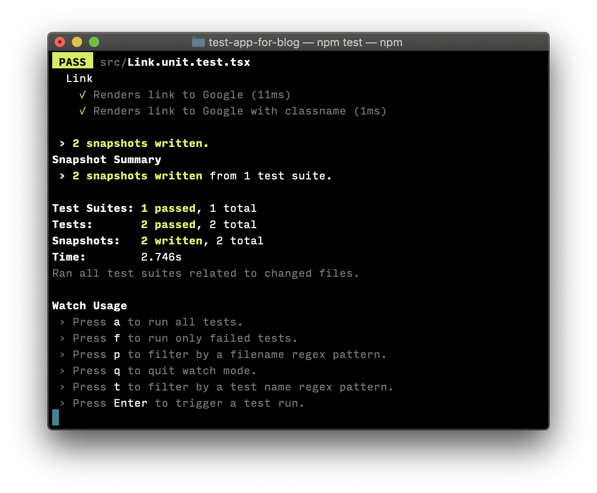

I was recently trying to get a Jest/Enzyme testing environment working with React (Create React App with Typescript) and all of the documentation I read couldn't help me fix this one error:


I finally figured out how to do it after reading a lot and trying out a handful of solutions. I'll be starting with a vanilla installation of CRA (with the Typescript flag set) as my starting point to illustrate how to get this working.

## A Create React App Gotcha

Because I'm using Create React App, there are certain benefits that I get out of the box, and one of those benefits is [Jest][1]. According to the [documentation][2], Create React App comes with:

> A fast interactive unit test runner with built-in support for coverage reporting.

As part of this built-in test bundle, Create React App sets up some default paths for you, including `./src/setupTests.js` as a path to test configuration. Because this path is setup for you, you'll run into conflicts if you try to rename the file or override the path elsewhere.

## 1. Setup Jest with Typescript

Now that we're aware of that gotcha, let's setup Jest with Typescript. These instructions come from a [starting resource that I found][3] on Github by [Basarat][4]. I'm including them for convenience.

First, install Jest types & TS-Jest:

```bash
yarn add @types/jest ts-jest -D
```

Next add a `jest.config.js` to your project root (outside of `src`) and add the following within that file:

```javascript
module.exports = {
  roots: ['<rootDir>/src'],
  transform: {
    '^.+\\.tsx?$': 'ts-jest',
  },
  testRegex: '(/__tests__/.*|(\\.|/)(test|spec))\\.tsx?$',
  moduleFileExtensions: ['ts', 'tsx', 'js', 'jsx', 'json', 'node'],
};
```

Basarat [does a good job of explaining this code][5], but the main point to understand is that we're telling Jest to use `ts-jest`when it encounters typescript files.

## 2. Install Enzyme

Now that we have Jest configured, we need to install Enzyme-related dependencies:

```bash
yarn add enzyme @types/enzyme enzyme-to-json enzyme-adapter-react-16 -D
```

Additionally, we need to tell Jest to use our Enzyme serializer. Add the following line to the end of `jest.config.js`:

```javascript
"snapshotSerializers": ["enzyme-to-json/serializer"],
```

Other tutorials tell you to add `"setupTestFrameworkScriptFile": "<rootDir>/src/setupEnzyme.ts"` to your Jest config file. However, if you're on CRA, that gotcha we discussed earlier will ignore this line and **will prevent Enzyme from working properly**.

## 3. Configure Enzyme

Enzyme needs to be configured and instantiated for it to work properly. If it doesn't already exist, create the file `setupTests.js` in your `src` directory and add the following to it:

```javascript
import {configure} from 'enzyme';
import * as Adapter from 'enzyme-adapter-react-16';

configure({adapter: new Adapter()});
```

## 4. Test!

Now that we've got Jest and Enzyme installed and configured, let's test! I've written a basic `Link` component that wraps `<a>`:

```typescript
/*===================
  Link.tsx
 ===================*/

import React from 'react';

interface LinkProps {
  className?: string;
  href: string;
}

const Link: React.FC<LinkProps> = ({className, href, children}) => {
  return (
    <a href={href} className={className}>
      {children}
    </a>
  );
};

export default Link;
```

I've also written a basic test for that link component:

```typescript
/*===================
  Link.unit.test.tsx
 ===================*/

import React from 'react';
import {shallow} from 'enzyme';
import Link from './Link';

describe('Link', () => {
  it('Renders link to Google', () => {
    const link = shallow(<Link href="http://google.com">Link to Google</Link>);
    expect(link).toMatchSnapshot();
  });

  it('Renders link to Google with classname', () => {
    const link = shallow(
      <Link href="http://google.com" className="my-link-class">
        Link to Google
      </Link>,
    );
    expect(link).toMatchSnapshot();
  });
});
```

Once you've got that component and test created, run `yarn test` to see the following output:



If you see something simliar to that, you're in business. Happy testing!

[1]: https://jestjs.io
[2]: https://github.com/facebook/create-react-app#whats-included
[3]: https://github.com/basarat/typescript-book/blob/master/docs/testing/jest.md
[4]: https://github.com/basarat/
[5]: https://github.com/basarat/typescript-book/blob/master/docs/testing/jest.md#step-2-configure-jest
