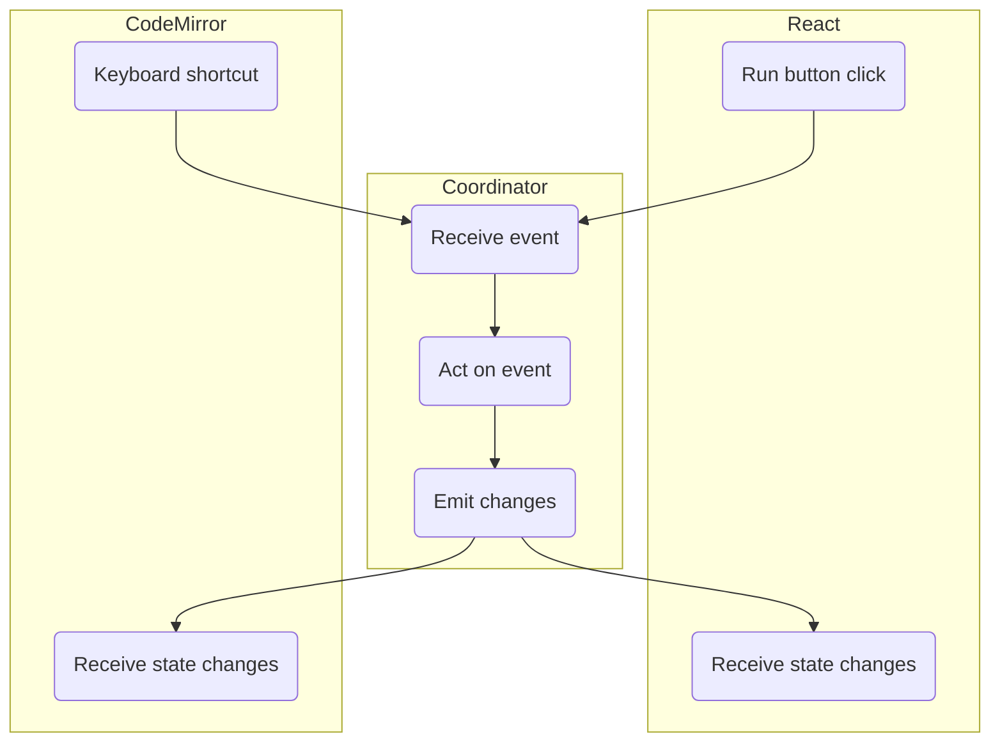

<Callout>
This article covers more advanced topics and assumes that you have a working knowledge of React and CodeMirror. I would recommend reading [Learning CodeMirror](/blog/learning-codemirror) and [CodeMirror and React](/blog/codemirror-and-react) as a primer.
</Callout>

When working in CodeMirror and React, I often found challenges around state management. Both systems want to own the state and act as the source of truth. There are a few ways that we can sync state, a few of which I covered in my [CodeMirror and React](/blog/codemirror-and-react) article. This offers another way to sync state–a method I call the "state coordinator" extension.

## Our SQL terminal

Let's say that we want to build a SQL terminal for our database. This terminal will be a CodeMirror editor (of course!) and has a few particular UX requirements:

- Users can't use wildcards in their queries because our particular database engine doesn't support them. We need to lint the query and show an error when they write a query with a wildcard in it.
- There is a `run` button that lets you run the query. Additionally, users should be able to run a query with a keyboard shortcut, in this case, `Ctrl-Enter`.
- If a user attempts to run an invalid query, it should disable the run button and display an error (if not already displayed).
- The linting function shouldn't run immediately, since that might be annoying to some users. So there is a little bit of time between when the user has stopped typing and when the linter runs and displays any errors.
- There should be a status bar under the SQL terminal that displays the current state.

Here's the final version of what we are building:

import {CodeEditor} from './CodeEditor';

<CodeEditor />

We face a few challenges in building this editor:

- The linter lives inside of CodeMirror and is triggered by CodeMirror. We need a way of getting the lint state out of CodeMirror and into React.
- There are multiple entry paths into the "run query" execution flow–one from React (button click) and one from CodeMirror (keyboard shortcut). We need to handle both of those executions in a way that generates the correct output and updates the state in both sides.
- There is a race condition that happens when you try to run the query after typing ends and before linting begins. We need a way of checking for a lint error and updating the state accordingly.

Now that we have a clear picture of the requirements for our SQL terminal, let's start building.

<Callout>
I won't walk through every line of code required to make this terminal, as there is a fair amount of scaffolding and styling that are required to understand it. The code is publically available on GitHub if you want to read through it.
</Callout>

## Terminal state

First we'll put together a way to describe the terminal state. In this trivial example, we'll use a very simple type called, you guessed it: `State`.

```ts
type State = 'valid query' | 'query executed' | 'error' | 'loading';
```

We can use this throughout the editor to describe its state. There are some places we will need to get this state out of CodeMirror to React. We could set up a `StateField` and `StateEffect` (like in [this example](/blog/codemirror-and-react/#syncing-react-state-with-codemirror-state)), but in this case, I want to simply emit the state and have React respond to it. For that, I'll use a [Facet](/blog/learning-codemirror/#facet) with a callback as the Facet type:

```ts
const emitStateToReact = Facet.define<(state: State) => void>();

function emitState(state: State, editorState: EditorState) {
  const [emit] = editorState.facet(emitStateToReact);

  emit(state);
}
```

I've also included a little helper function, `emitState`, that makes using this facet a bit more convenient throughout the code.

## Linting

With our state in place, we can move next to linting. Let's start with a simple function to check the presence of a wildcard in a query:

```ts
function checkQueryForWildcard(query: string): Diagnostic | null {
  const wildcardIndex = query.indexOf('*');

  if (wildcardIndex === -1) {
    return null;
  }

  return {
    from: wildcardIndex,
    to: wildcardIndex + 1,
    severity: 'error',
    message:
      'Wildcard selectors are disallowed. Please specify the columns you want to select.',
  };
}
```

This function outputs an object that conforms to the [`Diagnostic`](https://codemirror.net/docs/ref/#lint.Diagnostic) type, which is the type that CodeMirror uses in its linter to describe an error. With that in place, let's also use the CodeMirror [`linter`](https://codemirror.net/docs/ref/#lint.linter) function to lint our code:

```ts
const sqlLinter = linter(
  (view: EditorView) => {
    const document = view.state.doc.toString();

    const wildcardError = checkQueryForWildcard(document);

    if (wildcardError == null) {
      emitState('valid query', view.state);

      return [];
    }

    emitState('error', view.state);
    return [wildcardError];
  },
  {
    delay: 2500,
  },
);
```

You'll notice I set the delay to `2500`–this is to make the UI example really obvious, as 2.5 seconds is long enough to see the time between end of keystroke and when the lint cycle happens.

I'll also make a little watcher to reset the React state as soon as we no longer have any lint errors. This uses CodeMirror's [transaction filter](https://codemirror.net/docs/ref/#state.EditorState^transactionFilter)–I'll explain more about this particular function later, as we'll use it in our state coordinator.

```ts
const clearErrorOnDocChange = EditorState.transactionFilter.of(
  (transaction) => {
    if (transaction.docChanged && diagnosticCount(transaction.state) < 1) {
      emitState('valid query', transaction.state);
    }

    return transaction;
  },
);
```

## Describing an event

At this point, we have enough building blocks in place to work on the first piece of our state coordinator puzzle. For this, we'll use a CodeMirror `Annotation`. The docs give the definition of an annotation:

> Annotations are tagged values that are used to add metadata to transactions in an extensible way.

The problem of "triggering an event" could also be solved with a `StateEffect`, but because of the limitations around how state effects can be used, I opted to use an annotation.

Let's start by creating our annotation:

```ts
const triggerEvent = Annotation.define<'click' | 'keyboard'>();
```

This annotation lets us tell CodeMirror that an event has been triggered and also gives us the ability to describe the source of the trigger. We can set up a keyboard shortcut that is bound to `Ctrl-Enter` to kick off the event with `keyboard` as the source:

```ts
const keyboardShortcuts = keymap.of([
  {
    key: 'Ctrl-Enter',
    run: (view: EditorView) => {
      // 1
      if (diagnosticCount(view.state) > 0) {
        return true;
      }

      // 2
      view.dispatch({annotations: triggerEvent.of('keyboard')});

      return true;
    },
  },
]);
```

A couple of notes about this code:

1. Before we let the shortcut run, we first check to see if there are any diagnostics currently present on the editor, and bail if we find any.
2. [`view.dispatch`](https://codemirror.net/docs/ref/#view.EditorView.dispatch) is how we kick off an event within CodeMirror. We create a new instance of our Annotation with the `.of()` method and provide the source of the event.

Now that we are sending events, let's make a state coordinator to handle these events!

## State coordinator

Here's the mental model for how our state coordinator will connect to CodeMirror and React:



I use the term "state coordinator" in more of a conceptual way, as there is no "state coordinator" class or object within CodeMirror. Instead, we will build an extension that coordinates the state between CodeMirror and React and ensures both end up with the correct state information.

When building this, I needed to find an extension that would run as part of every transaction so that I could watch for the dispatched annotation and act on it. I eventually settled on [transaction filter](https://codemirror.net/docs/ref/#state.EditorState^transactionFilter) as the pick. This facet produces an extension that runs on each transaction, and lets us provide additional transactions as needed. This is ideal for cases where we need to modify the state in some way as part of our state coordinator.

<Callout>
The downside of using a `transactionFilter` is that it does not run for transactions that set `filter: false`. I found this was an acceptable tradeoff for this use case, but there also exists [`transactionExtender`](https://codemirror.net/docs/ref/#state.EditorState^transactionExtender) which is more limited than `transactionFilter` but is guaranteed to run on every transaction.
</Callout>

Here's what the code for our state coordinator looks like. I'll explain each step in detail:

```ts
const stateCoordinator = EditorState.transactionFilter.of((transaction) => {
  // 1
  const eventTrigger = transaction.annotation(triggerEvent);

  if (eventTrigger == null) {
    return transaction;
  }

  // 2
  const document = transaction.state.doc.toString();

  // 3
  const diagnostic = checkQueryForWildcard(document);

  // 4
  if (diagnostic == null) {
    emitState('loading', transaction.state);

    return transaction;
  }

  // 5
  emitState('error', transaction.state);

  return [
    transaction,
    {
      effects: [setDiagnosticsEffect.of([diagnostic])],
    },
  ];
});
```

Here's what's happening with this code:

1. We first need to examine the transaction to see if an annotation exists. `eventTrigger` is the value of the annotation if it matches the type that we've provided. So in this case, the value will be `click`, `keyboard`, or `null`. We can simply return the transaction and exit the function if the value is `null`.
2. We need to get the text of the document in order to pass it to our validation function. The docs emphasizes that [we should be discriminate about calls to `transaction.state`](https://codemirror.net/docs/ref/#state.EditorState^transactionFilter), as it will force creation of a state object that may be discarded if the transaction is filtered. Our use case is discriminate enough that we can proceed.
3. We run our validation function against the document. Why not use something like `diagnosticCount` instead? If this is triggered before linting starts, `diagnosticCount` will return `0`, so we need to check ourselves to see if this query is valid.
4. If we don't find a diagnostic, we can proceed with the execution and emit an event (in this case, the `loading` event).
5. If we find a diagnostic, we emit an `error` event and then set the diagnostic we found in CodeMirror state.

Now we have a state coordinator...but no React state to coordinate! We'll go there next.

## Connecting React state

We first need to set up our terminal state:

```ts
const [state, setState] = useState<State>('valid query');
```

By default our terminal gets `valid query` as its state until CodeMirror informs it that there is an error with the query. Now that we are tracking state, we can utilize our `emitStateToReact` facet to provide the implementation of what should happen when our `emitState` calls are made.

```ts
const emitStateToReactExtension = emitStateToReact.of((value) => {
  if (value !== 'loading') {
    setState(value);

    return;
  }

  setState('loading');

  setTimeout(() => {
    setState('query executed');
  }, 1500);
});
```

The implementation of this function is simple in our context because this terminal is just simulating state changes (and not actually performing the query). But within this function, it could kick off a call to an API or do any number of things. For now, the "API call" is just a timer that sets the state to `query executed` when it expires.

We've got one more piece of react state to wire up–our button. For this, we'll need access to the CodeMirror `view` object. I'm using React CodeMirror, so I get access to this object via a forward ref; the code for that looks like this:

```ts
const codeEditorRef = useRef<ReactCodeMirrorRef>(null);

function handleButtonClick() {
  codeEditorRef.current?.view?.dispatch({
    annotations: triggerEvent.of('click'),
  });
}
```

Like our keyboard shortcut code, this calls at `view.dispatch`, but sets the event to be of type `click` instead of `keyboard`.

## Conclusion

With our React state connection in place, we now have a working editor that covers all of the use cases:

<CodeEditor />

Because of our state coordinator, we have successfully eliminated the race condition. We can be sure that we won't ever run a query that has a wildcard in it, no matter when or how the query is triggered.

If you'd like to see all the code, it's publically available on GitHub. Good luck wrangling state! 🤠