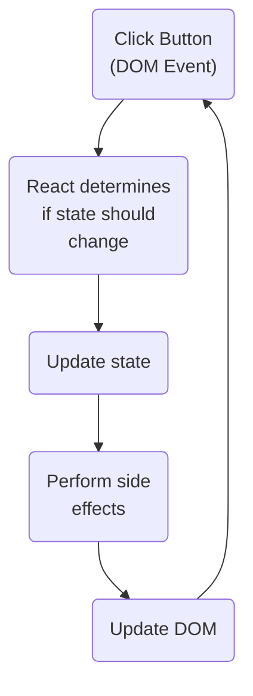
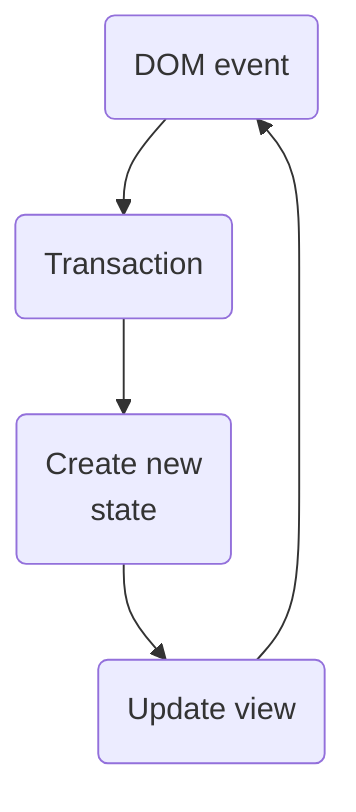
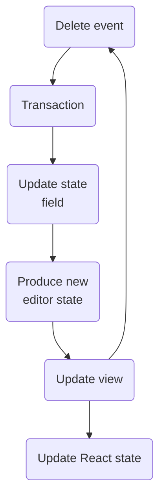

Over the past 10 months, I've been working with the [CodeMirror](https://codemirror.net/) framework to write and integrate a custom code editor into a React app. Coming from a React background, CodeMirror presented some unique challenges. I've spend many hours staring at [the docs](https://codemirror.net/docs/) and going in circles over how to get React and CodeMirror to play nicely. This article is meant to be a primer for any developers who are going to integrate CodeMirror into React–it contains many of the lessons I've learned and will hopefully act as a springboard to writing your own CodeMirror-powered editor.

<Callout>
  This isn't meant to replace reading the docs but is a high level guide to a
  few things you need to know about CodeMirror and React. I would still highly
  recommend the docs, starting with the [system
  guide](https://codemirror.net/docs/guide/).
</Callout>

## Getting an initial editor working within React

CodeMirror provides [the following code](https://codemirror.net/docs/guide/) as an example of how to set up CodeMirror in a vanilla javascript context:

```js
import {EditorState} from '@codemirror/state';
import {EditorView, keymap} from '@codemirror/view';
import {defaultKeymap} from '@codemirror/commands';

let startState = EditorState.create({
  doc: 'Hello World',
  extensions: [keymap.of(defaultKeymap)],
});

let view = new EditorView({
  state: startState,
  parent: document.body,
});
```

CodeMirror manages state separately from its view and derives what to display in the view based on the state (similar to React). It provides a way to automatically bind the `view` to a node in the DOM via the `view.parent` argument. React "owns" all of the DOM when it renders jsx, but we can get a reference to a DOM node by using a `ref`. If we were to set up this same basic editor in a React context, it might look something like this:

```tsx
export function CodeEditor() {
  // 1
  const containerRef = useRef<HTMLDivElement | null>(null);

  useEffect(() => {
    if (containerRef.current) {
      const state = EditorState.create({
        doc: 'Hello World',
        extensions: [keymap.of(defaultKeymap)],
      });

      new EditorView({
        state: startState,
        // 2
        parent: containerRef.current,
      });
    }
  }, []);

  return <div ref={containerRef} />;
}
```

This code does the following:

1. Sets up a ref that we can use to get access to the DOM node of the `<div>`
2. Binds the view to the `<div>` with the ref

This code would evolve as the code editor becomes more complex. It gives you a high degree of control at the cost of a lot of managing the connection between CodeMirror and React. Instead of doing this manually, I would recommend utilizing the [React CodeMirror](https://github.com/uiwjs/react-codemirror) package, which does most of the management of the CodeMirror-React connection for you. If you use that package, your setup code might look like this:

```tsx
import ReactCodeEditor from '@uiwjs/react-codemirror';

export function CodeEditor() {
  const doc = 'Hello World';
  const extensions = [keymap.of(defaultKeymap)];

  return <ReactCodeEditor extensions={extensions} value={doc} />;
}
```

React CodeMirror does a bunch of things but I'll call out just a few:

- It exposes props such as `value`, `placeholder`, and `extensions` to make passing values into React CodeMirror feel very "react-y"
- It exposes an `onChange` handler, which makes it easy to use controlled react state to manage the document
- Internally it manages the `view` and `state` for you, while exposing a forward ref to give you direct access to them. This makes it straightforward to call CodeMirror APIs that require `view` or `state` as an argument
- It also includes a `useCodeMirror` hook instead of a React component in case you decide to go with a hooks-based approach instead of a component-based approach

This barely scratches the surface for how you can customize React Codemirror–I would recommend reading [the React CodeMirror docs](https://uiwjs.github.io/react-codemirror/) to get started.

<Callout>
  I have noticed that React CodeMirror's react component tends to have problems
  with re-renders. I'm not sure if the root of this problem lies in the way the
  component is set up or if it's a CodeMirror problem. The solution is to reach
  for memoization more than you think you need. For example, even passing in an
  anonymous object to `basicOptions` will cause a re-render (something that
  wouldn't typically be a problem with a normal React component).
</Callout>

## CodeMirror lifecycle

One of the key parts in understanding CodeMirror is understanding its lifecycle. Let's first look at React's lifecycle and then we can compare CodeMirror's. Imagine that you have a simple React component that tracks a counter state.

- It has an inital count of 1 and counts up to 10.
- When it is about to hit 11, the counter is reset to 0.
- Whenever the count is set to 0, there is a side effect that alerts the user what happened.

Here's the component:

import {ButtonExample} from './ButtonExample';

<ButtonExample />

If you were to describe the lifecycle of this component, it might look like this:



This isn't meant to be a technical or perfectly accurate depiction of the React lifecycle, just a basic mental model of the sequence of events. Let's contrast this to the CodeMirror lifecycle–this lifecycle is described in the [system guide](https://codemirror.net/docs/guide/#state-and-updates), and looks like this:



At first glance, this looks pretty similar–but notice the absence of the `perform side effects` block. This is one of the key parts of the CodeMirror lifecycle: **you cannot perform a side effect during the CodeMirror state update lifecyle**. The transaction ➡️ new state flow is like a React reducer in that it's a pure function (no side effects). There are CodeMirror APIs that enable to you watch a value and perform side effect based on what you observe, but you cannot perform one while the editor is doing its update loop.

## Managing state between React and Codemirror

When implementing a CodeMirror editor in React, I often faced the question of "Who owns the state? Where is the source of truth?". I found that, as much as possible, it's best if CodeMirror is the source of truth, with React being a consumer of the state. By trying to make CodeMirror the place where the state is held, you go "with the grain" of CodeMirror instead of against it. However, there are also times when React needs to be the source of truth. I'll cover various ways to approach both of these cases.

### Syncing CodeMirror state to React

CodeMirror describes and tracks state by using the [`StateField` class](https://codemirror.net/docs/ref/#state.StateField). Let's say that we want to track the number of times a user deletes something in the code editor with the `backspace` key. At a high level, this means we need to:

1. Define a state field to track the state within CodeMirror
2. Update React when that state updates



We'll first create a simple state field that counts the number of `backspace` commands:

```ts
const deleteCountStateField = StateField.define<number>({
  create() {
    return 0;
  },
  update(currentValue, transaction) {
    let value = currentValue;

    if (transaction.isUserEvent('delete.backward')) {
      value = value + 1;
    }

    return value;
  },
});
```

When defining a state field in CodeMirror, we must pass in both a `create` and an `update` method. `create` defines the initial state of the field, and is passed an instance of the editor's state as a way to derive the initial state. `update` is passed the current value and the transaction that is triggering the `update` to be called. Now that we're tracking the state within CodeMirror, we can sync this state React with an [`updateListener`](https://codemirror.net/docs/ref/#view.EditorView^updateListener). The React state will also describe who has updated the state:

```tsx
// In React
const [deleteCount, setDeleteCount] = useState<{
  count: number;
  updatedBy: 'react' | 'codemirror';
}>({count: 0, updatedBy: 'react'});

// In CodeMirror
const syncDeleteCount = EditorView.updateListener.of(
  (viewUpdate: ViewUpdate) => {
    const count = viewUpdate.state.field(deleteCountStateField);
    setDeleteCount((currentState) => {
      if (currentState.count === count) {
        return currentState;
      }

      return {count, updatedBy: 'codemirror'};
    });
  },
);
```

This is doing a _little_ bit of optimization by checking if the current count matches the new count before updating the state. We could also have passed `setDeleteCount` directly to the `update` method of our state field:

```ts
update(value, transaction) {
  let value = currentValue;

  if (transaction.isUserEvent('delete.backward')) {
    value = value + 1;
    setDeleteCount({count: value, updatedBy: 'codemirror'});
  }

  return value;
}
```

However, there are times when multiple transactions are scheduled during an update cycle, and the state field may produce a new value more than once during the state update cycle. By using the `updateListener` pattern, we can wait until the new state is settled and reduce unnecessary React re-renders.

### Syncing React state with CodeMirror state

When syncing React state with CodeMirror, we have to be careful to make sure that the state update fits into CodeMirror's lifecycle. Let's say that, in addition to counting the number of times the backspace is tapped, we also want to track the number of times a React button is clicked. In order to use the same state between React and CodeMirror, we need to use a CodeMirror [`StateEffect`](https://codemirror.net/docs/ref/#state.StateEffect). The docs explain:

> State effects can be used to represent additional effects associated with a transaction. They are often useful to model changes to custom state fields, when those changes aren't implicit in document or selection changes.

In order to update CodeMirror's state when React's state changes, we need to:

1. Create a named state effect
2. Update our state field to watch for that state effect and unwrap the value when it encounters the state effect
3. Start watching changes to the React state with a `useEffect`
4. When the React state changes, update CodeMirror's state by starting a new transaction with `view.dispatch`

We'll start with creating a new, named state effect:

```tsx
const updateDeleteCountStateEffect = StateEffect.define<number>();
```

A state effect's definition doesn't hold a value but defines the type of value found in the state effect (in our case, a `number`). Now we'll add a button with a click handler to trigger the increment:

```tsx
function handleButtonClick() {
  setDeleteCount((currentState) => ({
    count: currentState.count + 1,
    updatedBy: 'react',
  }));
}

<button onClick={handleButtonClick}>Increase count</button>;
```

We can use a `useEffect` to automatically sync changes to the react state with CodeMirror:

```tsx
useEffect(() => {
  const stateEffectWithNewValue = updateDeleteCountStateEffect.of(
    deleteCount.count,
  );

  view.dispatch({
    effects: [stateEffectWithNewValue],
  });
}, [deleteCount]);
```

Notice the `.of()` syntax when creating the state effect–that wraps the count value in a new state effect. Since we're passing in a state effect to CodeMirror, we can now watch for and unwrap any values that come from a state effect. Our state field now looks like this:

```tsx
const deleteCountStateField = StateField.define<number>({
  create() {
    return initialCount;
  },
  update(currentValue, transaction) {
    let value = currentValue;

    if (transaction.isUserEvent('delete.backward')) {
      value = value + 1;
    }

    for (const effect of transaction.effects) {
      if (effect.is(updateDeleteCountStateEffect)) {
        value = effect.value;
      }
    }

    return value;
  },
});
```

The `effect.is()` syntax lets us check if a given effect is of the type of state effect that we need to act on. If it returns true, `effect.value`'s type is automatically derived to be `number`.

By this point, we have successfully added bi-directional state syncing between React and CodeMirror! 🎉

### Updating an extension based on React state

There are times where we need a React state value to update a value inside of a CodeMirror extension. For example, imagine that we were working on a javascript editor and we wanted to use a button to control if the editor should show or hide lint information. Our `linter()` function takes in a boolean and, based on the boolean, shows or hides the lint information (this linter comes from the [lint example](https://codemirror.net/examples/lint/) on the CodeMirror site):

```tsx
function makeLinter(shouldLint: boolean) {
  return linter(
    (view) => {
      if (!shouldLint) {
        return [];
      }

      const diagnostics: Diagnostic[] = [];
      syntaxTree(view.state)
        .cursor()
        .iterate((node) => {
          if (node.name === 'RegExp')
            diagnostics.push({
              from: node.from,
              to: node.to,
              severity: 'warning',
              message: 'Regular expressions are FORBIDDEN 🙅‍♂️',
            });
        });

      return diagnostics;
    },
    {delay: 0},
  );
}
```

In React, we might approach this problem with memoization:

```tsx
const linter = useMemo(() => linting(shouldLint), [shouldLint]);
```

While this works in React, it will have unintended consequences in CodeMirror as CodeMirror is not built in a way that we can simply yank out and replace an extension. The "CodeMirror way" to approach this would be to use a [`Compartment`](https://codemirror.net/docs/ref/#state.Compartment). The docs describe a compartment as:

> Extension compartments can be used to make a configuration dynamic. By wrapping part of your configuration in a compartment, you can later replace that part through a transaction.

I think of a compartment as a box around an extension–we can replace the contents of the box but CodeMirror still knows about and uses the box surrounding the contents. Let's use the compartment approach to this problem:

```ts
const [shouldLint, setShouldLint] = useState<boolean>(true);

// 1
const compartment = new Compartment();
// 2
const extension = compartment.of(makeLinter(shouldLint));

useEffect(() => {
  // 3
  view.dispatch({
    // 4
    effects: compartment.reconfigure(makeLinter(shouldLint)),
  });
}, [shouldLint]);
```

Here's an explanation of what is happening in this block of code:

1. We first create a new empty compartment–an empty box.
2. Next we call `compartment.of()` and pass in our extension. This places the newly-created extension into the "box" and returns it. Techincally we are returning our extension inside of the container of `compartment`, but CodeMirror looks at the contents of the box.
3. When we detect a change to our react state, we call [`view.dispatch`](https://codemirror.net/docs/ref/#view.EditorViewConfig.dispatch). Much like a reducer's `dispatch` function, the `view.dispatch` function is how we initiate a change in the state lifecycle.
4. When we call `compartment.reconfigure()`, it will return a [`StateEffect`](https://codemirror.net/docs/ref/#state.StateEffect) that essentially tells CodeMirror "please replace the contents of the box with these new contents". We pass in a call to the linter function we created earlie. Finally, that state effect is passed to `view.dispatch` via the `effects` key of the object.

Since we're looking at this in the context of React–what if we wanted to create a generic hook to manage this for us? Here's what that would look like:

```tsx
export function useExtensionWithDependency(
  // 1
  view: EditorView | null,
  // 2
  extensionFactory: () => Extension,
  deps: any[],
) {
  // 3
  const compartment = useMemo(() => new Compartment(), []);
  const extension = useMemo(() => compartment.of(extensionFactory()), []);

  useEffect(() => {
    if (view) {
      view.dispatch({
        effects: compartment.reconfigure(extensionFactory()),
      });
    }
    // 4
  }, deps);

  return extension;
}
```

Some callouts about this code:

1. This takes in the `view` object–if you are using React CodeMirror's react component, you get access at the `view` object via a forward ref on the react component. Because it uses refs, it might be `null` which is why the type is `EditorView | null`.
2. We use closures to encapsulate any arguments we need passed to generate a new extension.
3. Both the compartment and extension are memoized to ensure that they never change, preventing render issues that can happen between React and CodeMirror.
4. We use a dependencies array passed to `useExtensionWithDependency` in order to know when we should reconfigure the compartment.

Now let's refactor our example to use this hook:

```tsx
const [shouldLint, setShouldLint] = useState<boolean>(true);

const lintExtension = useExtensionWithDependency(
  view,
  () => makeLinter(shouldLint),
  [shouldLint],
);
```

### Putting it all together

Here's an example of a code editor that uses all of these patterns I've described. Feel free to view the source code on GitHub to see how everything connects.

import {ReactCodeMirrorSyncStateExample} from './ReactCodeMirrorSyncStateExample';

<ReactCodeMirrorSyncStateExample />

## Conclusion

In summary:

- [React CodeMirror](https://uiwjs.github.io/react-codemirror/) is a great package that takes care of a lot of the "boilerplate" of connecting CodeMirror to React.
- Reach for memoization more than you would normally to prevent re-renders in CodeMirror.
- CodeMirror doesn't support side effects through its normal lifecycle like React does.
- Use a state field + `updateListener` to track and sync state from CodeMirror to React.
- Use a state effect to sync React state to CodeMirror.
- Use a compartment to make extensions update when React state changes.

When all else fails–read the [docs](https://codemirror.net/docs/ref)!
