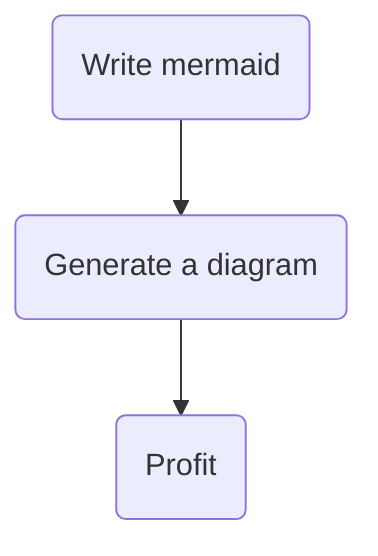
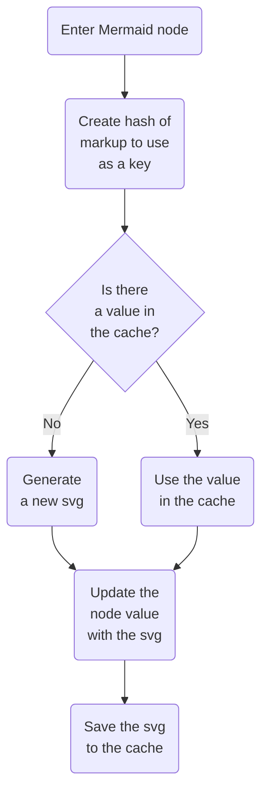
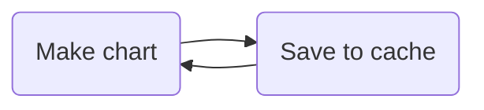

I like diagrams. I find they do a great job explaining my thought processes and giving a better understanding to what are often abstract systems. The problem I have with most diagrams (and diagramming tools) is that they often have a short shelf-life. Diagrams are typically stored as flat files (e.g. a `.jpg`) and when the diagram becomes out of date, it becomes a chore to find the original file to update it. Diagramming tooling is often gated by logins and licenses. Because the files aren't text, it's also hard to describe differences between an original diagram and an updated diagram with a tool like Git.

In February 2022, GitHub [added support for diagrams with Mermaid](https://github.blog/2022-02-14-include-diagrams-markdown-files-mermaid/), a markdown-inspired diagramming and charting tool. GitHub's support of [Mermaid](https://mermaid.js.org/) introduced me to the tool, and I was thrilled when I discovered it. Mermaid solves the problems I had with diagramming tools, and because it uses text to describe a diagram, I can track changes with git. My coworkers can tell you that for a few months afterwards, I was _constantly_ making Mermaid diagrams (maybe simply because I could).

I've wanted to start using diagrams in my writing on my blog, but I needed to first add support to it with my build tooling (Gatsby). However, I found that the existing tooling was a bit lacking and didn't suit my needs. I decided to roll up my sleeves and build support for it with the features I was looking for. In this article, I'll detail exactly how to build a Gatsby plugin that transforms Mermaid syntax like this:



To this:


## gatsby-remark-mermaid

I first went looking for existing options and found [gatsby-remark-mermaid](https://www.gatsbyjs.com/plugins/gatsby-remark-mermaid/). As I determined if this was the plugin I wanted to use, I learned a few things:

- Mermaid needs to run in a browser to render the layout for a diagram. gatsby-remark-mermaid requires a path to an instance of chromium (managed by the user, not by the plugin) and launches chromium in headless mode, lays out the chart, and returns the svg (or takes a screenshot to make an image/pdf). I originally thought this was a dealbreaker as I wanted a pure-CLI approach–though the solution I arrived at does something similar!
- The plugin is a thin wrapper around [remark-mermaidjs](https://github.com/remcohaszing/remark-mermaidjs), and because of the way the plugin is implemented, it doesn't support caching. I found this unnacceptable because rendering charts is slow–I wanted to render them once and then use a cached value in subsequent renders.
- remark-mermaidjs doesn't look specifically for the `mermaid` header, but instead renders the entire page and grabs the mermaid charts. I wanted something a little more precise.

For these reasons, I decided to go looking for other solutions.

## mermaid-cli

My goal was to find a command-line-based tool to render mermaid code to svg, which would enable me to integrate it as part of the Gatsby build process. I found [mermaid-cli](https://github.com/mermaid-js/mermaid-cli), a command line tool by the same folks who maintain mermaid.js. Instead of taking in a chromimum path, mermaid-cli utilizes puppeteer. Puppeteer downloads a chromium binary and uses that to do headless rendering, instead of using the local chromium installation.

I started playing around with mermaid-cli and initially tried the [node style](https://github.com/mermaid-js/mermaid-cli#use-nodejs-api) approach:

```js
import {run} from '@mermaid-js/mermaid-cli';

await run(
  'input.mmd',
  'output.svg',
);
```

I couldn't seem to get this approach to work–it kept complaining about the file path. I moved on to the [local node module](https://github.com/mermaid-js/mermaid-cli#install-locally) approach:

```bash
yarn add @mermaid-js/mermaid-cli
./node_modules/.bin/mmdc -i input.mmd -o output.svg
```

This approach worked and I was able to successfully convert a mermaid file to svg. 🎉

## Creating a local plugin

Now that I had succesfully used mermaid-cli, I wanted to integrate it with my build and development process with a Gatsby plugin. Gatsby makes local plugin development really easy–you essentially just need to follow the [plugin guidelines](https://www.gatsbyjs.com/docs/creating-a-local-plugin/#project-structure-for-a-local-plugin) and then your plugin "just works". I decided to follow the [Gatsby naming conventions](https://www.gatsbyjs.com/docs/how-to/plugins-and-themes/naming-a-plugin/#:~:text=gatsby%2D%5Bplugin%2Dname%5D%2D*,remark%2Dadd%2Demoji%20) and name my plugin `gatsby-remark-mermaid-to-svg`. Then I followed the right directory structure:

```
/thetrevorharmon.com
└── gatsby-config.ts
└── /src
└── /plugins
    └── /gatsby-remark-mermaid-to-svg
        └── package.json
        └── index.mjs
```

By following this directory structure, I can add the plugin to my config file with just the name and Gatsby will automatically pick up the local plugin and..._plug it in_ 😏...to my build process!

<Callout>
  You'll notice that I chose to make a local plugin instead of a community plugin. I don't want the burden of maintaining a plugin for the community when I only need it for my blog. However, if you're passionate about this, please take this work and make it into a community plugin!
</Callout>

Now that I have the correct directory structure in place, we can start by creating a basic function that wraps mermaid-cli:

```js
import fs from 'fs';
import {execSync} from 'child_process';
import {v4 as uuid} from 'uuid';

function generateSVGFromMermaid(mermaidText) {
  // 1
  const tempFilename = `${uuid()}.mmd`;

  // 2
  fs.writeFileSync(`/tmp/${tempFilename}`, mermaidText);

  // 3
  const command = [
    `./node_modules/.bin/mmdc`,
    `-i /tmp/${tempFilename}`,
    `-o /tmp/${tempFilename}.svg`,
  ].join(' ');

  execSync(command);

  // 4
  const svg = fs.readFileSync(`/tmp/${tempFilename}.svg`).toString();

  // 5
  fs.unlinkSync(`/tmp/${tempFilename}`);
  fs.unlinkSync(`/tmp/${tempFilename}.svg`);

  return svg;
}
```

This function:

1. Generates a new temporary filename with the [`uuid()`](https://github.com/uuidjs/uuid#readme) function. This ensures that I won't ever have naming collisions. Notice the `.mmd` file extension–that's the file extension for a standalone mermaid document.
2. `mermaidText` describes the markup that defines a diagram–I need to write that to a local, temporary file.
3. I assemble and execute a command against the `mmdc` binary. This dumps the result of the file into a `.svg` file.
4. The results of the svg file are read into a string.
5. Finally, we clean up the temporary files before returning the svg markup.

With this function that can take in mermaid text and returns a svg, we need to write the plugin function to connect this to Gatsby. The function will crawl a markdown document and when it encounters a mermaid code block, render the block to an svg. Here's the plugin function:

```js
import {visit} from 'unist-util-visit';

export function gatsbyRemarkMermaidToSvg({markdownAST}) {
  // 1
  visit(markdownAST, 'code', (node) => {
    if (node == null) {
      return;
    }

    // 2
    if (node.lang === 'mermaid') {
      try {
        const svg = generateSVGFromMermaid(node.value);

        // 3
        node.type = 'html';
        node.lang = undefined;
        node.value = `<div className="Mermaid">${svg}</div>`;
      } catch {
        // 4
        console.error(
          'Could not convert mermaid to svg with value:',
          node.value,
        );
      }
    }

    // 5
    if (node.lang === 'mermaid-code') {
      node.lang = 'mermaid';
      return;
    }
  });

  return markdownAST;
}
```

Some details about this code:

1. As I mentioned before, this parses mermaid diagrams within the context of markdown. I suppose that you could also define a parser for JSX, but this plugin will only work with markdown. Gatsby exposes a markdown as an abstract syntax tree called `markdownAST`, and we can use the `visit` function from [unist-util-visit](https://github.com/syntax-tree/unist-util-visit) to walk the tree. We are specifically looking for code nodes.
1. If we encounter a node with the `mermaid` language, we've found what we're looking for.
1. After generating the svg, we re-assign the type to `html`. This tells Gatsby to now render this node as html instead of as a code block (which also prevents other plugins from treating it like a code block). We also assign a new value to it that includes the newly-minted svg.
1. If we encounter an error somewhere along the way, we log it and _don't_ change the type or value. This way we can still get a code block with syntax highlighting if the svg renderer fails.
1. For cases where I want to show mermaid markup (instead of rendering an svg), I've added this extra check that will rewrite `mermaid-code` as just `mermaid`–then plugins like [prismjs](https://www.gatsbyjs.com/plugins/gatsby-remark-prismjs/) can provide syntax highlighting.

## Adding extensibility

Now that we have a working plugin, let's add a little extensibility. Right now, we are stuck with the base mermaid theme and font. We also can't customize anything about the markup. Let's add a few options to our function:

```js
// 1
// highlight-start
const defaultOptions = {
  wrapperClassName: 'Mermaid',
  shouldRemoveDefaultStyling: true,
  backgroundColor: 'transparent',
  mermaidOptions: {
    theme: 'base',
    flowchart: {
      useMaxWidth: true,
    },
    themeVariables: {
      fontFamily: 'ui-serif, Georgia, Cambria, "Times New Roman", Times, serif',
    },
  },
};
// highlight-end

// 2
export function gatsbyRemarkMermaidToSvg({markdownAST}, pluginOptions) { // highlight-line
  // 3
  const options = Object.assign({}, defaultOptions, pluginOptions); // highlight-line

  visit(markdownAST, 'code', (node) => {
    if (node && node.lang === 'mermaid') {
      try {
        const svg = generateSVGFromMermaid(node.value, options);

        node.type = 'html';
        node.lang = undefined;
        // 4
        node.value = `<div class=${options.wrapperClassName}>${svg}</div>`; // highlight-line
      } catch {
        console.error(
          'Could not convert mermaid to svg with value:',
          node.value,
        );
      }
    }
  });

  return markdownAST;
}
```

I made the following changes:

1. As with any sensible plugin, I'm defining default options that can be overriden in the Gatsby config file. You'll see how each of these are used in the code.
1. The `pluginOptions` in the function is the object that is passed to the `options` key in a Gatsby config file.
1. I take the options passed in and combine them with the defaults (as a fallback) so we always have a complete config object.
1. The `wrapperClassName` option is the classname of the div that wraps the svg—in this case, it defaults to `Mermaid`.

Now that we've added plugin options, we can pass them through to our svg generator function:

```js
function generateSVGFromMermaid(mermaidText, options) { // highlight-line
  const tempFilename = `${uuidv4()}.mmd`;

  // 1
  // highlight-start
  fs.writeFileSync(
    `/tmp/${tempFilename}.json`,
    JSON.stringify(options.mermaidOptions, undefined, 2),
  );
  // highlight-end

  fs.writeFileSync(`/tmp/${tempFilename}`, mermaidText);

  const command = [
    `./node_modules/.bin/mmdc`,
    `-i /tmp/${tempFilename}`,
    `-o /tmp/${tempFilename}.svg`,
    // 2
    `--backgroundColor ${options.backgroundColor}`, // highlight-line
    `--configFile /tmp/${tempFilename}.json`, // highlight-line
  ].join(' ');

  // Convert the mermaid text to an SVG using mermaid-cli
  execSync(command);

  // Read the SVG file into a string
  const svgString = fs.readFileSync(`/tmp/${tempFilename}.svg`).toString();

  // Clean up the temp files
  fs.unlinkSync(`/tmp/${tempFilename}`);
  fs.unlinkSync(`/tmp/${tempFilename}.svg`);
  fs.unlinkSync(`/tmp/${tempFilename}.json`);

  // 3
  // highlight-start
  if (options.shouldRemoveDefaultStyling) {
    const svgStringWithoutStyle = svgString.replace(
      /(<style>[\s\S]+<\/style>)/,
      '',
    );

    return svgStringWithoutStyle;
  }
  // highlight-end

  return svgString;
}
```

Some details of this code:

1. mermaid-cli requires us to pass in the options as a path to a file, so we stringify and save the mermaid options to a config file.
1. In addition to the mermaid configuration options, mermaid-cli gives us an option for the background color of the rendered webpage (which I've set to `transparent`).
1. I find the default mermaid styling to be a bit...lacking. Additionally, none of the themes match the theme of my blog. Unfortunately, mermaid-cli doesn't give us an option to opt out of the theme and always embeds the styles as part of the svg. I added a simple regex replace that removes anything between `<style>` tags so that I can provide my own styles without a bunch of `!important` statements everywhere.

## Caching the generated svgs

Once I had this initial implementation working and my mermaid charts were rendered, I thought I was done. However, as I started to write an article that contained a few diagrams, I found that the live preview performed poorly. I started to notice how slow the update cycle was and working on the article felt sluggish. I figured that caching was the solution to my problem, and fortunately Gatsby makes interacting with the cache very straightforward–it's one of the arguments that is passed to a plugin!

In order to cache a mermaid block, I needed a way to create a unique id for each mermaid block, as there is no "default" unique id for a markdown code block. The solution I arrived at was to hash the content of the block and use the hash as the cache key. If the diagram remains the same, the hash stays the same and is fetched from the cache. If it changes, the hash changes and a chart is generated and then cached.

The downside of this approach is that it creates orphaned svgs in the cache (since I don't keep a running list of all of the mermaid blocks). I think this is an acceptable tradeoff since clearing the cache is easy and fairly quick.

Here's the logical flow I wanted to implement:



In order to implement this logical flow into our plugin, we first need a helper function to generate our cache key:

```js
function getNodeKey(node, markdownNode) {
  const contentHash = crypto
    .createHash('sha256')
    .update(node.value)
    .digest('hex');
  return `${markdownNode.frontmatter.slug}__Mermaid__${contentHash}`;
}
```

I'm using the node.js `crypto` module to perform the hash. The two arguments are named similarly but are distinct–the `node` describes the node of the markdown syntax tree that we walk, whereas `markdownNode` describes the Mdx object generated by `gatsby-plugin-mdx`. I don't love that they are so similarly named, but `markdownNode` is named by Gatsby and I figured it made sense to go with their naming conventions.

Now that we have a helper function, our plugin can change to support caching:

```js
export async function gatsbyRemarkMermaidToSvg(
  {markdownAST, markdownNode, cache}, // highlight-line
  pluginOptions,
) {
  const options = Object.assign({}, defaultOptions, pluginOptions);

  visit(markdownAST, 'code', async (node) => {
    if (node == null) {
      return;
    }

    if (node.lang === 'mermaid-code') {
      node.lang = 'mermaid';
      return
    }

    if (node.lang === 'mermaid') {
      // highlight-start
      // 1
      const nodeKey = getNodeKey(node, markdownNode);
      // 2
      const cachedValue = await cache.get(nodeKey);

      let svg = node.value;

      // 3
      if (cachedValue) {
        svg = JSON.parse(cachedValue).svg;
      } else {
        try {
          svg = generateSVGFromMermaid(node.value, options);
        } catch {
          console.error(
            'Could not convert mermaid to svg with value:',
            node.value,
          );
        }
      }

      node.type = 'html';
      node.lang = undefined;
      node.value = `<div class=${options.wrapperClassName}>${svg}</div>`;

      // 4
      if (svg && svg !== node.value) {
        await cache.set(nodeKey, JSON.stringify({svg}));
      }
      // highlight-end
    }
  });

  return markdownAST;
}
```

As mentioned before, Gatsby makes interacting with the cache really easy. In this updated code, we:

1. Get a cache key using the helper from earlier
2. Look to see if a cached svg exists for this node
3. Either assign the cached value or generate a new value
4. Save the value into the cache to use later

With this addition, our mermaid charts are now cached! 💾



## Conclusion

I found making a local plugin in Gatsby to be very straightforward–the fact you can simply conform to a directory structure and then be off to the races is `:chefs-kiss:`. If you've made it this far and you're looking for a simple copy+paste, feel free to check out the [plugin code on GitHub](https://github.com/thetrevorharmon/thetrevorharmon.com/blob/main/plugins/gatsby-remark-mermaid-to-svg/gatsby-remark-mermaid-to-svg.mjs).