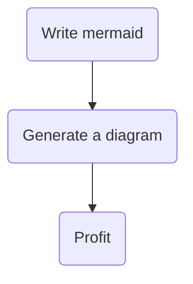
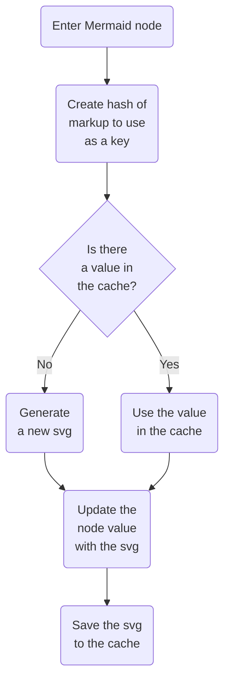

I like diagrams. I find they do a great job explaining my thought processes and giving a better understanding to what are often abstract systems. The problem I have with most diagrams and diagramming tools is that diagrams often have a short shelf-life. Making changes to diagrams is cumbersome because it requires access to tooling that is often gated by logins and licenses. It's also hard to describe differences between two different diagrams with a tool like git when the diagrams are stored as files, not text.

In February 2022, GitHub [added support for diagrams with Mermaid](https://github.blog/2022-02-14-include-diagrams-markdown-files-mermaid/), a markdown-inspired diagramming and charting tool. GitHub's support of [Mermaid](https://mermaid.js.org/) introduced me to the tool, and I was thrilled when I discovered it–it solves the problem of needing a separate tool and is supported in a tool I already use on a regular basis. My coworkers can tell you that for a few months afterwards, I was _constantly_ making Mermaid diagrams (maybe simply because I could).

I've wanted to start using diagrams in my writing on my blog, which means I needed to add Mermaid support to my blog. However, I found that the existing tooling was a bit lacking and didn't suit my needs. I decided to roll up my sleeves and build support for it with a local plugin. In this article, I'll detail exactly how to build a plugin that transforms Mermaid syntax like this:



To this:


## gatsby-remark-mermaid

My first instinct was to look at existing plugins, and I found that [gatsby-remark-mermaid](https://www.gatsbyjs.com/plugins/gatsby-remark-mermaid/) already existed. As I determined if this was the right approach, I learned a few things:

- Mermaid needs to run in a chromium browser to determine the layout for a chart. The way that gatsby-remark-mermaid approaches this is by asking for the path to an instance of chromium. From there, it launches chromium in headless mode, lays out the chart, and returns the svg (or takes a screenshot to make an image/pdf). I originally thought this was a dealbreaker as I wanted a pure-CLI approach–though the solution I arrived at does something similar!
- The plugin is a thin wrapper around [remark-mermaidjs](https://github.com/remcohaszing/remark-mermaidjs), and because of the way the plugin is implemented, it doesn't do any caching. I found this unnacceptable because rendering charts is slow–I wanted to render them once and then use a cached value any time I could.
- remark-mermaidjs doesn't look specifically for the `mermaid` header, but instead renders the entire page and grabs the mermaid charts. I wanted something a little more precise.

For these reasons, I decided to go looking for other solutions.

## mermaid-cli

My goal was to find a command-line based tool to generate mermaid code to svg, which would enable me to integrate this as part of the Gatsby build process. I found [mermaid-cli](https://github.com/mermaid-js/mermaid-cli) which is a command line tool by the same folks who maintain mermaid.js. Instead of taking in a chromimum path, mermaid-cli includes puppeteer. Puppeteer downloads a chromium binary and uses that to do headless rendering, instead of using the local chromium installation.

I started playing around with the tool and initial tried the [node style](https://github.com/mermaid-js/mermaid-cli#use-nodejs-api) approach:

```js
import {run} from '@mermaid-js/mermaid-cli';

await run(
  'input.mmd',
  'output.svg',
);
```

However, I couldn't seem to get that to work–it kept complaining about the file path. I moved on to the [local installation](https://github.com/mermaid-js/mermaid-cli#install-locally) approach:

```bash
yarn add @mermaid-js/mermaid-cli
./node_modules/.bin/mmdc -h
```

This approach worked and I was able to successfully convert a mermaid file to svg. 🎉

## Creating a local plugin

Now that I had succesfully used mermaid-cli, I wanted to integrate it with my build and development process. The best tool for the job for this was to create a local gatsby plugin. Gatsby makes local plugin development really easy–you essentially just need to follow the [right project structure](https://www.gatsbyjs.com/docs/creating-a-local-plugin/#project-structure-for-a-local-plugin) and then your plugin "just works". I decided to follow the [Gatsby naming guidelines](https://www.gatsbyjs.com/docs/how-to/plugins-and-themes/naming-a-plugin/#:~:text=gatsby%2D%5Bplugin%2Dname%5D%2D*,remark%2Dadd%2Demoji%20) and name my plugin `gatsby-remark-mermaid-to-svg`. Then I needed to follow the right directory structure:

```
/thetrevorharmon.com
└── gatsby-config.ts
└── /src
└── /plugins
    └── /gatsby-remark-mermaid-to-svg
        └── package.json
        └── index.mjs
```

By following the right directory structure, I can add it to my config file with just the name and Gatsby will automatically pick up the local plugin and..._plug it in_ 😏...to my build process!

<Callout>
  You'll notice that I said local plugin instead of community plugin. I don't
  want the burden of maintaining a plugin for the community when I only need it
  for my blog (which is a pretty narrow use case). However, if you are
  passionate about this, please take this work and make it into a community
  plugin!
</Callout>

As a starting point, I created a basic function that wraps the mermaid-cli:

```ts
import fs from 'fs';
import {execSync} from 'child_process';
import {v4 as uuid} from 'uuid';

function generateSVGFromMermaid(mermaidText) {
  // 1
  const tempFilename = `${uuid()}.mmd`;

  // 2
  fs.writeFileSync(`/tmp/${tempFilename}`, mermaidText);

  // 3
  const command = [
    `./node_modules/.bin/mmdc`,
    `-i /tmp/${tempFilename}`,
    `-o /tmp/${tempFilename}.svg`,
  ].join(' ');

  execSync(command);

  // 4
  const svg = fs.readFileSync(`/tmp/${tempFilename}.svg`).toString();

  // 5
  fs.unlinkSync(`/tmp/${tempFilename}`);
  fs.unlinkSync(`/tmp/${tempFilename}.svg`);

  return svg;
}
```

This function:

1. Generates a new temporary filename with the [`uuid()`](https://github.com/uuidjs/uuid#readme) function. This ensures that I don't ever have naming collisions. Notice the `.mmd` file extension–that's the file extension that mermaid files use when they aren't embedded in a markdown document.
2. `mermaidText` describes the markup that defines a diagram–I need to write that to a local, temporary file.
3. I assemble and execute a command against the `mmdc` binary. This dumps the result of the file into a `.svg` file.
4. The results of the svg file are read into a string.
5. Finally, we clean up the temporary files before returning the svg markup.

Now that we have a function that can take in mermaid text and get back SVG, we need to write the plugin function. This will crawl the document and when it encounters a mermaid block, render it to an SVG. That function looks like this:

```ts
import {visit} from 'unist-util-visit';

export function gatsbyRemarkMermaidToSvg({markdownAST}) {
  // 1
  visit(markdownAST, 'code', (node) => {
    // 2
    if (node == null) {
      return;
    }

    // 3
    if (node.lang === 'mermaid') {
      try {
        const svg = generateSVGFromMermaid(node.value);

        // 4
        node.type = 'html';
        node.lang = undefined;
        node.value = `<div className="Mermaid">${svg}</div>`;
      } catch {
        // 5
        console.error(
          'Could not convert mermaid to svg with value:',
          node.value,
        );
      }
    }

    // 6
    if (node.lang === 'mermaid-code') {
      node.lang = 'mermaid';
      return;
    }
  });

  return markdownAST;
}
```

Some details about this code:

1. For my use case, I am parsing mermaid diagrams within the context of markdown. I suppose that you could also define a parser for JSX, but I'll only cover markdown. Gatsby exposes `markdownAST`, and we can use the `visit` function from [unist-util-visit](https://github.com/syntax-tree/unist-util-visit) to walk the tree. We are specifically looking for code nodes.
2. I do a basic `null` check to appease typescript.
3. If we encounter a node with the `mermaid` language, we've found what we're looking for.
4. After generating the svg, we re-assign the type to `html`. This tells Gatsby to now render this node as html instead of as a code block (which also prevents other plugins from treating it like a code block). We also assign a new value to it that includes the newly-minted svg.
5. If we encounter an error somewhere along the way, we log it and _don't_ change the type or value. This way we can still get a code block with syntax highlighting if the svg renderer fails.
6. For cases where I want to write show mermaid markup, I've added this extra check that will rewrite `mermaid-code` as just `mermaid`–then plugins like [prismjs](https://www.gatsbyjs.com/plugins/gatsby-remark-prismjs/) can provide syntax highlighting.

## Adding extensibility

Now that we have a working plugin, let's add a little extensibility. Right now, we are stuck with the base Mermaid theme and font. We also can't customize anything about the markup. Let's add a few options to our function:

```ts
// 1
// highlight-start
const defaultOptions = {
  wrapperClassName: 'Mermaid',
  shouldRemoveDefaultStyling: true,
  backgroundColor: 'transparent',
  mermaidOptions: {
    theme: 'base',
    flowchart: {
      useMaxWidth: true,
    },
    themeVariables: {
      fontFamily: 'ui-serif, Georgia, Cambria, "Times New Roman", Times, serif',
    },
  },
};
// highlight-end

// 2
export function gatsbyRemarkMermaidToSvg({markdownAST}, pluginOptions) { // highlight-line
  // 3
  const options = Object.assign({}, defaultOptions, pluginOptions); // highlight-line

  visit(markdownAST, 'code', (node) => {
    if (node && node.lang === 'mermaid') {
      try {
        const svg = generateSVGFromMermaid(node.value, options);

        node.type = 'html';
        node.lang = undefined;
        // 4
        node.value = `<div class=${options.wrapperClassName}>${svg}</div>`; // highlight-line
      } catch {
        console.error(
          'Could not convert mermaid to svg with value:',
          node.value,
        );
      }
    }
  });

  return markdownAST;
}
```

I made the following changes:

1. As with any sensible plugin, I'm defining default options that can be overriden in the Gatsby config file. You'll see how each of these are used in the code.
2. The `pluginOptions` in the function is the object that is passed to the `options` key in the Gatsby config file.
3. I take the options passed in and combine them with the defaults (as a fallback) so we have a complete config object.
4. The `wrapperClassName` option is the classname of the div that wraps the svg—in this case, it defaults to `Mermaid`.

Now that we have options in our plugin, we can pass them through to our svg generator function:

```ts
function generateSVGFromMermaid(mermaidText, options) { // highlight-line
  const tempFilename = `${uuidv4()}.mmd`;

  // 1
  // highlight-start
  fs.writeFileSync(
    `/tmp/${tempFilename}.json`,
    JSON.stringify(options.mermaidOptions, undefined, 2),
  );
  // highlight-end

  fs.writeFileSync(`/tmp/${tempFilename}`, mermaidText);

  const command = [
    `./node_modules/.bin/mmdc`,
    `-i /tmp/${tempFilename}`,
    `-o /tmp/${tempFilename}.svg`,
    // 2
    `--backgroundColor ${options.backgroundColor}`, // highlight-line
    `--configFile /tmp/${tempFilename}.json`, // highlight-line
  ].join(' ');

  // Convert the mermaid text to an SVG using mermaid-cli
  execSync(command);

  // Read the SVG file into a string
  const svgString = fs.readFileSync(`/tmp/${tempFilename}.svg`).toString();

  // Clean up the temp files
  fs.unlinkSync(`/tmp/${tempFilename}`);
  fs.unlinkSync(`/tmp/${tempFilename}.svg`);
  fs.unlinkSync(`/tmp/${tempFilename}.json`);

  // 3
  // highlight-start
  if (options.shouldRemoveDefaultStyling) {
    const svgStringWithoutStyle = svgString.replace(
      /(<style>[\s\S]+<\/style>)/,
      '',
    );

    return svgStringWithoutStyle;
  }
  // highlight-end

  return svgString;
}
```

Some details of this code:

1. mermaid-cli requires us to pass in the options as a path to a file, so we stringify and save the mermaid options to a config file.
2. In addition to the mermaid configuration options, mermaid-cli gives us an option for the background color of the rendered webpage (which I've set to `transparent`).
3. I find the default mermaid styling to be a bit...lacking. Additionally, none of the themes match the theme of my blog. Unfortunately, mermaid-cli doesn't give us an option to opt out of the theme and always embeds the styles as part of the svg. I added a simple regex replace that removes anything between `<style>` tags so that I can provide my own without a bunch of `!important` statements everywhere.

## Caching the generated svgs

- Caching really wasn't on my radar initially
- As I started to work on an article that had a few diagrams in it, I noticed it took while to update the live preview
- The slow updates became noticable and I couldnt tolerate the performance hit 
- Fortunately Gatbsy makes interacting with the cache really straightforward with a plugin since it's one of the arguments that is passed to the plugin

- I needed a way to create a unique id for a specific markdown block
- By default, markdown code blocks don't have any kind of unique identifier that I could tap into
- I felt that the best way to create a unique id was to create a hash of the content and use that hash as the id
- i could use the id as a cache key—if the diagram had changed, the hash would change and it would trigger the generation of a new svg
- the downside of this approach is that it creates orphaned svgs in the cache. i felt this was an acceptable tradeoff because clearing the cache is easy

when the plugin loads, it takes the following flow

