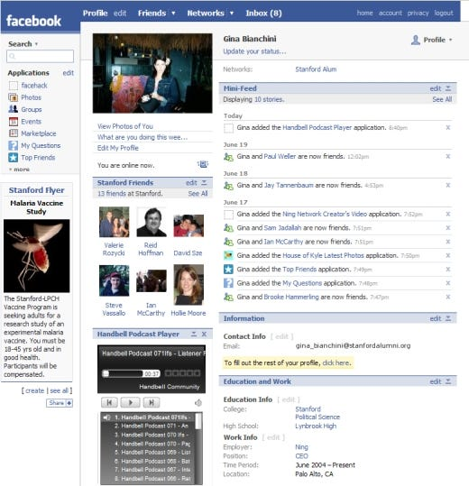
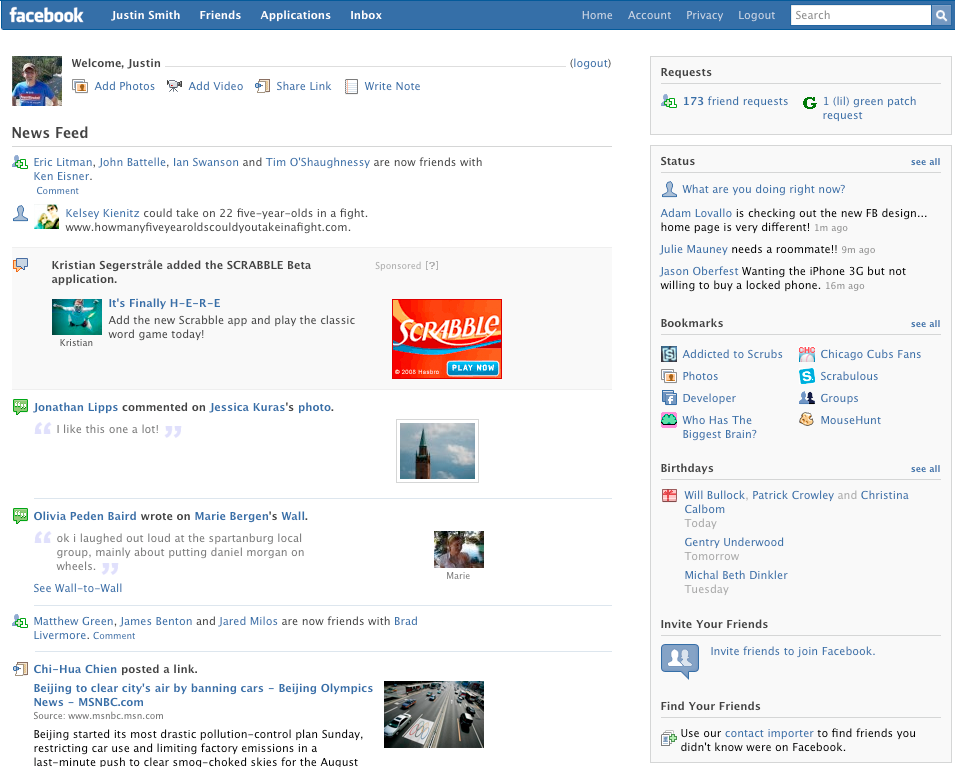
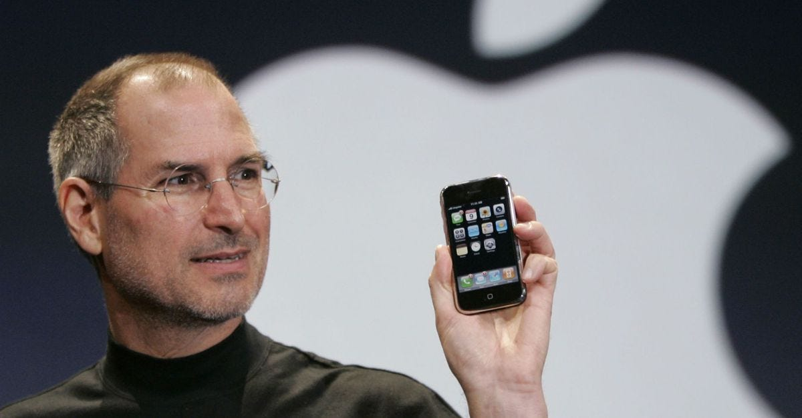
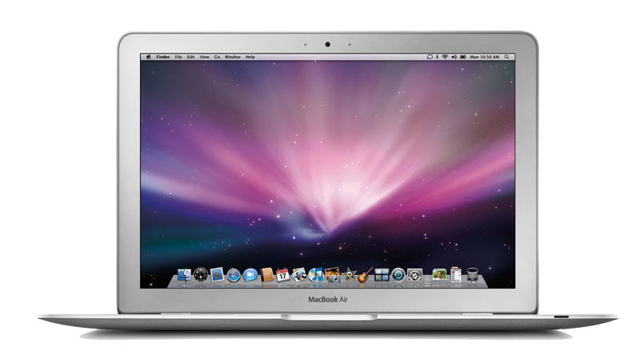
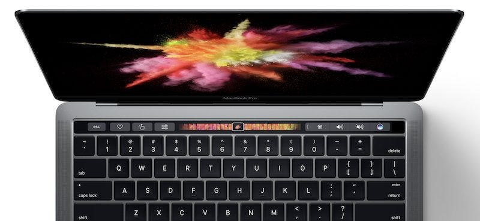

At the end of 2007, a friend of mine told me about Facebook, a new social network that was "less sketchy than MySpace". After showing me the site, he convinced me to sign up and start posting things on my wall. Only 20 of my friends had Facebook, and I remember convincing some of my non-Facebook friends they should join. At the time, the site looked something like this:

Compared to MySpace, this design was awesome! So clean and so much whitespace. Then a year later in 2008, Facebook released a major change to their UI:

When the new layout dropped, I remember thinking "whoa! cool new layout!". However, there were users of Facebook that weren't too pleased. Pretty soon my feed was littered with groups and pages with names like "IF THIS GETS 100 MILLION LIKES, FACEBOOK WILL BRING THE OLD FACEBOOK BACK!" and "2 MILLION STRONG AGAINST THE NEW FACEBOOK!". One developer even went so far as to create a [Facebook application](https://techcrunch.com/2008/09/16/dont-let-facebook-force-the-new-profile-on-you-heres-how-to-get-the-old-one-back/) that modified the UI to the point where it looked like the previous version.

In hindsight, we understand perfectly clearly why Facebook made drastic changes to their layout: _they were in the process of finding the best user experience._

Were the changes painful for many users? Absolutely. Did Facebook lose users as a result? Probably. But was it the best choice for Facebook to make? Without a doubt. Social media on the web in 2008 was still largely in its infancy. Sure, there were social media sites before Facebook, but those sites never gained the traction or market penetration that Facebook has achieved.

## Apple's Slow, Touchscreen Phone

The same year I joined Facebook, this happened:

Once again, while early adopters were excited about the iPhone, some tech pundits bemoaned the iPhone's many perceived flaws. "It doesn't have a physical keyboard! It's too expensive! It really isn't _that_ innovative. It's not very good at doing what phone is supposed to do - make phone calls!"

Some of those early critics were definitely right - the first iPhone was expensive compared to phones of the day, and poor cell service on AT&T resulted in many dropped calls.

Did the iPhone's flaws hold it back? Nope. You know the rest of the story.

## Apple's Underpowered Laptop

A year later, Apple announced a new laptop that was "thin as Air":

Once again, it wasn't without its flaws. Critics were quick to point out that it didn't have an optical drive, was far less powerful than its MacBook and MacBook Pro counterparts, and had a goofy flip-down door containing a headphone jack, a micro-DVI port, and a USB port (and that was the only USB port on the entire machine).

Flash forward 7 years, and we know how the MacBook Air turned out.

## What about the New MacBook Pro?

Last week, Apple announced this:

The backlash against the most recent MacBook Pro announcement has been louder than I can remember from previous announcements; to only mention a few of the criticisms:
- The maximum configuration of RAM is 16gb, while there are other laptops on the market that support up to 32gb of RAM (there has been [some debate](https://www.reddit.com/r/apple/comments/59yrxg/the_true_reason_the_mbp_doesnt_come_with_ddr4_or/) on whose to blame for that, but John Gruber does a good job of articulating [what is most likely the case](https://daringfireball.net/linked/2016/10/31/intel-mbp-ram)).
- The only ports on the computer are Thunderbolt 3/USB-C and a headphone jack (ironically).
- The base price of the MacBook Pro 13" _without_ TouchBar is $1500, while the base price of the MacBook Pro 13" with Touchbar is $1800.

As per usual, you'll see lots of articles that read something like "Is this the Death of Apple?" and "Apple is forgetting x group of users". Already the rumor mill is churning with reports that Apple is going to lower the price point next year and bump the specs.

My take on the situation? While I'm not totally bullish on the new MacBook Pro, I suspect it will turn out the same that previous products have turned out: after a few years, we'll reap the benefits of Apple pushing the world toward a more unified standard (USB-C) and we'll forget how "painful" that initial transition was.

## What does this have to do with Facebook?

Why mention Facebook initially, if we've seen that Apple has a great track record? Facebook was willing to make drastic changes to its product - so much so that it upset a vocal portion of its users (who used the platform itself to express their views - I would call that a win!). Look at the UI now, however, and each of those changes seems so obvious.

I'd argue that the changes made with this MacBook will be the same way. _Of course_ we would want Apple to push the world towards USB-C. _Of course_ we would want them to give us new ways of interaction (Touch Bar). _Of course_ we'd want a Pro-level laptop even thinner and lighter than before.

I think [Chuq Von Rospach put it well](https://www.chuq.me/2016/10/how-apple-could-have-avoided-much-of-the-controversy/):

> We demand Apple innovate, but we insist they don't change anything.

Change will always be painful at first. But in hindsight, innovative change is obvious.