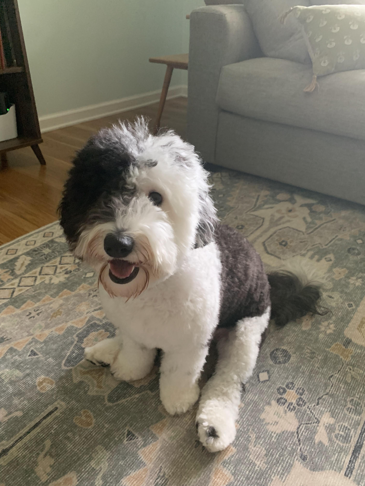
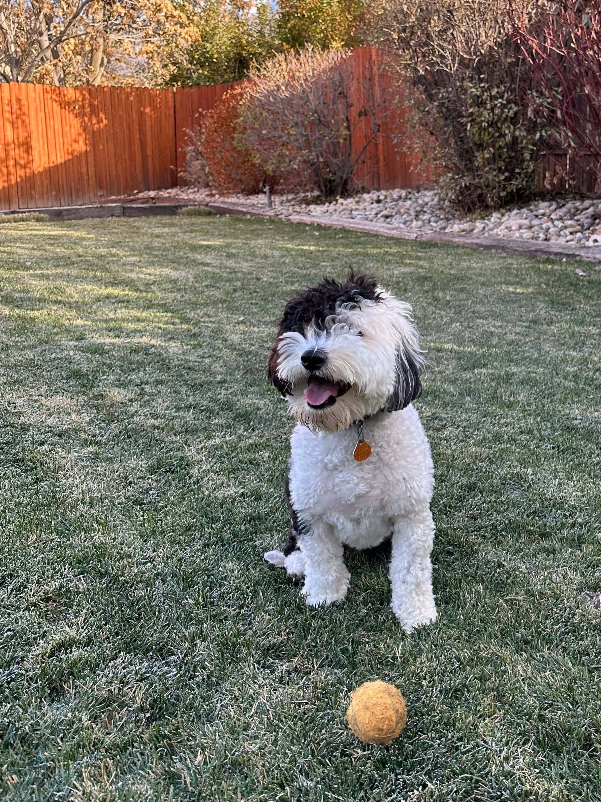
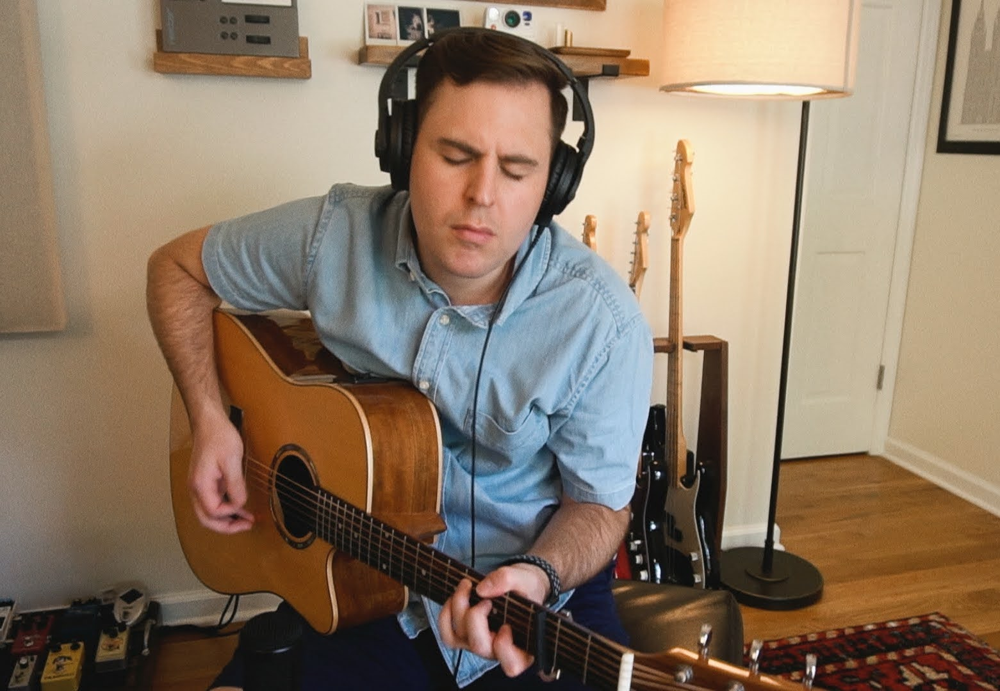
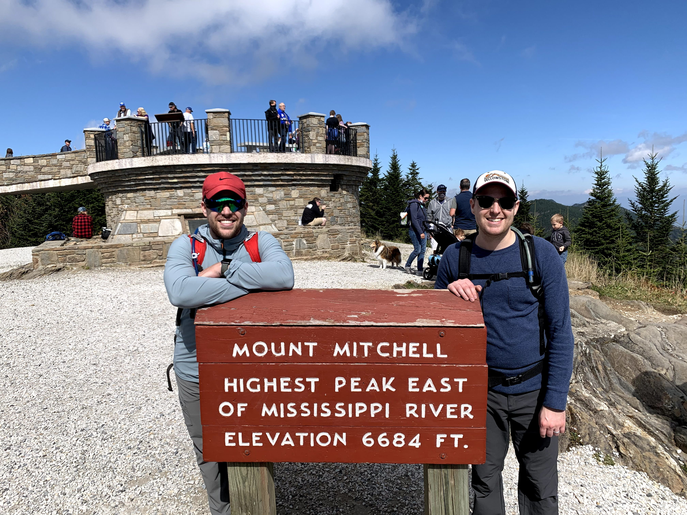

At the start of 2020, I was feeling lots of momentum with my blog. I had been writing consistently for over a year, I had my first speaking opportunity at [Gatsby Days LA](https://thetrevorharmon.com/blog/sell-things-fast-with-gatsby-and-shopify/), and I was working on [my first piece of open source software](https://github.com/thetrevorharmon/gatsby-theme-shopify-manager). I was feeling good and excited for the future.

Then, of course, the pandemic happened. I decided to step away from pursuing the blog and "personal brand" and instead focus on living in the moment.

So, what have I been up to since then?

**I moved across the country.** In June 2020, I moved from Los Angeles to North Carolina. I moved to support my wife in attending grad school, and the city we moved to felt like the exact inverse of where we were living before. It was a difficult adjustment, but we have grown to know and love NC.

**I've shipped a lot of code.** I joined Shopify about 6 months before my most recent post (August 2019), and it feels like I've had several mini-careers at Shopify since then. One of the most impactful changes I've experienced is [our permanent shift as a company to remote work](https://www.fool.com/investing/2020/05/22/shopify-is-going-all-in-on-remote-work.aspx). I shared in October 2019 about [my experience](https://thetrevorharmon.com/blog/what-I-learned-from-my-first-month-working-remote/) working remote on a hybrid team. Having the entire company shift to remote work has been tremendously positive for my experience at Shopify. I'm proud of the work I've shipped as part of [in-context analytics](https://shopify.engineering/shopify-in-context-analytics), [BFCM Notebook](https://twitter.com/Shopify/status/1466152432392675333?s=20), and [ShopifyQL Notebooks](https://www.shopify.com/editions/winter2023). Fun fact about the BFCM Notebook—it dropped the same day as Spotify's yearly Wrapped feature totally by accident.

**I got a dog.** We had been talking about getting a dog for quite a while, but I had difficulty pulling the trigger. One night at 7pm—basically on a whim—my wife convinced me to jump in our car and drive 8 hours to Ohio to pick up a mini sheepadoodle (which we named Poppy). Training her and surviving puppyhood was hard (puppy blues are a real thing), but she has turned out to be the sweetest addition to our little family. We've had her for a couple of years and now we can't imagine _not_ having her in our lives.

import {TwoUp} from '../../../../components';

<TwoUp>

</TwoUp>

**I put out some music.** I've been in a number of music groups over the past ten years, including [Jefferson & York](https://open.spotify.com/album/0WEod59ULOzfjJiZS6AJ9F?si=-hVsyye_QLeaPltQvAvMyA), [Michael Barrow & the Tourists](https://open.spotify.com/artist/1mhe70fSiQDyc16JVlhBUE?si=iVc7DmhoTCKsPTFIa9N5xg), and The Last Seconds. In those groups, I served as a lead guitarist and very occasionally a singer. Though I've been writing songs (lyric & melody) for a long time, I never served as a singer or frontman in any of those groups. When I moved across the country, I found myself wanting to play music but without a group to play with (and for part of it, I didn't feel comfortable playing with folks because of COVID). I decided to finally work on my solo music and since then have put out an instrumental EP called [Songs for Sleep](https://open.spotify.com/album/7ePZVqwRTdt0Sjxe2Mex1a?si=EOa0v7OdRruqd40pCHKxfQ) and two vocal songs—[I Walked Through Fire](https://open.spotify.com/track/3jS2MJ4fkQWBsvCWCfVMoh?si=JziYmQiVQeieX-TFTRuOrg) and [Still Can't Explain](https://open.spotify.com/track/2sYkRzFX9tBCzTCfzE07Y8?si=Ae2tsmFETK2dYWDZ4D2LrA).

**I survived PA school (as the spouse of a student).** I graduated BYU in 2018 with a master's degree ([MISM](https://marriott.byu.edu/infosys/mism/what-will-i-study/program-overview/)), and when my wife said she wanted to get a master's degree, I thought "oh yeah, I have one of those, I know what that's like". I have since discovered that my master's was more like "master's lite" compared to the immense workload that a PA student has while in school. While it's not _technically_ medical school, there are similarities in terms of workload at various points throughout the curriculum. PA school put immense pressure on our marriage at times, but we deliberately chose to work through it and are better because of it.

**I went through therapy.** As part of “deliberately choosing to work through it”, I decided I needed to work with a counselor to figure out why I had been experience some regular anxiety and depression. She helped me learn some hard truths about myself, and I was able to work through some feelings and choices that were causing my anxiety and depression. I don't think I would have chosen to go to therapy without the pressure of PA school, but I'm grateful for it because of the positive impact it's had on my life and relationship with Kels.

**I became more active.** After moving out to North Carolina, my brother and I discovered that the tallest mountain east of the Mississippi was in the mountains on the west side of the state (Mount Mitchell). We made plans to hike it together, which pushed me to start running in order to train for the hike. After our hiking trip, I decided to keep up the habit and continue to be more active as a way to invest long-term in my health. Since then I've switched between running, cycling on an indoor bike, going on walks with the dog, and playing pickleball as ways that I keep active.

**I became more connected to my identity as a Christian.** Some time ago, the leader of my church ([The Church of Jesus Christ of Latter-day Saints](https://www.churchofjesuschrist.org/?lang=eng)) [called for us to focus on the correct name of the church](https://www.churchofjesuschrist.org/study/general-conference/2018/10/the-correct-name-of-the-church?lang=eng) instead of adopting nicknames or shortened versions of the name. While I began to abandon the nickname of "mormon", I accidentally found myself on a journey to understand my beliefs in a new context. It led me to do a lot of soul-searching to understand my identity as a follower of Jesus. This process of greater understanding has brought me peace and hope despite the many troubling things that have happened over the past three years (and that we continue to see in the news today).

## Looking forward

Historically, I've treated this blog as strictly a career-only outlet, focusing heavily on how-to type articles with the occasional philosophical article thrown in. My goal was to develop a personal brand and a following based on the content I produced. I've decided I want to shift how I use my site to be more representative of all of me, not _just_ my thoughts on code. This will make my blog less follow-able (because inevitably the variety will be a turn off to some folks), but I'm ok with that. I plan write more this year than in the last few years—you can expect:

- More how-to articles about code, especially about some things I've learned at work (these will probably never go away)
- Musings about what it's like to work remote (coming up on 4 years in!)
- Thoughts about how to build lasting habits and how that's been going for me
- Updates when I release more music
- The occasional post that leans philosophical/religious

If you enjoyed this post and want to follow along, I plan to post updates about my blog on [twitter](https://twitter.com/thetrevorharmon), [the RSS feed](https://thetrevorharmon.com/rss.xml), and [mailing list](https://thetrevorharmon.us18.list-manage.com/subscribe?u=564c646304e7c3dcd08710731&id=03c1d4d9de) (the mailing list is basically RSS to email).

It's good to be back. Thanks for reading.
