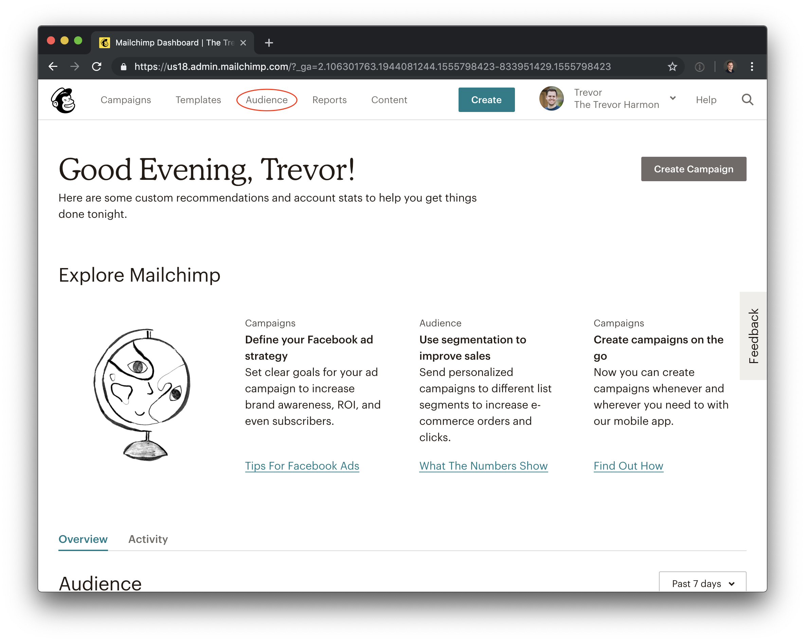
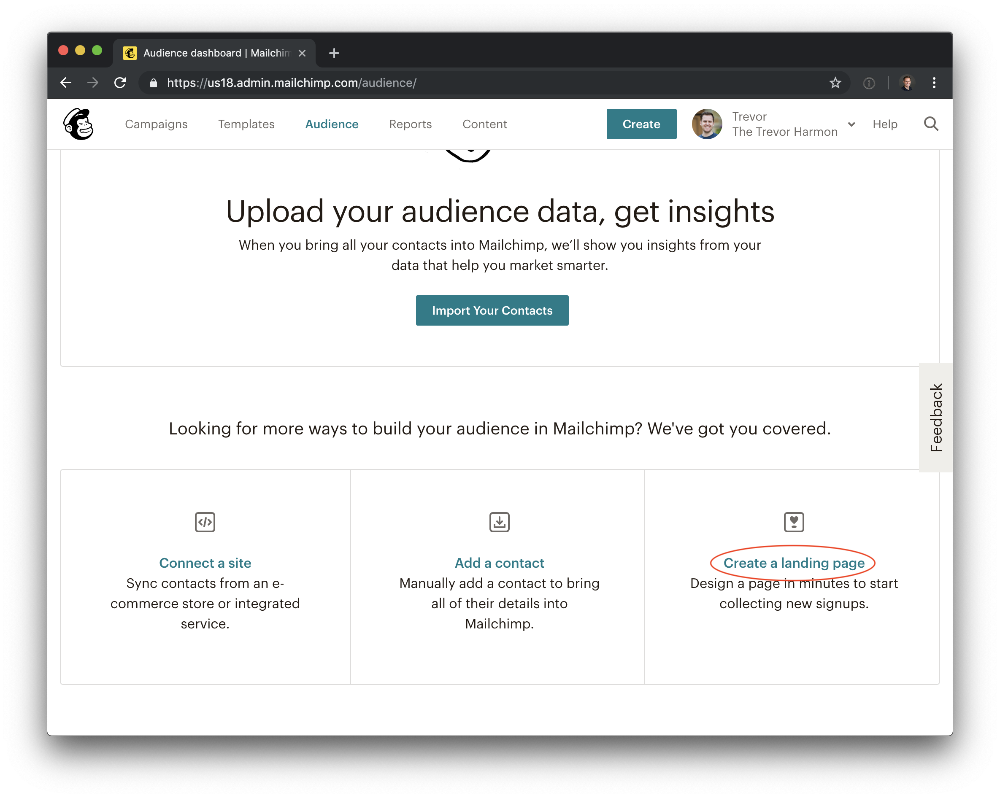
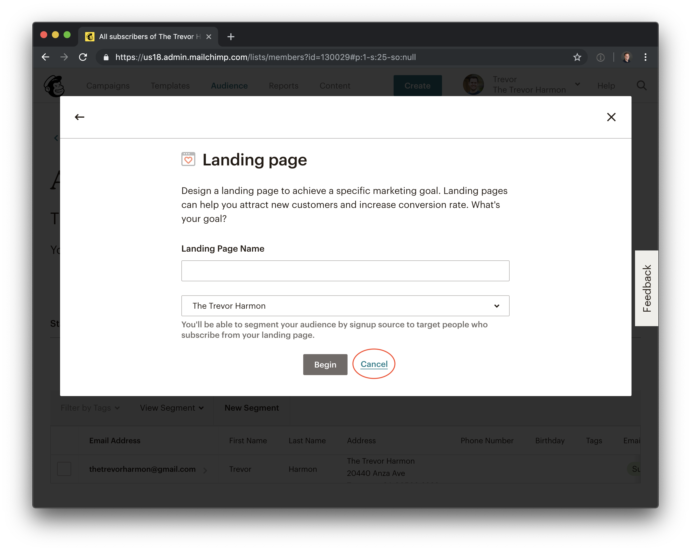
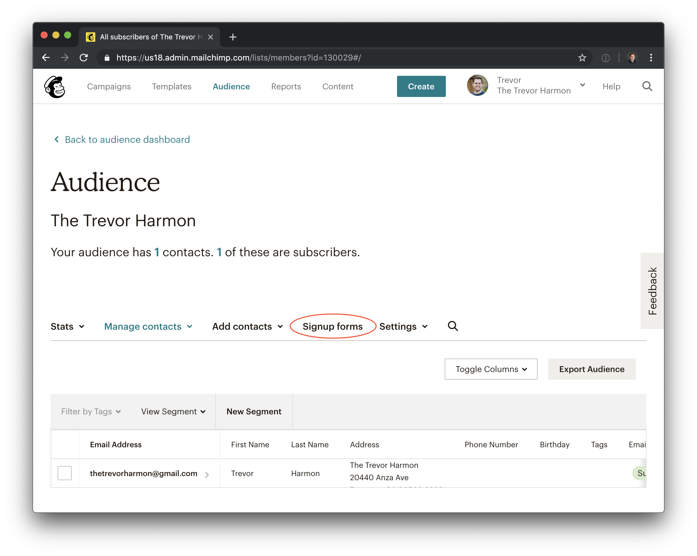
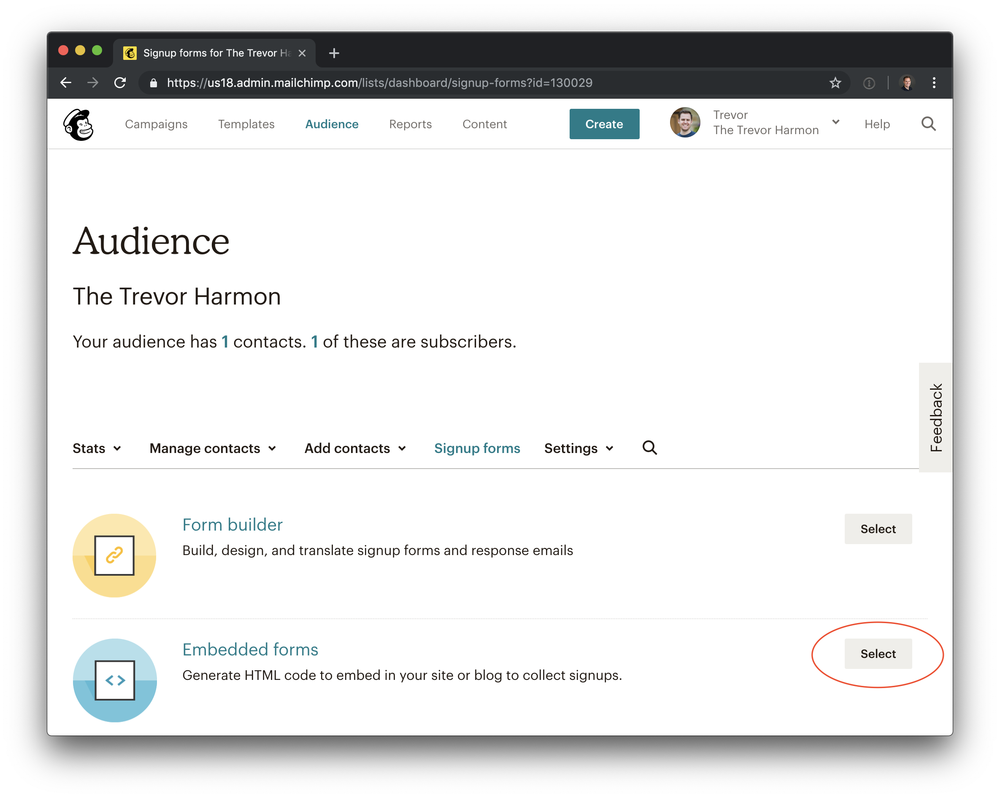
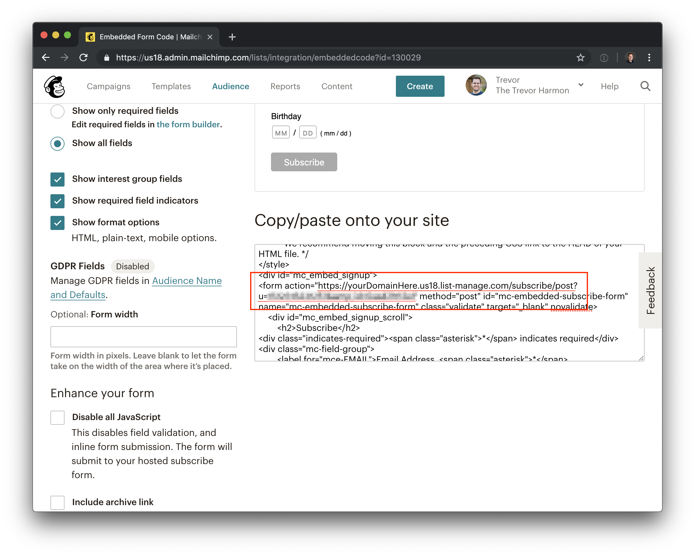
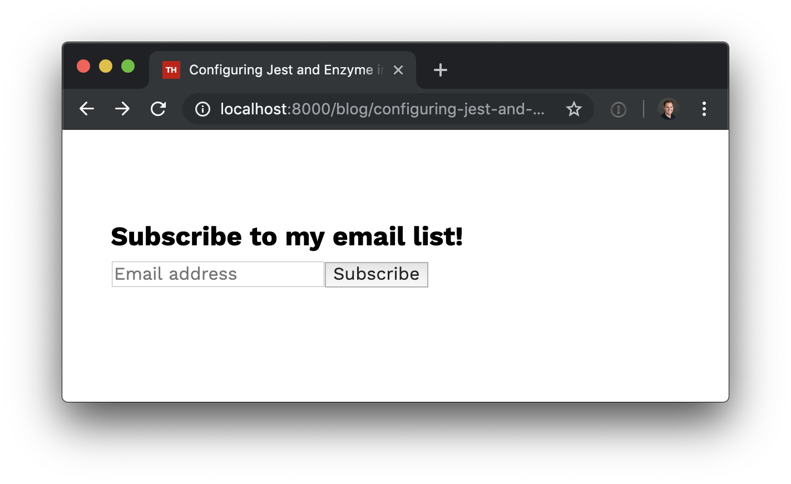
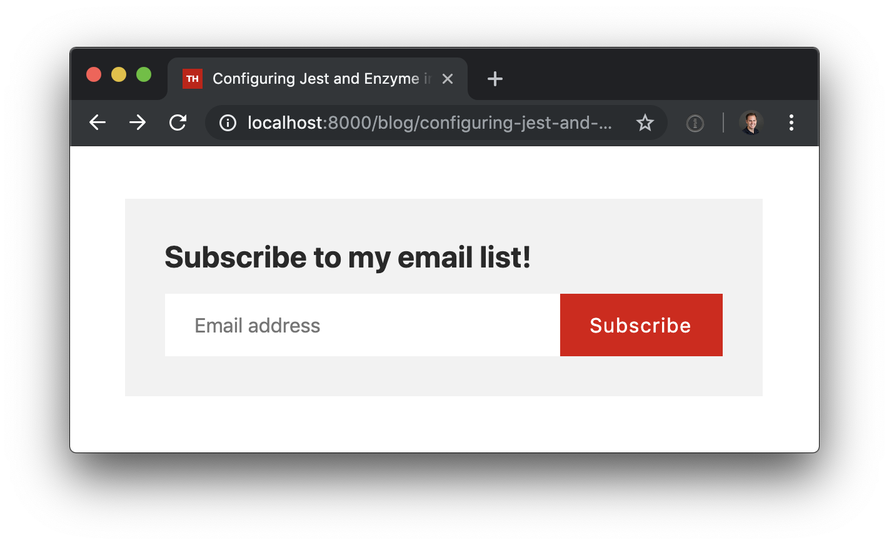
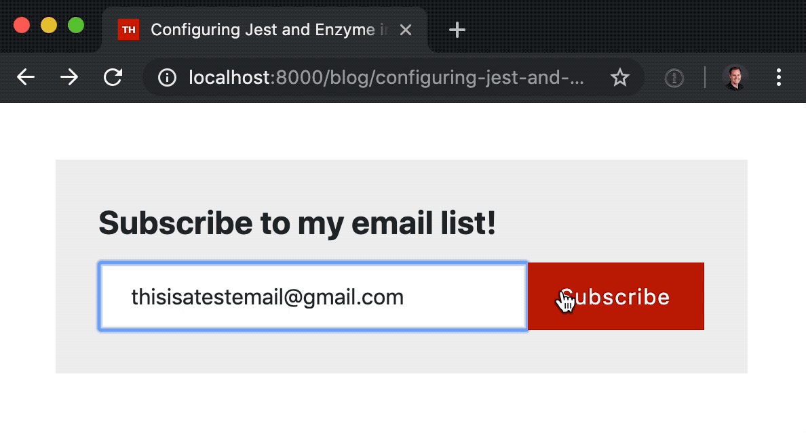

If you're using Gatsby to power your blog, chances are that you need an easy way for others to sign up for your posts. While some choose to offer their content through RSS or Twitter, one of the most reliable ways to make sure that your content gets in front of the eyes of your audience is by building an email list. Thanks to [benjaminhoffman][2] (and other contributors), setting up an email list signup within Gatsby is a breeze. In the article, I'll walk you step by step (and provide sample code!) to creating a Mailchimp signup form for Gatsby.

_Note: this article assumes that you've already [signed up for a Mailchimp account][3]. If you haven't, you should go do that and come back to this._

## Find your Mailchimp form action

The goal of this step is to get the form action from the embedded form that is associated with a Mailchimp list. Go ahead and do the following:

Log in to your Mailchimp dashboard and click "Audience".



Scroll down and look for "Create a landing page".



You'll see a modal that says "Landing page", which you can dismiss.



Click on 'Signup forms'.



Click on 'Embedded forms'



Scroll down until you can see the code for the form, and then scroll through the form looking for the post action. It will look something like this:

```
https://yourDomainHere.us18.list-manage.com/subscribe/post?u=1512315231251&amp;id=0asd21t12e1
```



Copy that post action and paste it somewhere for safekeeping.

## Install the plugin

Install the plugin to get it working on your machine:

```
yarn add gatsby-plugin-mailchimp
```

## Add the plugin to your Gatsby config file

In your gatsby-config file, add the plugin with your Mailchimp endpoint. The string you copied earlier is the value for `endpoint`.

```javascript
{
  resolve: 'gatsby-plugin-mailchimp',
  options: {
  	endpoint: 'THE FORM ACTION WE JUST COPIED',
  },
},
```

## Create a component

In order to have a functional signup form, we need a component! I've written a simple one for you to start with. Here's the code:

```javascript
import React, {useState} from 'react';
import * as styles from './EmailListForm.module.scss';

const EmailListForm: React.FunctionComponent<{}> = () => {
  const [email, setEmail] = useState('');

  const handleSubmit = (e: React.FormEvent<HTMLFormElement>) => {
    e.preventDefault();
  };

  const handleEmailChange = (event: React.ChangeEvent<HTMLInputElement>) => {
    setEmail(event.currentTarget.value);
  };

  return (
    <form onSubmit={handleSubmit} className={styles.EmailListForm}>
      <h2>Subscribe to my email list!</h2>
      <div className={styles.Wrapper}>
        <input
          placeholder="Email address"
          name="email"
          type="text"
          onChange={handleEmailChange}
        />
        <button type="submit">Subscribe</button>
      </div>
    </form>
  );
};

export default EmailListForm;
```

Right now, the form looks like this:



It looks a little plain. Let's add some CSS to make it look more interesting:

```scss
.EmailListForm {
  display: flex;
  flex-direction: column;

  background: #f2f2f2;
  color: #2a2a2a;

  font-family: -apple-system, Helvetica, Arial, sans-serif;
  padding: 2rem;

  h2 {
    margin-top: 0;
    margin-bottom: 1rem;
  }

  .Wrapper {
    display: flex;
    flex-direction: row;
  }

  input {
    color: #2a2a2a;
    width: 100%;
    border: none;
  }

  button,
  input {
    padding: 1rem 1.5rem;
  }

  button {
    display: inline-block;

    border: none;
    background-image: none;
    background-color: #dd0505;
    color: white;

    letter-spacing: 1px;
    transition: all 0.1s linear;

    &:hover {
      cursor: pointer;
      background: darken(#dd0505, 15%);
    }
  }
}
```



Perfect!

## Type definitions

As of the time of this writing, there aren't typescript definitions for `gatsby-plugin-mailchimp`. The good news is that I've written some already, and you get to steal my work. If you're using typescript, create `gatsby-plugin-mailchimp.d.ts` and use the following code:

```typescript
declare module 'gatsby-plugin-mailchimp' {
  import * as React from 'react';

  type MailchimpResult = 'success' | 'error';

  export interface MailchimpResponse {
    result: MailchimpResult;
    msg: string;
  }

  export interface MailchimpFields {
    [key: string]: string;
  }

  function addToMailchimp(
    email: String,
    listFields?: MailchimpFields,
  ): Promise<MailchimpResponse>;
  export default addToMailchimp;
}
```

## Start using the plugin

The great thing about this plugin is how straightforward it is to use. You just import the function:

```
import addToMailchimp from 'gatsby-plugin-mailchimp';
```

And you're off to the races! Let's add `addToMailchimp` to our form submission handler:

```javascript
const handleSubmit = (e: React.FormEvent<HTMLFormElement>) => {
  e.preventDefault();

  addToMailchimp(email)
    .then((data) => {
      alert(data.result);
    })
    .catch((error: Error) => {
      // Errors in here are client side
      // Mailchimp always returns a 200
    });
};
```

In this example, `addToMailchimp` returns a promise that you need to handle. It will only ever enter the `catch` of the promise if you don't reach Mailchimp at all. If you reach Mailchimp but encounter an error, they'll return a 200 and it's up to you to look inside of `data.result` to see if it was a success or failure.

Now that we've got everything wired up, let's test it:



## Conclusion

This is a simple example of a signup form for a single list. This isn't comprehensive of what the plugin can do–[read the docs][4] to see how you can use more than one list or for more detailed information about the plugin. And for the completed component, check out the [gist][5].

And if you found this article valuable, feel free to subscribe!

[1]: https://medium.com
[2]: https://twitter.com/benhoffman_
[3]: https://login.mailchimp.com/signup/
[4]: https://github.com/benjaminhoffman/gatsby-plugin-mailchimp
[5]: https://gist.github.com/thetrevorharmon/6f308dc9f97aaa050f6e1424dce0890d
