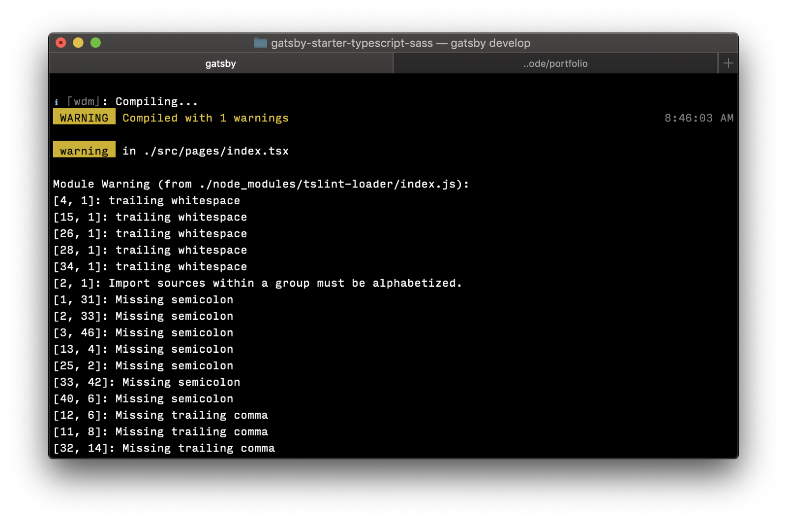

I wanted to set up linting in a Gatsby project I was working on, but there weren’t any great resources for linting Typescript. I wrote a plugin to make it easy– here’s how to set it up.

*Disclaimer: I use yarn in all of my sample commands, but you can easily switch it out for NPM and it’ll work.*

## 1. Install the plugin & dependencies

The plugin (`gatsby-plugin-tslint`) is available through NPM, so you can use either yarn or node to install it. Visit the [plugin’s github page](https://github.com/tdharmon/gatbsy-plugin-tslint "Gatsby TSLint Plugin GitHub page") to learn more about it, if you’d like.

You’ll also need to install `tslint-loader` and `tslint` as a dependency. Both can be installed as dev dependencies.

If you want to install all of these in one easy command, do this:

```shell
yarn add --dev gatsby-plugin-tslint tslint-loader tslint
```

## 2. Add the lint plugin to your gatsby-config.js file

Add the line `gatsby-plugin-tslint` to the plugins section of your config file. If you don’t have a config file yet, you can find good documentation about it on [gatsbyjs.org](https://www.gatsbyjs.org/docs/gatsby-config/ "Documentation about Gatsby config files").

## 3. Generate a TSLint file

Assuming that you’ve installed TSLint into your repo, you can use it to generate a `tslint.json` file (this is the file that configures your lint rules). If you install `tslint` globally, you can just run it from the command line, but if you’ve only installed it locally, you can still use its executable to generate your file for you. At the top level of your directory, run the following command:

```shell
node_modules/tslint/bin/tslint --init
```

If you installed it globally, you can omit the path and just use `tslint --init`.

## 4. Customize the TSLint file

Right now your lint file probably only extends the recommended set of rules and nothing else. It’s useful to extend the react-specific lint rules. Do that by installing the `tslint-react` package:

```shell
yarn add --dev tslint-react
```

In addition to extending the `tslint-react` rules, there are a couple of tweaks that I find to be helpful when linting react. Here’s my preferred `tslint` setup:

```javascript
{
    "defaultSeverity": "error",
    "extends": [
        "tslint:recommended",
        "tslint-react"
    ],
    "jsRules": {},
    "rules": {
      "quotemark": [true, "single", "jsx-double"],
      "interface-name": [false],
      "jsx-no-multiline-js": [false]
    },
    "rulesDirectory": []
}
```

If you made it this far, run `gatsby develop` (or `yarn start`). If everything was configured properly, you should be seeing gatsby start linting correctly:



## 5. You’re done!
Happy linting!