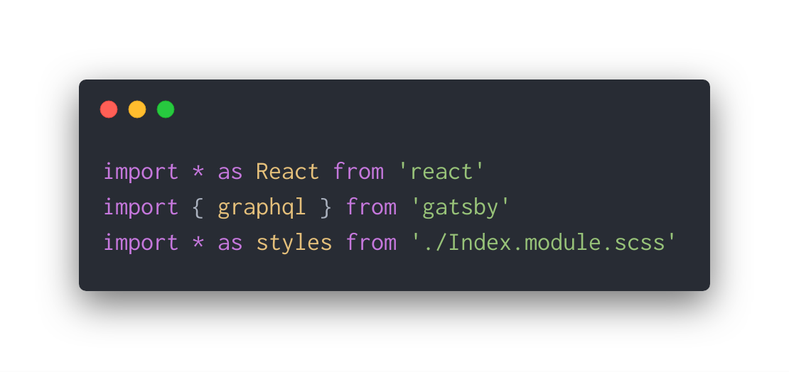

I was working on a React project and I kept running into an error that read `Cannot find module './Index.module.scss'`. The file was definitely there, and the project was building fine. What gives?

## Missing Type Definitions

After doing more research, it turns out that this isn’t a problem with missing files at all, but missing type definitions. For whatever reason, when Typescript reads the file, realizes it doesn’t have type definitions, and instead of saying something like “Missing type definitions for file”, it says that it can’t find it at all. To fix this error, you need to take two steps:

1. Add a `tsconfig.json` file
2. Provide type definitions for your `.scss` files

## 1. Add a tsconfig file

This step is pretty straightforward — just add a file named `tsconfig.json` to the top level of your project. You can have Typescript automatically generate one (with the command `tsc --init`), but here’s an example of a basic one to get you started:

```javascript
{
  "compilerOptions": {
    "target": "es5",
    "module": "commonjs",
    "jsx": "react",
    "strict": true,
    "esModuleInterop": true
  }
}
```

If you decide to have Typescript automatically generate one, just make sure you set the `jsx` option to `react`.

*Random tidbit: you can actually fix this error with a blank `tsconfig` file. While that’s an option, I think it makes sense to populate it with actual values, so you don’t have some random blank file hanging around. You also then have more control over how your Typescript is compiling.*

## 2. Add type definitions for your .scss files

There are three approaches to solving this problem:

1. Provide all of the type definitions by hand for every CSS class you create (hard)
2. Automatically generate type definitions for your `.scss` files (hard because the tooling out there isn’t perfect)
3. Add a catch-all type definition for all `.scss` files (easy)

After spending hours on trying to make #2 work, I decided to go with option #3. To do this, you create a `.d.ts` file somewhere in your project (I stuck mine in the `src` folder and called it `globals.d.ts`) and add the following definition to it:

```javascript
declare module '*.scss' {
  const content: {[className: string]: string};
  export = content;
}
```

This declaration basically tells Typescript what to expect when looking at a `.scss` file. Save that and then…

