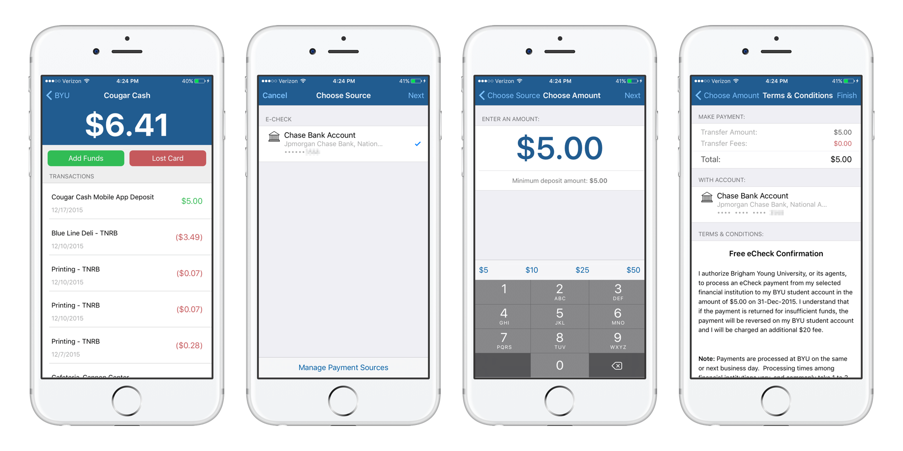

In 2014, BYU rebranded their student ID card system as "CougarCash", allowing students to use their student ID cards as a debit fund on campus. I built a feature in the BYU iOS app to give students access to their account balances, transactions, and add funds into their accounts. I took the project from concept to finish, going through the UX, UI, and development stages.

## Initial Research
I started out with the information previously mentioned and was given a handful of API endpoints with the following feature requirements:

- Ability to access account balances and transactions
- Ability to load funds into a student's account
- Ability to report a lost card

I started by researching other banking and banking-like apps that had similar features; I looked at apps for Chase bank, Google Wallet, and Venmo. As I analyzed other apps, read through documentation about the APIs, and talked with prospective users of the CougarCash feature, I decided to optimize the app's flow for the following use cases (in this order):

1. Check account balance
2. View recent transactions
3. Add funds
4. Report lost card

## Design & Development

I knew I wanted to show the balance and transactions on the initial screen, so the design of that was pretty simple to nail down. The flow of adding funds was key - it needed to be easy to understand and quick enough to do on the go. My goal was to create a flow that a student could do from start to finish in less than 20 seconds. The final version of the add funds flow turned out to be: 

1. Account Overview
2. Choose Source
3. Enter Amount
4. Review &amp; Agree

After determining the flow of the app, I built out the app using Objective-C. Most of the BYU app was built using default iOS paradigms, so I tried to adhere to the Apple Human interface guidelines as much as possible.

In the code, I used a [facade pattern](https://en.wikipedia.org/wiki/Facade_pattern) to make getting data from our API into the app easy to maintain and add on to (since the app is maintained by a small team).

## Results 

- 50% of all money deposited into CougarCash is through the app
- Over 10,000 students have used the CougarCash feature of the app
- Over the course of a month, the app was used over 28,000 times

BYU has invested heavily in CougarCash's success, and continues to advertise and remind students about the system. The system effectively cuts credit card companies out of the payment process, which means that BYU's tax-exemption benefits are passed on to students (you don't pay taxes when you pay with CougarCash), and BYU saves the 2% credit-card processing fee that they have to pay on card transactions.

BYU's demographic is 90% iOS, and the CougarCash app I built plays a key role in keeping students connected to CougarCash; it helps both BYU and its' students save on every transaction. Out of all the features in the app, CougarCash is the 2nd most used feature.

