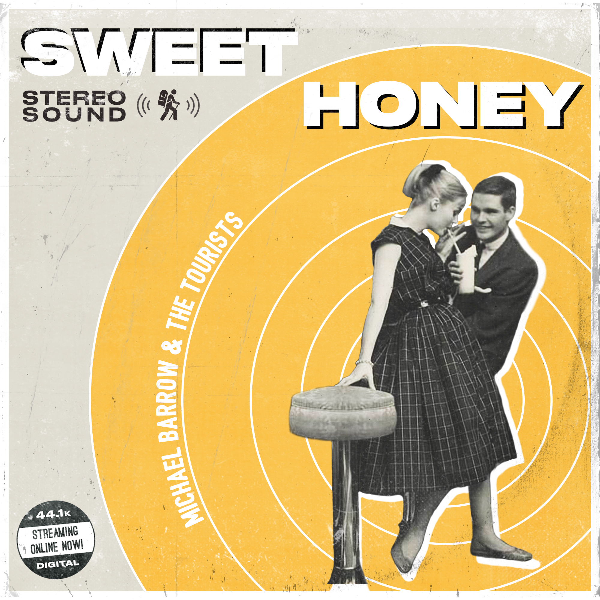

For the better part of the past 3 years, I've been associated with [Michael Barrow & the Tourists][7], a band from Provo, UT. Part of my role for the band has to been to design flyers, posters, album covers, and everything else under the sun that a band needs designed.

Recently I designed the artwork for ["Sweet Honey"][8], their first single of 2019. I went through six significant iterations on the design. Each iteration shows my design process and illustrates the path I took to get to the final design.

## Iteration 1: Honey Dipper

"Sweet Honey" sings about love with bee metaphors. The song's lyric feels overt at times, like the end of the chorus:

> I wanna be with you baby / even if I get stung

I wanted to design an overtly-bee-related cover to match the lyric. I found an image of a honey dipper, did some color correction, and slapped some text and a border on it. After sitting on this design for a little while, it had three problems:

1. It didn't give a clear direction (stylistically) to future designs, which is important because this single starts a new "era" of music for the band.
2. It really wasn't memorable in any way.
3. The band didn't love the design (and neither did I).

## Iteration 2: Bit-O-Honey Bus

I decided to pursue an idea related to the band's name: _Michael Barrow_ & the _Tourists_. I wanted to show Michael as "the tourist" in different countries. I also wanted to bring in a vintage element to the design. I found a vintage bit-o-honey container which I photoshopped "Sweet Honey" onto, and was in the process of integrating that as the advertisement on the side of the bus. My plan was to then add Michael as a "tourist" inside of the bus.

Despite having some positive feedback on this idea, I decided to abandon it for two reasons:

1. It wasn't easily replicated or translated into designs for other needs. For example, how do you translate this design into a Facebook header? An Instagram profile photo?
2. It didn't provide a clear stylistic direction for future designs.

## Iteration 3: Vintage Television

The vintage element of the bit-o-honey container stuck for future designs, and ended up influencing the photo choice for this iteration. The idea behind this design was to have a photo of a single object that represents the song somehow. It would make it easy for an easily replicated design for future design work.

However, this design was only loosely related to Sweet Honey. The television was appropriate only because we wanted something that felt vintage, and an old tube TV evoked that imagery. Even though it would be easy to re-create this design in other places, nothing about it felt connected with the song or the music created by Michael Barrow & the Tourists.

## Iteration 4: Dancing in Black & White

Shortly after the vintage television cover, I designed this as part of a series for other singles. The black and white photo was meant to add emotion to the image, and make the image feel more human (unlike how sterile the television felt).

The band had a positive response to this cover, but I felt like the design wasn't opinionated enough stylistically.

## Finding Guiding Principles

After the fourth iteration, I knew that there was a better design out there, but I hadn't found it yet. I decided to examine the successes and failures of each design. I also examined the song itself and how it was recorded. I came away from that study with three guiding principles:

1. **The design needed to feel vintage.** Sweet Honey was recorded mostly live in a single room, and was mixed on an analog console (both considered to be old-school recording strategies), and the design needed to match.
2. **The design needed to feel human.** The song is about that awkward in-between stage of relationships where you're trying to figure out what the other person is feeling. Because the song content is so human, I felt like the design needed to try to reflect that.
3. **The design needed to feel real.** After looking at a previous design I did for ["Santa Barbara Sessions"][1], I realized that what these four iterations lacked was a "tactile" feel to them, and some texture would help. I also decided to steal the sticker from that album cover because I liked it so much.

I decided to look at old album covers, advertisements, and other designs from the 50's to get a sense for some of the design choices of that style. [Zach Collier][2] found [an excellent old photo of a couple on a date][3], and I decided to start over with a blank canvas.

## Iteration 5: Vintage Couple

I started this design by selecting [Druk Text Wide][4] as an era-appropriate typeface for the "Sweet Honey" text. I extracted the couple, and then created the yellow circles that the couple floats on. I then added the band's name (using [Bushcraft][5], their logo's font) and had it follow one of the edges of the circle, helping it blend in nicely with the rest of the design.

Once I finished some of the more critical parts of the design, I started working on the details. I added a shadow to the couple, and also added shadows to the "Sweet Honey" lettering. One of the design choices I noticed in old designs was non-global shadow angles (global shadow angles add to the sense that the light originates from a single source). I followed suit by inverting the shadow angle of just the word "Sweet".

I also noticed stickers and extra words like "stereo" or "hi-fi" on vintage covers, so created some of my own on this cover. As a finishing touch I added a border and then applied a nice layer of texture and grime to the design.

We submitted this iteration as the final design, but it was rejected because of some [style guide rules][6] ( we couldn't use the words "44.1k" and "digital" in the album cover because they were a reference to Sweet Honey being a digital product).

## Iteration 6: The Final Design

To fix the style guide issues, I changed the text on the sticker to read "Very Sweet" and "100% genuine honey!", instead of referencing anything digital. I also slightly changed the position of the sticker and pulled back the amount of "wear".

## Lessons learned

I started my first design sometime at the end of July 2018, and the final version was submitted at the end of January 2019. During those six months of iterations, I learned four lessons:

1. **A bad design can lead to a good design if you examine it closely.** Iterations two through four weren't all that good, but looking closely at them helped me distill which parts of the design worked.
2. **It's difficult but worthwhile to push through creative blocks.** There were several points throughout the process that I felt lost. I knew that the current iteration wasn't what I envisioned for the cover, but I wasn't sure _what_ I envisioned. However, I refused to settle on a medicore design and continued trying to create something worthwhile.
3. **Creative work is easier when you have guiding principles.** After examining iterations one through four, I was armed with a few [guiding principles](#principles). Iteration five was significantly easier to execute on because I had something test design decisions against.
4. **Great creative work takes time.** With rare exception, it's difficult to create something worth keeping on the first try.

Iterating on creative work can be difficult, but produces better results in the end.

[1]: https://thetrevorharmon.com/projects/santa-barbara-sessions-album-cover
[2]: https://twitter.com/zachisatourist
[3]: https://foter.com/photos/pi/332/50s-bar-stools-4.jpg
[4]: https://commercialtype.com/catalog/druk_text_wide
[5]: https://pixelbuddha.net/freebie/bushcraft-font-family
[6]: https://help.apple.com/itc/musicstyleguide/en.lproj/static.html
[7]: https://instagram.com/michaelbarrowandthetourists
[8]: https://open.spotify.com/track/24p3wDqcjQecwXMFxXkzYn?si=8PpfLBV0TRWN2Zc4j8r1Tw
