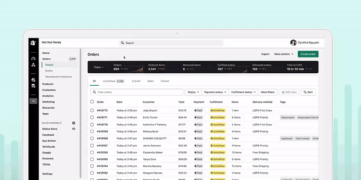
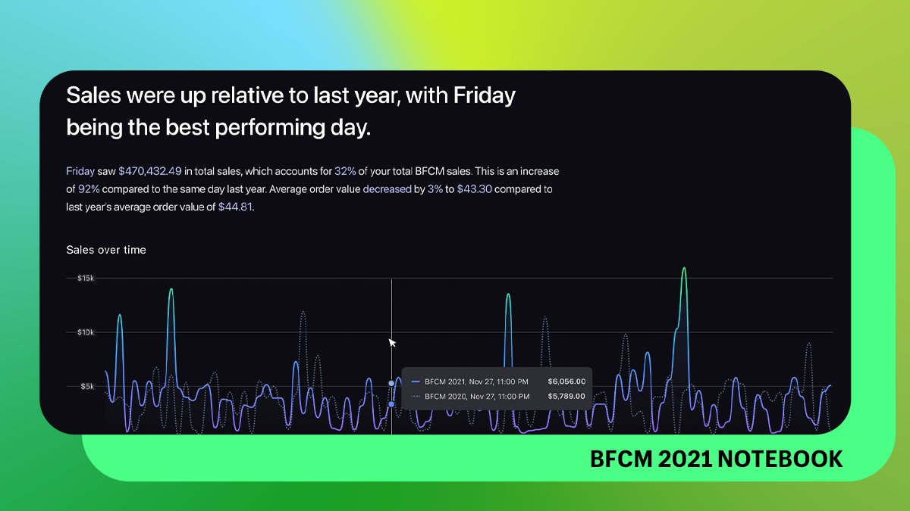
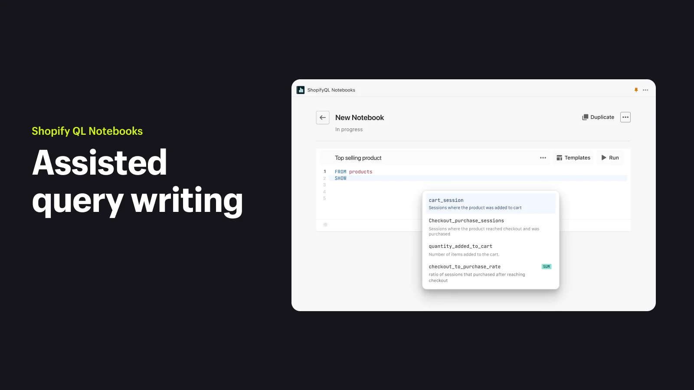
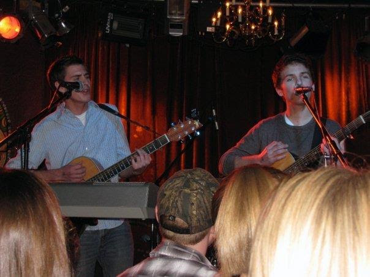
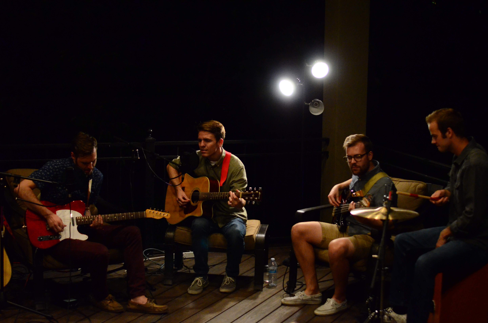
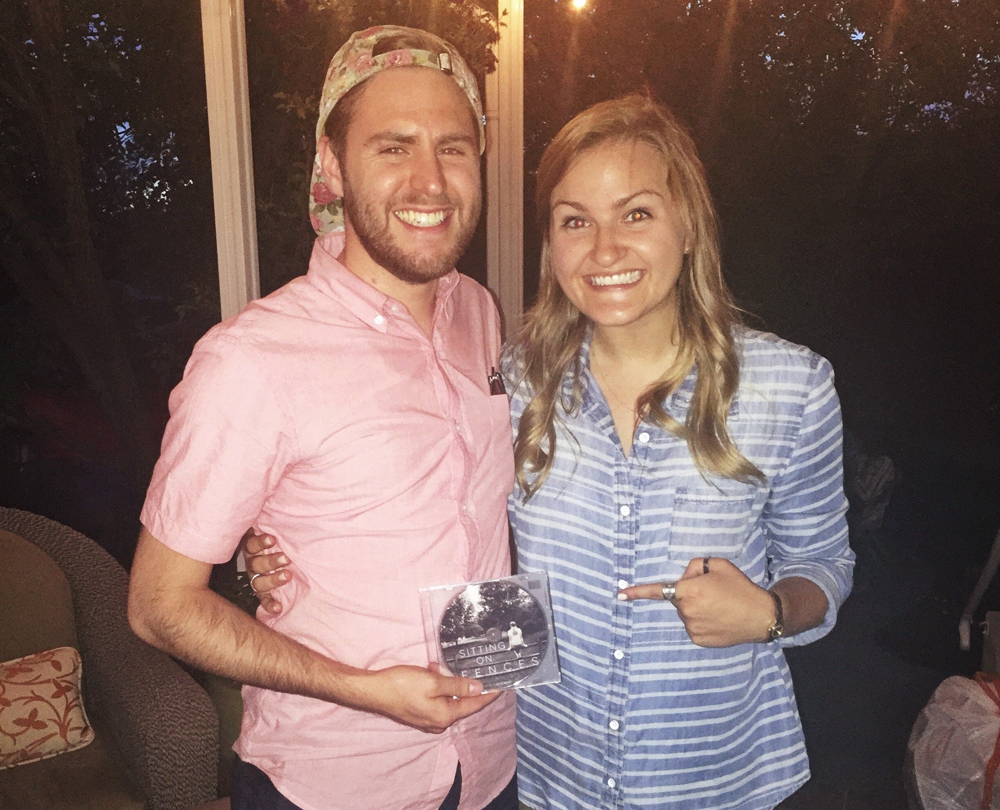
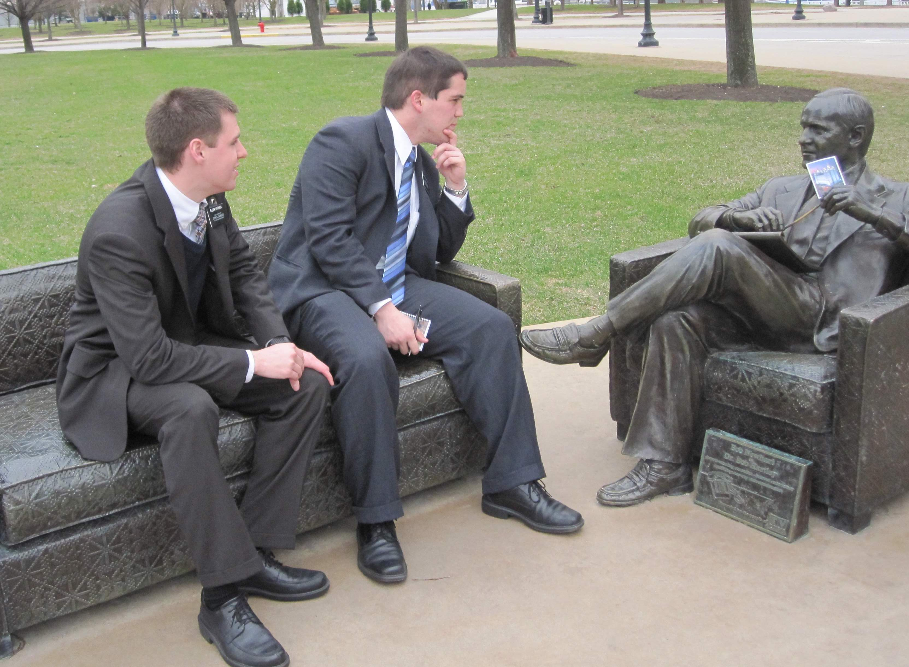

Hi there! Welcome to my little space on the internet. This page wound up being a little longer than expected, so here's a small table of contents for you:

1. [Work](#work)
1. [Music](#music)
1. [Design](#design)
1. [Faith](#faith)
1. [Etcs](#etcs)
1. [Contact](#contact)

## Work

I graduated from [BYU](https://www.byu.edu/) in 2018 and did a brief stunt at [Pariveda](https://www.parivedasolutions.com/) (formerly Pariveda Solutions), where I quickly learned that consulting was _not_ for me. After a year there I was fortunate to find my way onto the [Shopify](https://www.shopify.com/) analytics team (formerly “Insights”, now “Optimize”). Working at Shopify has been both a delight and a wonderful learning opportunity–I have learned _so much_ in my 4 years there.

I joined the company as a remote worker before COVID (I wrote about that on my [blog](/blog/what-I-learned-from-my-first-month-working-remote)). This means I joined Shopify in its pre-remote era. Joining the company in that era was an interesting time to be a part of it, and, selfishly, I was happy when the whole company went remote.

I've been able to be a part of shipping a number of analytics products, but the most notable:

### Orders Reporting

As part of this project, we shipped new reports to merchants that made it a lot easier to understand their orders, including reporting around fulfillment and delivery times.

### BFCM Notebook 2021

The BFCM Notebook 2021 was a special report that went out to merchants after the black-friday-cyber-monday 2021 sales event ended. It told a data-rich story about a merchant's BFCM sales. Incidentally, it shipped the same day that Spotify Wrapped shipped-completely by accident!

### ShopifyQL Notebooks

As a follow up to the BFCM notebook, we release a notebook experience as a first party app within Shopify. Much like [Jupyter notebooks](https://jupyter.org/), it's a notebook experience within Shopify to enable merchants to tell rich data stories using their Shopify data. I worked extensively on the ShopifyQL code editor as part of this project.

You can learn more about ShopifyQL Notebooks on the [Shopify Engineering blog](https://shopify.engineering/building-commerce-data-models-with-shopifyql).

## Music

I've been playing music since I was a kid, and writing/producing it since I was a teenager. Primarly I'm a guitarist, but I also have a background in piano and pretend to be a singer every now and again. Here are some of the notable projects I've been a part of:

### Early Summer (2008-2010)

This was my high school band, a duo with my cousin [Jordan Gundersen](https://jordangundersen.com/about/). We wrote songs that were either nonsensical or love songs and played small shows at local venues with other high school friends. Our music lives on [soundcloud](https://soundcloud.com/earlysummermusic/sets/this-is-early-summer) since it came out in the pre-Spotify era and it's certainly not good enough to be on Spotify.

The most notable experience we had as a band was opening for a favorite band at the time, [We Shot the Moon](https://open.spotify.com/artist/5n3zvKC7Mc9enZVt4bz6CK?si=zcmT0yNzSK-zG0lrPWdpbw), at [Velour](https://www.velourlive.com/) in Provo, UT.

### Jefferson & York (2013-2016)

Jordan and I both took time off of college for [service missions](https://newsroom.churchofjesuschrist.org/article/mission) for our church, and when we returned we reunited under the name Jefferson & York (derived from two streets from our service missions). We eventually brought on [Jordan Saltmarsh](https://www.jordansaltmarshdrums.com/) to play drums and rotated through several bassists as we pursued a more "full band" sound.

We released two EPs:

1. [Jefferson & York: Unplugged](https://soundcloud.com/jeffersonandyork/sets/unplugged-ep)
2. [The Backyard EP](https://open.spotify.com/album/0WEod59ULOzfjJiZS6AJ9F?si=LaQ0rNzoTyy0g8_IndR9gQ)

The most notable experience we had was recording The Backyard EP–we had planned to record this EP ahead of Jordan leaving for an internship across the country. Through a series of favors, we were able to record it on the back porch of a friend for basically free. I'm glad we were able to make it happen as it was the last major thing we did as a band–the songs would remain unrecorded without all the favors from our friends!

### Eliza Smith (2015)

In 2015, sometime during my tenure with Jefferson & York, I was talking with my friend Eliza Smith about her music. She had recently been [called on a mission](https://newsroom.churchofjesuschrist.org/article/mission) to the Phillipines and was unsure if she'd be able to record some songs she had written before leaving. I had access to a small vocal studio and had recently finished up recording Jefferson & York's Unplugged EP. I offered to produce & record her EP for free, since I wanted to grow & learn as an engineer/producer, and I loved the songs she wrote and wanted them out in the world.

Over the period of a few months we recorded 5 songs that eventually became [Sitting on Fences](https://open.spotify.com/album/0fmcPjySBBvii85gqyHSqd?si=WIl_WThqRqu-xj2Zm30gxQ). Some of the songs she had a clear vision for, and others were more of a collaborative effort.

One of the sessions we did that I clearly remember was when we recorded the last track of the EP, [On the Line](https://open.spotify.com/track/3p9cKuErP219QRv7T8xszQ?si=ae11f0dba65f4dec). Eliza had written the song but didn't have a clear vision for what it should sound like. A few days before that session, I had watched a live broadcast by Jason Scheff about vocal layering, so I thought it would be cool to give that technique a try. We dove headfirst into that idea and produced a song with a really interesting pad-like vocal. It was really fun pursuing that idea and coaching her through it as we discovered the song together.

### Michael Barrow & the Tourists (2016-2018)

Incidentally, a few of the friends who helped with Jefferson & York's “The Backyard EP” turned out to be my future band mates. We were asked to be a hired backing band behind Michael Barrow, a local songwriter. We recorded [The List](https://open.spotify.com/track/7fwnuP8wfbiDuztawdhYxA?si=d972dbb957264412), and afterwards decided to become an “actual” band instead of just hired guns.

While I was part of the band we wrote and recorded [Juneau](https://open.spotify.com/album/6paW7rC4mJ5zUY43nWuuc4?si=R39mjrI8SZW1XFE_3nCXGw), the band's debut album. I had set a goal as a teenager to release an album, and helping produce Juneau was a fulfillment of that goal. The album was recorded on a shoestring budget but holds many fond memories of college for me.

In early 2018 I moved in with Michael Barrow, and we had the idea to record a live EP in our living room. We recorded [Santa Barbara Sessions](https://open.spotify.com/album/5tt75nfPFSB9Irt84PEIR9?si=YX74BjqmTbym8MWDc9qHJA) (named after our apartment complex [Santa Barbara Villa Condos](https://aspenridgemanagement.com/units/santa-barbara-207/)) in a single sitting in January 2018. I did all of the production on the EP–recording, mixing, and mastering.

After graduation in April 2018, I had taken a job that would require me to leave the band; before we left, we recorded three of the songs that became the [Something New](https://open.spotify.com/album/1ekqkcJ1gtdyCRnkZu7H7J?si=IxFkbholSxuDr08yuAucUg) EP. The final song on the EP, [Sweet Honey](https://open.spotify.com/album/5IXCJYwqILaWOpXCVcKZBT?si=ZsSjPNwtQ3KkZnVTjZkKnw), is a song that I had a lot of ownership in the songwriting process on. It was the band's first single to pass a million streams on Spotify.

A favorite memory for my time with the band comes from when we were about to release Juneau. We had to push the release date back but had already committed to play Velour in April 2017. We decided to have an “Album Preview Show”, where we played all of the tracks from our new album, plus one cover of John Mayer's “I'm Gonna Find Another You”. I had dreamt of selling out Velour, and we were able to make that dream a reality when we sold out Velour that night! I can still feel the energy of the crowd during the last song of the night.

### The Last Seconds (2018-2019)

After leaving Michael Barrow & the Tourists (and after moving to LA), I ended up playing as a guitarist with Kyle Leach's band The Last Seconds. All of the bands up until that point had been groups that wrote and played original music, whereas The Last Seconds was primarly a cover band. I had an absolute blast getting to play covers at local dive bars and family reunions.

<TwoUp>
   
</TwoUp>

### Trevor Harmon (2020-present)

During the pandemic I moved from LA to North Carolina and found myself writing songs without a group to play them with. I decided to pursue my own solo music and release music with my own singing on (something I had never done before in any serious way). Since that I've had a few releases:

1. [Songs For Sleep](https://open.spotify.com/album/7ePZVqwRTdt0Sjxe2Mex1a?si=tDF7o753SsqxfJeRlEiM8g): This EP was many years in the making; I had been casually writing acoustic-only songs for years and decided to collect them into a 5-song EP. The goal of this EP was for the listener to feel like they were in the room with me as I played some sleepy songs on my guitar.
2. [I Walked Through Fire](https://open.spotify.com/album/733BliNAH60CTRqwhxGezC?si=mT_Ox3iiQeiSrK3LBFE9xw): This was the first song I released with my vocals on it and the first full-band song that I really wrote and recorded primarly by myself. I reached out to Jordan Saltmarsh, the drummer from Jefferson & York, and we collaborated on this remotely, with him providing drums.
3. [Still Can't Explain](https://open.spotify.com/album/787j3LRWyQgIDwvDkfIao4?si=HU0RloEYQpKy1kv_tk1lXw): Another vocal tune that I collaborate with Jordan Saltmarsh on, this song was one of the most difficult musical pursuits I've ever completed. I had no idea what the song "should" sound like or a goal for the song, and so I agonized over that question for months. However, I learned a lot about what _not_ to do, so it was still a valuable (if not completely frustrating) experience.

## Design

Before becoming a developer, I first started out as a designer. My main focus was on graphic design related to music (bands' myspace pages, album covers, etc), before I eventually branched out into website design. While in college, I took a job as a UX designer, thinking that it would eventually lead me to a career in UX design. After awhile I pivoted to pursue more development, but my interest in design has kept me closer to the front end of the stack because it helps to scratch that itch.

I've included some of my recent designs on the [Projects](/projects/) page.

## Faith

I'm a member of [The Church of Jesus Christ of Latter-day Saints](https://www.churchofjesuschrist.org/). As a Latter-day Saint, my worship is focused on Jesus Christ and on trying to follow His teachings. I read the words of prophets to learn about Jesus Christ and how to become more like Him. My faith brings me stability and peace in a way that no other practice in my life can.

### Mission

In October 2010 until October 2012 I served [a mission](https://newsroom.churchofjesuschrist.org/article/mission) in Chicago. I spent two years teaching people about Jesus Christ and finding opportunities to serve in my local community. Serving a mission was a pivotal moment in my life and is a treasured experience for me.

### Lay ministry

The church has a [lay ministry](https://newsroom.churchofjesuschrist.org/article/mormon-lay-ministry), where all of the leaders of the church are not ordained ministers but instead are volunteers from the congregation. Sunday services don't feature a central pastor figure, but instead feature messages from individuals in the congregation. Occasionally I am asked to participate by speaking on a particular message, and some of those messages I will adapt into blog posts. In those posts, the referenced bible verses will usually come from the King James Version of the bible, unless otherwise noted.

### Terminology

The church has terminology that may be unfamiliar to some readers. This is a running list of the terms you may encounter in some of my blog posts, and what they mean (in no particular order):

- **Ward:** the most basic unit of the church. A synonomous term used by other churches is congregation. Wards are generally organized by geography. When a congregation is not big enough to be considered a ward, it is called a branch.
- **Stake:** a collection of wards in a geographic area. Stakes generally include 6-9 units (branches or wards).
- **Stake President:** the leader of a stake.
- **High council:** a group of twelve men from various units of a stake that come together and focus on the needs of the stake, as directed by the stake president. High councillors are often assigned a unit that isn't their "home" unit to shepherd and provide training.
- **General conference:** A bi-annual conference where the entire church gets together for a weekend (Saturday & Sunday) to hear messages from leaders of the church. The conference is held in Salt Lake City, UT, and most members watch a broadcast on various streaming services.
- **Ministering:** A program in the church where we are assigned to watch over and care for other families in the church. The spirit of the program is to focus on love and friendship for our fellow members.
- **Temple:** A sacred building built for worship services. A temple is distinct from a meetinghouse; meetinghouses are for weekly services & every day activities, whereas a temple is built exclusively for worship experiences that center around making promises to follow Jesus Christ in a higher way. The most iconic temple is (probably) [the Salt Lake City temple](https://churchofjesuschristtemples.org/salt-lake-temple/).

## Etcs

I have a dog (mini sheepadoodle) named Poppy. She is a sweetheart of a dog and also a total nut. She does this thing where she frantically waves her paws when she wants something (pictured in the gif below).

<TwoUp> </TwoUp>

## Contact

Thanks for reading this far! If you like my work, or just want to say hello, feel free to reach out on [Twitter](https://twitter.com/thetrevorharmon). You can also reach me at `the trevor harmon @ gmail . com`.

–Trevor
