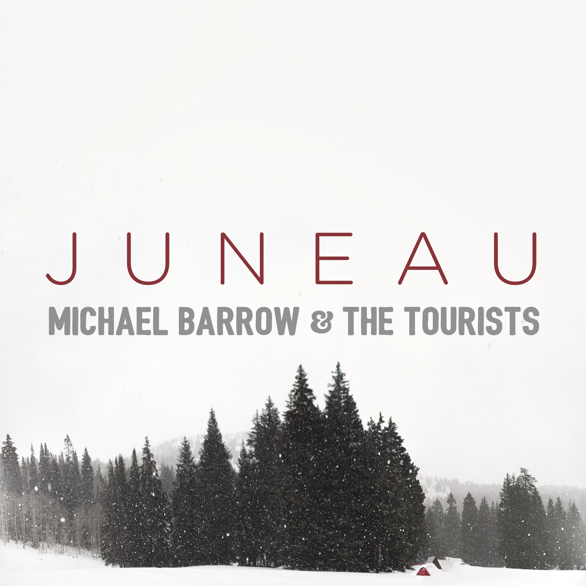
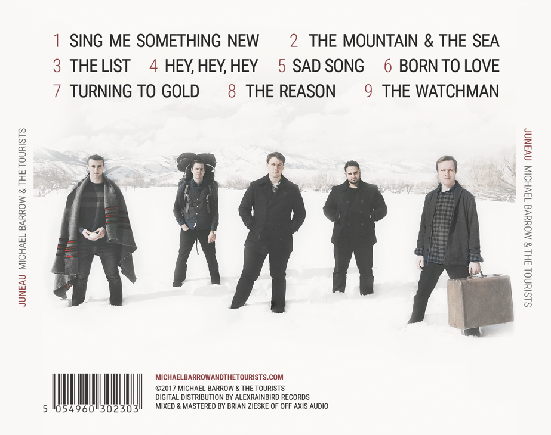
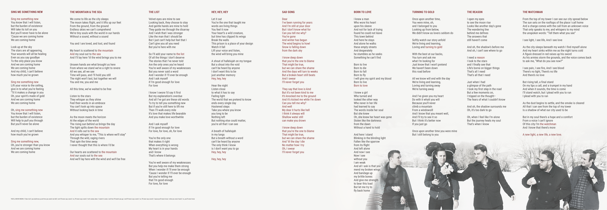
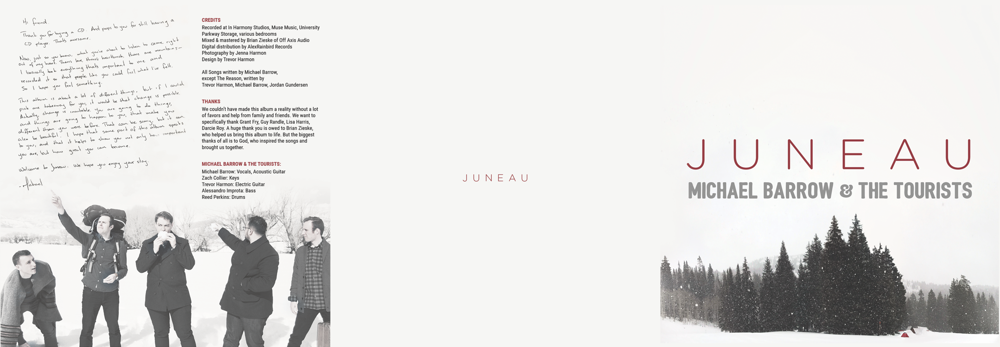
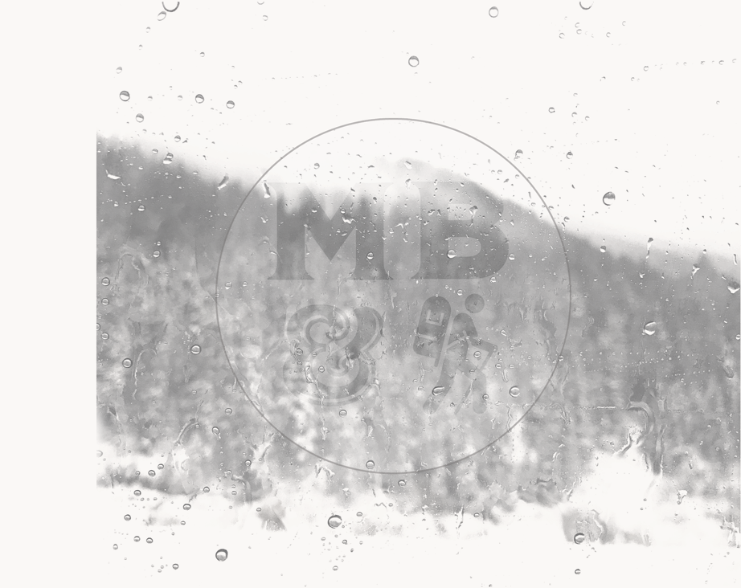
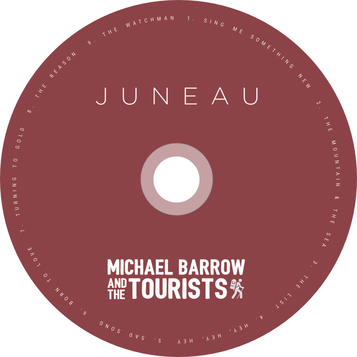

Michael Barrow & the Tourists decided to do a limited run of physical cds with a 3-panel folding insert. I did all of the designs and provided the landscape photography. Other photography was provided by Jenna Harmon.

