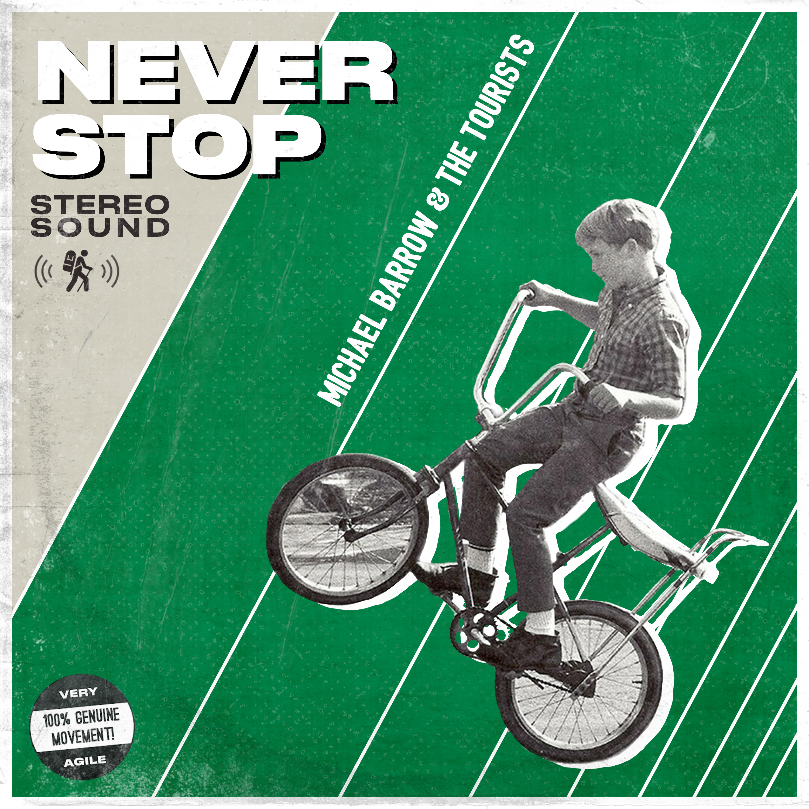

This album cover was done for Michael Barrow & the Tourist's single "Never Stop". This was created as a companion art to ["Sweet Honey"](/projects/sweet-honey-cover-art 'The Sweet Honey album art'). I decided to go with a design that would be heavily inspired by the design for "Sweet Honey", and you can read about that process in depth in my article ["The Value of Iterative Design"](/blog/the-value-of-iterative-design 'The blog post explaining the iterations I went through to get to my final design for Sweet Honey').

