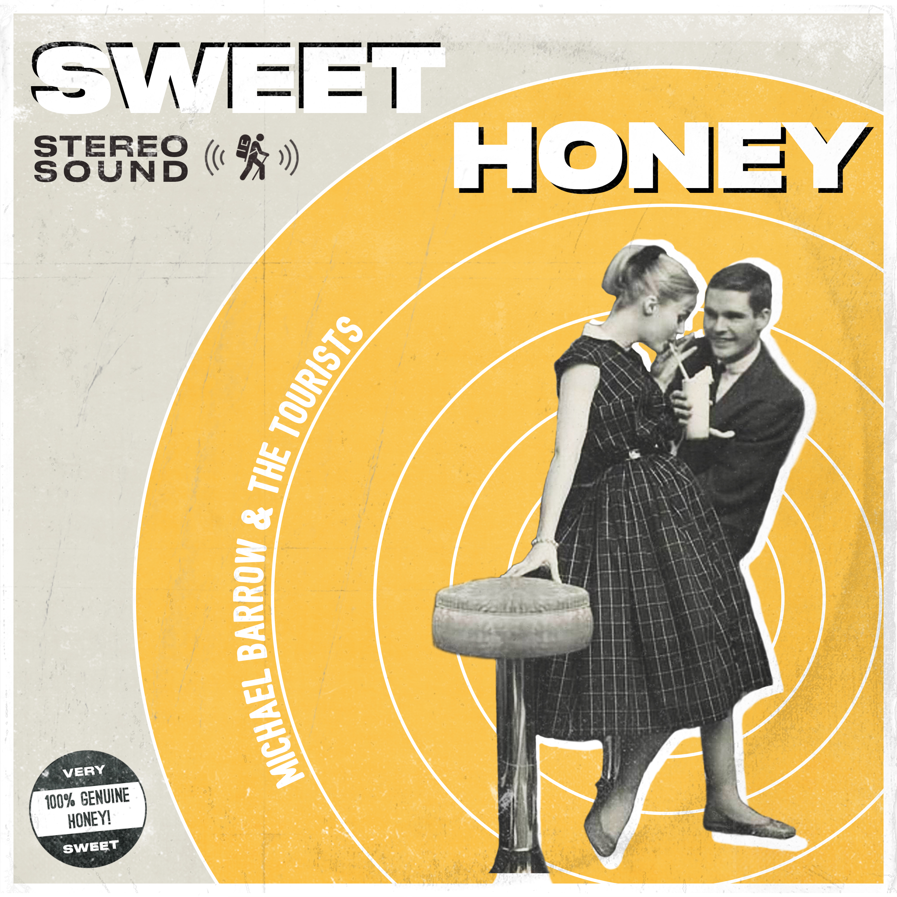

This album cover was done for Michael Barrow & the Tourist's single "Sweet Honey". I went through several iterations for this, which you can read about in depth in my article ["The Value of Iterative Design"](/blog/the-value-of-iterative-design 'The blog post explaining the iterations I went through to get to my final design for Sweet Honey').

